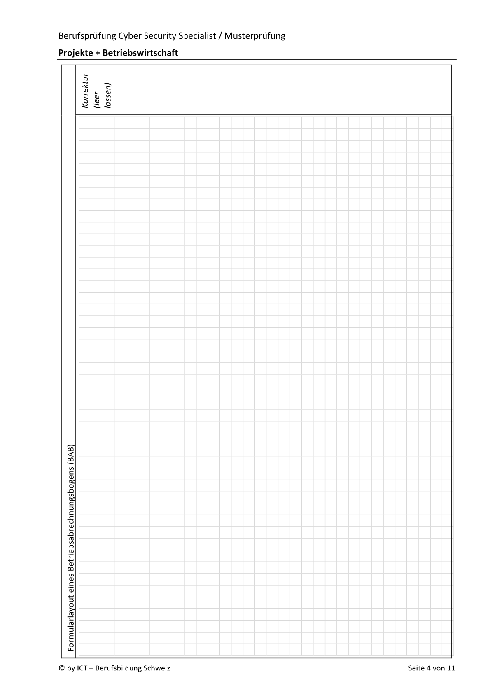

# Musterprüfung Pos. 2 Projekte + Betriebswirtschaft

Created: 2021-11-02 19:59:18 +0100

Modified: 2021-11-19 11:12:08 +0100

---

![Berufsprüfung Cyber Security Specialist / Musterprüfung Pos. 2 Projekte + Betriebswirtschaft Informationen zur Prüfung Bei jeder Aufgabe sind die Punktzahlen angegeben, die Sie für die korrekte Beantwortung der jeweiligen Aufgabe maximal erhalten. Schreiben Sie in gut lesbarer Schrift. Unleserliches wird nicht korrigiert und nicht bewertet. Korrekturen in Ihrer Lösung müssen eindeutig als solche erkennbar sein (z.B. mittels Durchstreichen). Mehrdeutige Lösungen werden nicht korrigiert und nicht bewertet. Für Ihre Lösung steht Ihnen bei jeder Aufgabe ein entsprechendes Feld zur Verfügung. Texte oder Skizzen ausserhalb der Feldbegrenzungen werden nicht korrigiert und nicht bewertet. Für umfangreiche Korrekturen stehen Ihnen am Ende des Prüfungshefts Lösungsblätter zur Verfügung. Verweisen Sie bei der Verwendung von Lösungsblättern klar auf die entsprechende Aufgabe. Formale Vorgaben und Begrenzungen an die Lösung einer Aufgabe (z.B. "in 3 Sätzen" Oder "mit max. 5 Stichworten") sind verbindlich. Abweichende Lösungsformen oder überzählige Antworten werden nicht korrigiert und nicht bewertet, wobei bei der Korrektur mit den erstgenannten Elementen begonnen wird. Ihre Antworten müssen einen konkreten Bezug zum Fallbeispiel haben. Wenn beispielsweise nach Massnahmen oder nächsten Schritten gefragt wird, genügen allgemeingültige Globalantworten wie "planen" Oder "Kommunizieren" nicht. ](../media/S0_XX_Musterprüefung-Musterprüfung-Pos.-2-Projekte-+-Betriebswirtschaft-image1.png){width="8.322916666666666in" height="11.78125in"}

![Berufsprüfung Cyber Security Specialist / Musterprüfung Projekte + Betriebswirtschaft 1. Erstellen einer Kostenrechnung Ausgangslage Die Emmental-Software AG erhält den Auftrag, eine detaillierte Kostenrechnung der Agro- und Kommunal-Tech AG mit Schnittstelle zur vorhanden Finanzbuchhaltungssoftware zu erstellen. Durch Interviews bei den zuständigen Personen in der Agro- und Kommunal-Tech AG konnten folgende Elemente für die Kostenrechnung erhoben werden. Abteilungen: Entwicklung Produktion Mäher und Mähdrescher Produktion Mehrzwecktransporter Produktion Kommunalfahrzeuge für Strassenunterhalt Lager Material Verwaltung und Vertrieb Gebäude Folgende betriebliche Ertragspositionen sind in der Erfolgsrechnung vorhanden: Verkauf Mäher und Mähdrescher Verkauf Mehrzwecktransporter Verkauf Kommunalfahrzeuge Folgende Aufwand-Elemente sind in der Erfolgsrechnung ersichtlich: by ICT Materialaufwand Lohnaufwand Technik Lohnaufwand Liegenschaftsunterhalt Lohnaufwand Verwaltung Mietaufwand Kommunikationsaufwand Büroaufwand Abschreibungen Zinsaufwand --- Berufsbildung Schweiz Seite 2 von Il ](../media/S0_XX_Musterprüefung-Musterprüfung-Pos.-2-Projekte-+-Betriebswirtschaft-image2.png){width="8.322916666666666in" height="11.78125in"}

![Berufsprüfung Cyber Security Specialist / Musterprüfung Projekte + Betriebswirtschaft Aufgabe 1.1 [13 Punkte] Erstellen Sie ein Formularlayout der Kostenrechnung mit den Informationen gemäss Ausgangslage in Form eines Betriebsabrechnungsbogens (BAB) mit den notwendigen Spaltenuberschriften. Definieren Sie aus den Vorgaben gemäss Aufgabenstellung zudem die direkten und indirekten Kosten. Antwortstruktur (nächste Seite) a) b) by ICT Formularlayout eines Betriebsabrechnungsbogens (BAB), nur mit den Spaltenüberschriften. Bestimmung und Beschriftung aller hierfür benötigen Tabellenspalten. Aufzählung der Aufwand-Elemente gemäss Vorgaben der Ausgangslage und eindeutige Zuweisung derer zu den direkten oder indirekten Kosten. --- Berufsbildung Schweiz Seite 3 von Il ](../media/S0_XX_Musterprüefung-Musterprüfung-Pos.-2-Projekte-+-Betriebswirtschaft-image3.png){width="8.322916666666666in" height="11.78125in"}

{width="8.322916666666666in" height="11.78125in"}

![Berufsprüfung Cyber Security Specialist / Musterprüfung Projekte + Betriebswirtschaft 2. Projektstrukturplan nach Hermes Ausgangslage Sie arbeiten für die Firma „Barista AG" und sollen das neue Projekt „Barista to go" leiten. Mit einem Budget von 1,7 Millionen CHF soll ein Kaffeevollautomat für Personenkraftfahrzeuge (PKWs) entwickelt werden. Ihre Firma arbeitet nach dem phasenorientierten Vorgehensmodell „Hermes". Hier ein Auszug aus dem Sitzungsprotokoll des Kick-Offs: Ablauf: Analyse von mindestens 3 Varianten in Studie Sobald Finanzierung und Planung freigegeben, wird Pflichtenheft benötigt Kreative Herangehensweise für Einführungskonzept erwünscht Zeitplanung: Abnahme des Projekts muss spätestens zwei Monate vor dem Projektende angekündigt werden zusätzlich zur Geschäftsleitung auch Einbezug wichtiger Stakeholder seitens Lizenzgeber Autosalon Genf: Beschluss: Messestand auf dem nächsten Autosalon in Genf Kommunikationsmassnahmen zur Steigerung der „Aufmerksamkeit" der Besucher Zum Ende des Projektes wünscht Management schriftlich konzipierte Marketingmassnahmen Verträge: Lizenzvertrag mit „Nespresso" unterzeichnet alles steht unter Geheimhaltungspflicht weitere rechtliche Abklärungen notwendig Rechtsgrundlagen müssen analysiert und erstellt werden Produkt Geschäftsleitung Beschluss: 3 funktionsfähige Prototypen Produktion des Serienmodells erst nachdem die 3 Prototypen ausführlich getestet sind by ICT Produktkonzept muss Design und Technik thematisieren --- Berufsbildung Schweiz Seite 5 von Il ](../media/S0_XX_Musterprüefung-Musterprüfung-Pos.-2-Projekte-+-Betriebswirtschaft-image5.png){width="8.322916666666666in" height="11.78125in"}

![Berufsprüfung Cyber Security Specialist / Musterprüfung Projekte + Betriebswirtschaft Aufgabe 2.1 [10 Punkte) Ordnen Sie die gemäss Ausgangslage verlangten Lieferergebnisse der richtigen HERMES projektphase Zu, indem Sie diese im vorgegebenen Projektstrukturplan ergänzen. Antwortstruktur 10 Lieferergebnisse gemäss Hermes im vorgegebenen Projektstrukturplan. Antwortfeld Initialisierung Prclekt „dar•sta to Konzept Realisierung Einführung Bemerkungen zur Korrektur (leer lassen) by ICT --- Berufsbildung Schweiz Korrektur (leer lassen) Seite 6 von Il ](../media/S0_XX_Musterprüefung-Musterprüfung-Pos.-2-Projekte-+-Betriebswirtschaft-image6.png){width="8.322916666666666in" height="11.78125in"}

![Berufsprüfung Cyber Security Specialist / Musterprüfung Projekte + Betriebswirtschaft Aufgabe 2.2 18 Punkte) Nennen Sie für alle 4 vorgegebenen Phasen je ein zusätzliches Wichtiges Lieferergebnis gemäss HERMES, welches in der Ausgangslage noch nicht erwähnt Wird. Achten Sie darauf, dass Sie 4 unterschiedliche Lieferergebnisse nennen. Antwortstruktur 4 Lieferergebnisse gemäss Hermes und ihre Zuordnung zur entsprechenden Phase. Antwortfeld Initialisierung ZZZZ Kon zept Realisierung Einführung Bemerkungen zur Korrektur (leer lassen) by ICT --- Berufsbildung Schweiz Korrektur (leer lassen) Seite 7 von Il ](../media/S0_XX_Musterprüefung-Musterprüfung-Pos.-2-Projekte-+-Betriebswirtschaft-image7.png){width="8.322916666666666in" height="11.78125in"}

![Berufsprüfung Cyber Security Specialist / Musterprüfung Projekte + Betriebswirtschaft 3. Terminplan erstellen Ausgangslage Sie leiten das Projekt „Arbeitsplatzsystem (APS) Life Cycle 2020". Die Arbeitsplatzcomputer (PC) nähern sich dem Ende ihres Lebenszyklus und sollen durch neue Laptops ersetzt werden. Der Rollout erfolgt unter folgenden Rahmenbedingungen: 1 Standort 300 neue Laptops Verantwortlichkeit durchzuführen durch I. Arbeitsaufträge 2. 3. Konfiguration 4. Benutzerschulung 6. Abnahrneprotokdl Artwitsauftrage je 2 DINA Seiten für involvierte ßationseinheiten erstellen. Verteilung der Laptops auf die Arbeitsplätze. Betriebssystem und Applikationen wurden durch Händler vorinstalliert. Erstinbetriebnahme. und Funktionstest der La am Artkits atz. Kompakte %hulung für Mitarbeiten& nt der User mit Fehlern/Supportbedarf --- Erneute %hneII-XOnfigura tim und Funktimstest am Arbeits atl. Abnahmeprotokdl erstenen und anschliessend vorn Bereichsleitenden des Integrations• und Informationsmanagernent signieren lassen. von 15 DINA 2 Mitarbeitende vom Infrastrukturma nagenent 2 Mitarbeitende vom 2 Mitarbeitende von der Benutz t 1 Mitarbeitender vom (h-Site-Support Projektleitung + Integrations- und Informat ion by ICT --- Berufsbildung Schweiz Seite 8 von Il ](../media/S0_XX_Musterprüefung-Musterprüfung-Pos.-2-Projekte-+-Betriebswirtschaft-image8.png){width="8.322916666666666in" height="11.78125in"}

![Berufsprüfung Cyber Security Specialist / Musterprüfung Projekte + Betriebswirtschaft Aufgabe 3.1 [16 Punkte) Berechnen, beziehungsweise schätzen Sie für jedes Arbeitspaket (AP 1 bis 7) den zeitlichen Aufwand unter Berücksichtigung der gegebenen Rahmenbedingungen. Ihre Berechnungen oder Schätzungen müssen nachvollziehbar sein. Begründen Sie Ihre Resultate bei Bedarf zusätzlich kurz in Worten. Skizzieren Sie anschliessend einen, durch Einbau von Parallelität bezüglich Endtermin zeitoptimierten Terminplan in Form eines Balkendiagramms (Gantt-Diagramm). Antwortstruktur Nachvollziehbare Berechnung des Aufwandes pro Arbeitspakete als aufgerundete Zahl in Tagen Skizze des Terminplans in Form eines Balkendiagramms (Gantt-Diagramms) Antwortfeld Bemerkungen zur Korrektur (leer lassen) by ICT --- Berufsbildung Schweiz Korrektur (leer lassen) Seite 9 von Il ](../media/S0_XX_Musterprüefung-Musterprüfung-Pos.-2-Projekte-+-Betriebswirtschaft-image9.png){width="8.322916666666666in" height="11.78125in"}

![Berufsprüfung Cyber Security Specialist / Musterprüfung Projekte + Betriebswirtschaft 4. Risiken identifizieren Ausgangslage Sie arbeiten in der IT einer Bank. Die Bank organisiert für ihre Kunden regelmässig Events. Nun will die Bank ein Softwaresystem für die Eventorganisation einführen. Sie sollen dieses IT-Projekt leiten. In der Initialisierungsphase muss evaluiert werden, ob die Software in Eigenentwicklung gefertigt werden soll, oder ob eine schon auf dem Markt vorhandene Lösung beschafft wird. Ein Mitglied der Geschäftsleitung bevorzugt einen Lieferanten aus Grossbritannien, mit dem er schon in der Vergangenheit gearbeitet hat. Die Bereichsleitung der Informatikabteilung hingegen hat eine gute Beziehung zum CEO der Bank und sieht einen grösseren Nutzen in der Eigenentwicklung. Aufgrund der momentanen Arbeitsauslastung können sie jedoch frühestens in 5 Monaten mit der Entwicklung beginnen. Ausserdem haben sie ein solches Eventorganisationssystem noch nie entwickelt. Das Projekt soll in 18 Monaten abgeschlossen sein und darf das Budget von CHF 1'500'000.- nicht übersteigen. Weitere Rahmenbedingungen sind, dass das Eventorganisationssystem von der Informatikabteilung und den IT-Verantwortlichen an allen 5 Standorten in der Schweiz betrieben werden kann und die Datenschutz- sowie Sicherheitsvorgaben einzuhalten sind, weil sensible Kundendaten verwaltet werden. by ICT --- Berufsbildung Schweiz Seite 10 von II ](../media/S0_XX_Musterprüefung-Musterprüfung-Pos.-2-Projekte-+-Betriebswirtschaft-image10.png){width="8.322916666666666in" height="11.78125in"}

![Berufsprüfung Cyber Security Specialist / Musterprüfung Projekte + Betriebswirtschaft Aufgabe 4.1 [18 Punkte) Identifizieren Sie auf der Basis der Informationen aus der Ausgangslage für die beiden Beschaffungsarten (Eigenentwicklung / externe Beschaffung) je 3 unterschiedliche Risiken und begründen Sie diese nachvollziehbar. Antwortstruktur 3 Risiken einer Eigenentwicklung in Stichworten mit je einer Begründung in maximal 2 Sätzen. 3 Risiken einer externen Beschaffung in Stichworten mit je einer Begründung in maximal 2 Sätzen. Antwortfeld Bemerkungen zur Korrektur (leer lassen) by ICT --- Berufsbildung Schweiz Korrektur (leer lassen) Seite 11 von II ](../media/S0_XX_Musterprüefung-Musterprüfung-Pos.-2-Projekte-+-Betriebswirtschaft-image11.png){width="8.322916666666666in" height="11.78125in"}

