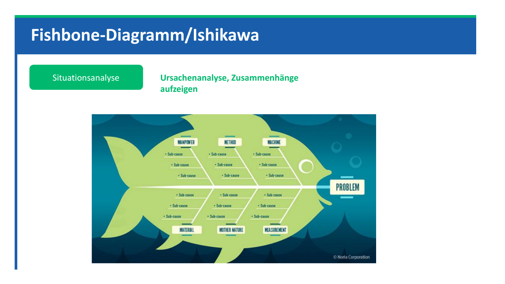

# SYEN: Block 1 und 2

Created: 2021-05-20 10:58:33 +0200

Modified: 2022-01-20 17:37:51 +0100

---

<<[SYEN_Block_1.pdf.pdf](../media/SYEN_Block_1.pdf.pdf)>>

Situationsanalyse: Muss kein Problem sein, kann auch eine Herausforderung sein: Kein Mangel, sondern Chance

Analyse: Aussortierung

Lebenszyklus enthält ausserdem das Bedürfnis der Kunden - Wunsch nach Neuem etc. (Begehrlichkeit vorhanden bsp. Smartphone --> Austausch obwohl altes Gerät noch funktioniert)

Wir befassen uns in diesem Fach mit Evaluation (von IT Mitteln)

Diese Wörter müssen wir verstehen / können / Lernen

Das System ist die Küche

Die Systemgrenze - Es geht NUR um die Küche

In der Küche - in dem System gibt es verschiedene Elemente

Zum System gehört die Umwelt - Bspw. Haus --> Umwelt - gibt vor wie die Küche gebaut werden kann --> Angrenzende Räume, Grösse, Elektrik etc.

Die Elemente stehen in Beziehung zu einander. Element Arbeitsplatte steht in Beziehung zu Schrankelemente

![Aufgabe --- Szenario Pfefferminzia AG Die Pfefferminzia Versicherung AG in Basel vertreibt Produkte aus den Sparten Lebensversicherung Krankenversicherung Sachversicherung. Im Innendienst sind 1' 200 Mitarbeiter beschäftigt, 350 davon sind im Bereich «'T» tätig. Für den Vertrieb ist der Bereichsleiter «Vertrieb und Marketing» verantwortlich. Der Vertrieb der Versicherungen erfolgt über die eigenen Broker und über externe Versicherungsmakler. Insgesamt beschäftigt das Unternehmen 320 eigene Broker, verteilt über Vertriebsagenturen in der gesamten Schweiz. Die Broker arbeiten mit Laptops --- sowohl im Büro in der Vertriebsagentur als auch vor Ort beim Kunden. Dabei verwenden sie derzeit als Verkaufsunterstützung die Offline- Anwendung «My Pfefferminzia». Diese wird durch die eigene IT supportet. Die Konkurrenz im Versicherungsmarkt --- insbesondere im Bereich Krankenversicherung --- ist gross. 0 SjuJ ](../media/S1_01_SYEN_System-Engineering-SYEN--Block-1-und-2-image30.png)

# Gruppenlösung

Negativ: Interview: Nicht objektiv, schwer zu gliedern / sortieren / auswerten, evtl. nicht ausführlich

Positiv: gut zu vertiefen

Allgemein: Nur für kleine Gruppen geeignet.

Fragebogen: Anonym - Ehrlichkeit, Ergebnisse unausführlich, nicht für die Tiefe geeignet, kann aber kein Stimmungsbild auffangen

Multimomentstudie: Einfach mitgehen und schauen was gemacht wird / zbsp. Im Callcemter

![Aufgabe In der Versicherung Pfefferminzia sorgt die Offline-Anwendung, welche die Broker zum Versicherungs- vertrieb bei den Kunden verwenden, zunehmend für Unmut: die Anwendung wurde selbst programmiert --- Dokumentationen existieren nicht die Wartung der Anwendung erfordert enormen Aufwand in der IT die Vertriebler können keine Kundendaten in das Tool einbinden --- so ist es in einem Beratungsgespräch vor Ort unmöglich, anhand der Kundendaten einen konkreten Versicherungstarif zu berechnen dies erfordert Abstimmung mit dem Innendienst, der sich über den Zusatzaufwand beklagt die Abschlussquote ist beeinträchtigt, da die Kunden nicht sofort ein Angebot erhalten wird dieses nachgeliefert, springen viele Kunden wieder ab die Anwendung des Tools wird in den Vertriebsagenturen geschult --- mit unterschiedlicher Qualität von der mangelhaften Performance des Tools frustriert verzichten viele Broker auf dessen Anwendung und führen die Beratungsgespräche «frei» - ebenfalls mit unterschiedlicher Qualität (wichtige Infos und Argumente gehen vergessen) der Vertriebsleiter ist wenig IT affin und ignoriert die Beschwerden weitgehend 15' ](../media/S1_01_SYEN_System-Engineering-SYEN--Block-1-und-2-image39.png)

1.  Fragebogen erstellen

2.  Interview über Gruppe von ca. 10 Personen / KeyUser aus unterschiedlichen Bereichen IT / Vertrieb

3.  Evtl. Multimomentstudie in einem Kundengespräch

Stärke oder Schwäche: schlecht dokumentiert, hoher wartungsaufwand, kein Kundenkontent, SW kann von Agenturen selbst geschult werden (Vorteil), Performance Probleme

Wirkung: Zusatzaufwand für Kundendatenpflege Abschlussquote beeinträchtigt, Fehlende Nutzung der Software

Situation Frei beurteilen - Was ist jetzt Positiv und was Negativ

Ursache: keine Dokumentation - Wirkung: hoher wartungsaufwand

Ursache: Keine Kundendaten im System, Wirkung: hoher Zusatzaufwand --> Mangelnde Abschlüsse durch wartezeiten -

Anwendung inkonsistenz geschult - fehlerhafte nutzung der software

Mangelnde Performance --> verzicht auf Nutzung der Anwendung

