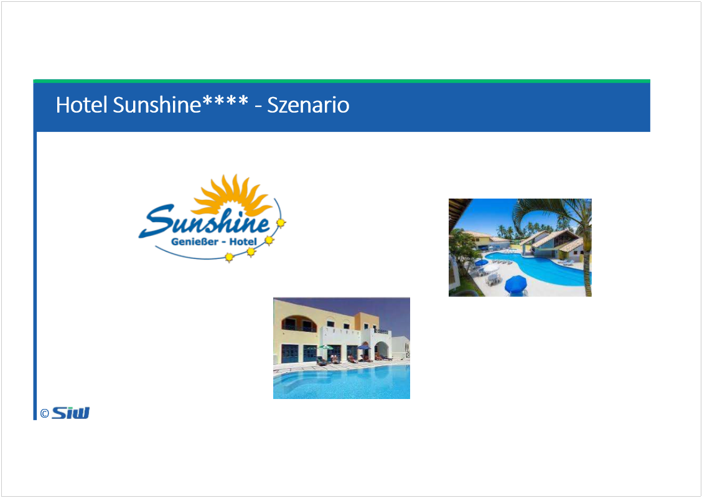

# Szenario Hotel Sunshine

Created: 2021-05-20 17:16:32 +0200

Modified: 2021-05-20 17:17:03 +0200

---

![Computergenerierter Alternativtext: Hotel Sunshine**** Szenario © Das unmittelbar an einem Traumstrand gelegene Hotel Sunshine**** im Süden der italienischen Insel Sardinien verfügt über drei Pools, 3 Restaurants (2 x à la carte, 1 x Buffet) und umfangreiche Sportmöglichkeiten. Viele Mitarbeiter haben während des Shutdown in der Corona Zeit gekündigt, da die Gehälter während der Kurzarbeit nur sporadisch gezahlt wurden und Unterstützungsleistungen weitgehend ausblieben. Die gesamte Belegschaft wurde zu 70% ausgetauscht. In der Hauptsaison ist das Hotel voll belegt. Besonders beliebt sind die Lage der Anlage sowie deren geschmackvoll Ausstattung. Das Hotel spricht ein breites Publikum an: junge Familien, Paare, Sportbegeisterte. Viele benachbarte Hotels musste durch die Coronakrise dauerhaft schliessen--so sind die Hauptkonkurrenten in der Gegend weggebrochen. ](../../media/S1_01_SYEN_System-Engineering-Szenario-Hotel-Sunshine-image2.png)![Computergenerierter Alternativtext: Hotel Sunshine**** Ausgangslage © § Die Gäste beschweren sich über lange Wartezeiten am Buffet und in den à la carte Restaurants § Das Servicepersonal ist unterbesetzt und noch nicht eingespielt --die Schichtleiter müssen diverse Fehler korrigieren, so bleibt ihnen kaum Zeit einzuspringen wenn nötig § Für Schulung/Training der Mitarbeiter bleibt kaum Zeit, da alle immer „unter Dampf" stehen § Das Hotel hat einige negative Bewertungen auf Trip Advisorerhalten § Die Geschäftsleitung hat Angst, dass nun Gäste ausbleiben und stellt kein Budget für Personalaufstockung § Einige Gäste reklamieren die Qualität des Essens § 3 Köche erkrankten kurzfristig --der Ersatz ist nicht wirklich ausgebildet, zudem fehlt den „Jungköchen" die Praxis § Ein Pool musste zum Ärger der Gäste gesperrt werden, da die Pumpe defekt ist --noch hatte der verantwortliche Mitarbeiter keine Zeit für die Reparatur § Der hoteleigene Strand ist erst ab ca. 12 Uhr nutzbar --vorher muss dieser gereinigt werden: In der Nähe eröffnete ein Youth Hostelund die Gäste feiern nachts gern am Strand, ohne den Müll danach zu beseitigen ](../../media/S1_01_SYEN_System-Engineering-Szenario-Hotel-Sunshine-image3.png)

