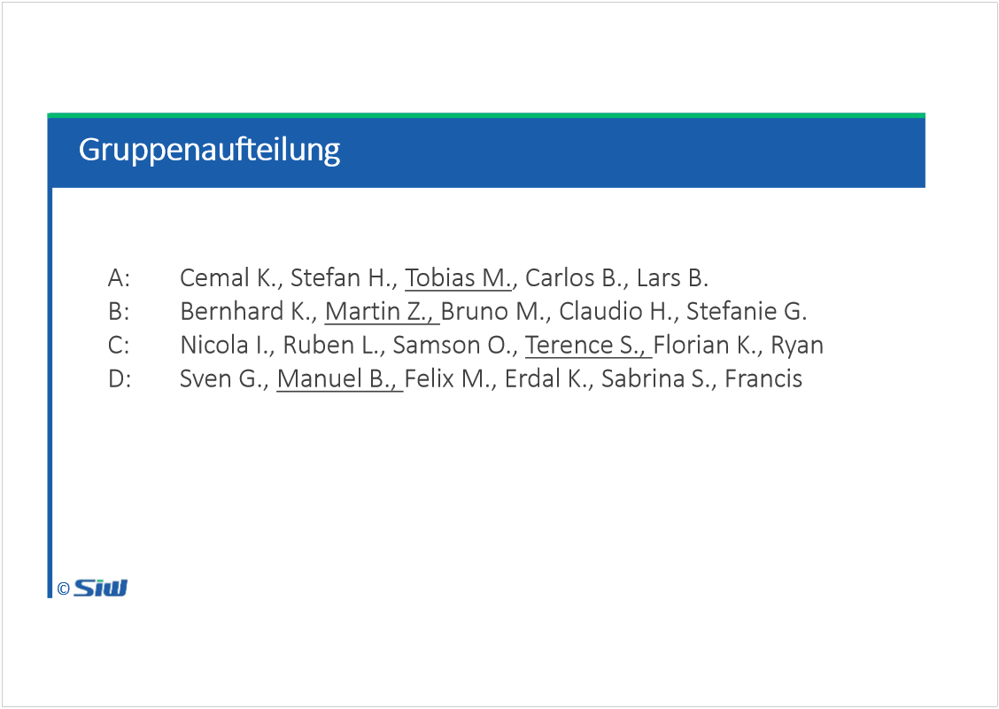
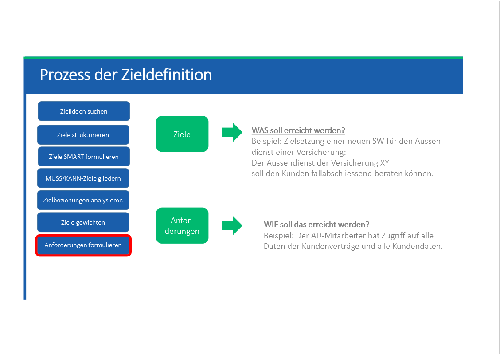
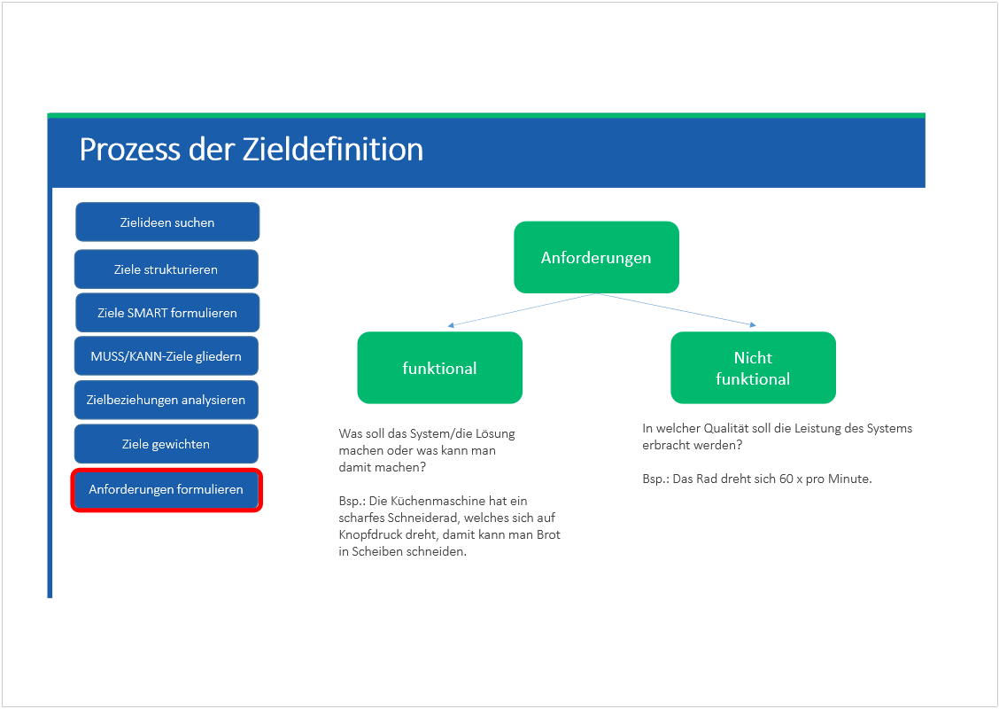

# SYEN: Block 3 und 4

Created: 2021-05-26 17:31:49 +0200

Modified: 2021-09-20 20:15:19 +0200

---

![Computergenerierter Alternativtext: Lernziele Die Studierenden ... ... können verschiedene Methoden zur Problemanalyse anwenden ... kennen den Sinn und Zweck der Zielformulierung (= 2. Phase des PLZ) ... können das Vorgehen innerhalb der Zielformulierung erklären ... können für eine mittelkomplexe Problemstellung die Ziele beschreiben ... können Ziele hinsichtlich ihrer Qualität beurteilen ... können zwischen Zielen und Anforderungen unterscheiden ... können Anforderungen definieren ... können Use Cases erstellen ... kennen die Bedeutung eines Pflichten-und Lastenhefts © ](../media/S1_01_SYEN_System-Engineering-SYEN--Block-3-und-4-image2.png)

Hauptproblem

Hauptursachen

unterursachen

Definitiv nochmal anschauen

Hausaufgabe!

Vision ist Langfristig

Weitere Stakeholder:
-   Kunden
-   Finance
-   Compliance und Recht (alles geht mit rechten Dingen zu)
-   Dienstleister

IT:
-   Geringer Wartungsaufwand
-   Datensicherheit, Datenschutz

Broker:
-   Hohe Verfügbarkeit
-   Systemdokumentation
-   Easy to use
-   Komplette Fallbearbeitung
-   Performance

Innendienst:
-   Saubere Datenqualität
-   Easy to use

Finance
-   Geringe Beschaffungskosten
-   Geringe wiederkehrende Kosten

Systemziele: was soll es eigentlich leisten

Vorgehensziele: diese ziele sind nicht mehr wichtig, wenn problem gelöst

<table>
<colgroup>
<col style="width: 16%" />
<col style="width: 43%" />
<col style="width: 39%" />
</colgroup>
<thead>
<tr class="header">
<th></th>
<th><strong>Systemziele</strong></th>
<th><strong>Vorgehensziele (gilt für alle zeilen) - für die Strukturierung, vorgehen und planung</strong></th>
</tr>
</thead>
<tbody>
<tr class="odd">
<td><strong>Finanzielle Ziele</strong></td>
<td><ul class="incremental">
<li>
Geringe Beschaffungskosten
</li>
<li>
Geringe wiederkehrende Kosten
</li>
</ul></td>
<td></td>
</tr>
<tr class="even">
<td><strong>Soziale Ziele</strong></td>
<td>
Gute Zusammenarbeit Broker /ID

Easy to use
</td>
<td></td>
</tr>
<tr class="odd">
<td><strong>Leistungsziele</strong></td>
<td><ul class="incremental">
<li>
Performance
</li>
<li>
Verfügbarkeit
</li>
<li>
Geringer Wartungsaufwand
</li>
<li>
Datensicherheit, Datenschutz
</li>
<li>
Datenqualität
</li>
<li>
Datensicherheit
</li>
<li>
Integrität
</li>
</ul>
<blockquote>

</blockquote></td>
<td>Anwendung soll bis Ende 2021 laufen 
Geringe Ausfallzeit zwischen alter und neuer Lösung 
Bevor die Evaluation startet, wird das Budget festgelegt</td>
</tr>
<tr class="even">
<td></td>
<td></td>
<td></td>
</tr>
</tbody>
</table>

Ziel Geringe Beschaffungskosten

SMART: Die Beschaffungskosten für performante Server dürfen 25'000 nicht überschreiten

Geringer Wartungsaufwand

Der Wartungsaufwand für Applikationsupdates sollte innerhalb eines quartals nicht mehr als 8 Arbeitsstunden überschreiten

Mvp - minimum valuable product - minimal existenzfähiges produkt (für Prototyp)

![Prozess der Zieldefinition Zielideen suchen Ziele strukturieren Ziele SMART formulieren MUSS/KANN-Ziele gliedern Zielbeziehungen analysieren Ziele gewichten Anforderungen formulieren Finanzielle Ziele Soziale Ziele Leistungs- ziele Systemziele Beschaffungskosten maximal IOCYOOO CHF Wiederkehrende Kosten maximal 10' 000 CHF p.a. Jedes Untermenü lässt sich mit 2 Klicks erreichen. Datensicherhfit, Datenschutz: Die Daten müssen im produktivfall bor Fremdzugriffen geschützt sein, Vorgehensziele Anwendung soll bis Ende 2021 Kundendaten verarbeiten können Anwendung soll bis Ende 2021 mit den geplanten Ressourcen produktiv laufen Prototyp steht bis Ende September 2021 zur Verfugung. (Minimum Viable ](../media/S1_01_SYEN_System-Engineering-SYEN--Block-3-und-4-image49.png)

Kosten könnten in Konkurrenz zur Datensicherheit stehen

Muss Ziele müssen nicht gewichtet werden

Kann Ziele müssen gewichtet werden:

