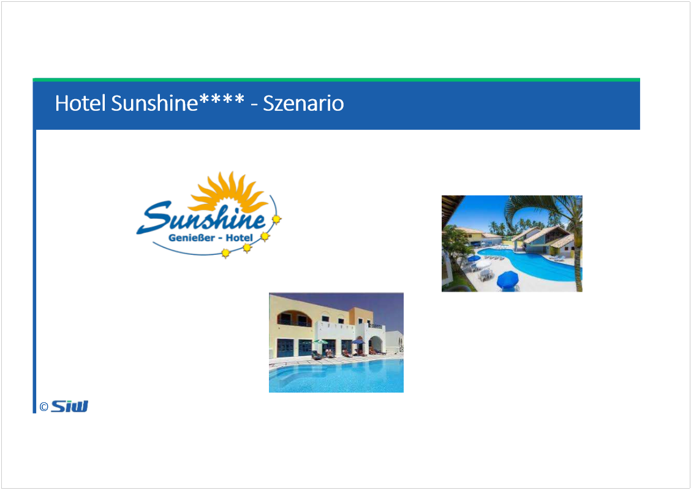
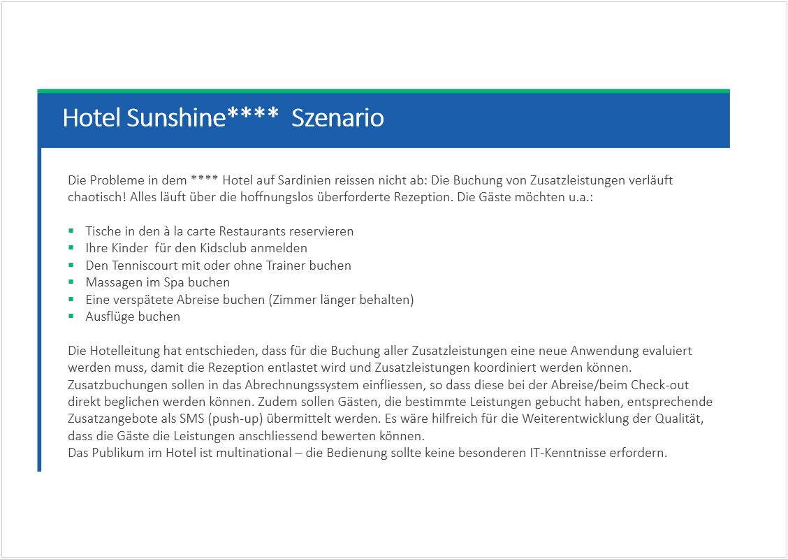
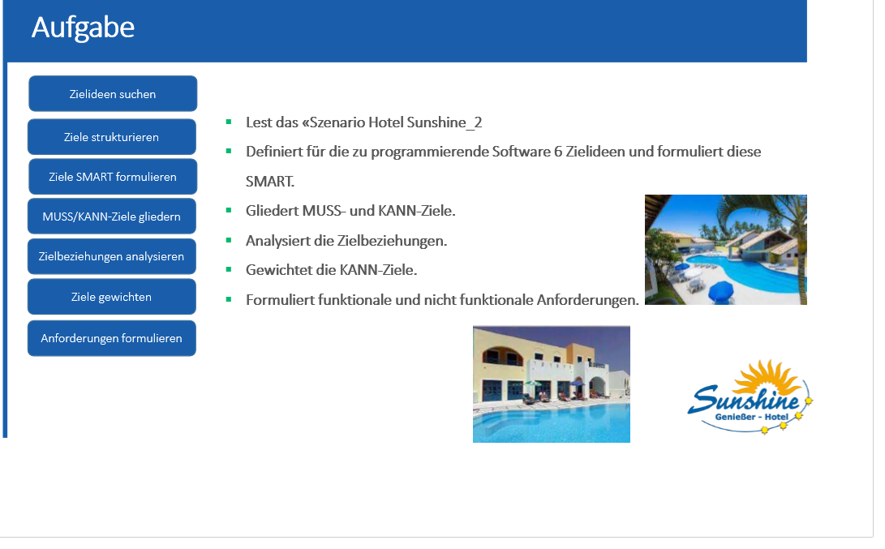

# Szenario Hotel Sunshine 2

Created: 2021-05-26 17:33:09 +0200

Modified: 2021-06-01 14:43:37 +0200

---

6 Zielideen für die Software

**S**pecific: Ziele müssen eindeutig definiert sein, nicht wage, sondern sehr präzise
**M**easurable:Ziele müssen messbar sein. Die Erreichung der Ziele muss gemessen werden können
**A**chievable: Die Umsetzung der Ziele muss auf Grund der Fähigkeiten des MA erreichbar sein
**R**esult-oriented: Es wird beschrieben, was erreichbar werden soll, nicht wie.
**T**ime-related: Ein genauer Zeitpunkt für die Zielerfüllung muss definiert sein.

- Ziel 1: Beim Buchen einer Zusatzleistung via App soll die getätigte Buchung durch den Kunden innerhalb von 5 Minuten automatisch durch das System in das Abrechnungssystem einfliessen.
- Ziel 2: Die durch den Kunden gebuchte Leistung soll nach Abschluss der Dienstleistung vom Kunde in der App bewertet werden können.
- Ziel 3: Zusatzleistungen sollen via Push Nachricht während des Aufenthaltes des -Kunden an den Kunden gesendet werden
- Ziel 4: Beim Starten der App soll ausgewählt werden können, in welcher Sprache - Deutsch, Englisch und Französisch - die App bedient werden soll.
- Ziel 5: Die App muss durch den Kunden ohne IT-Kenntnisse bedient werden können.
- Ziel: Die App soll eine Übersicht aller angebotenen Zusatzleistungen auflisten und diese via Navigation buchbar zur verfügung stellen.

