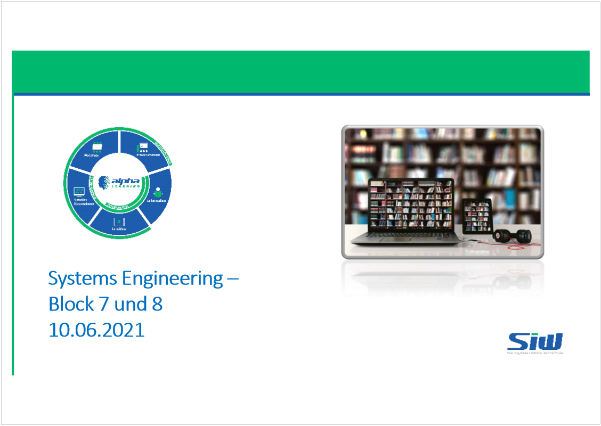
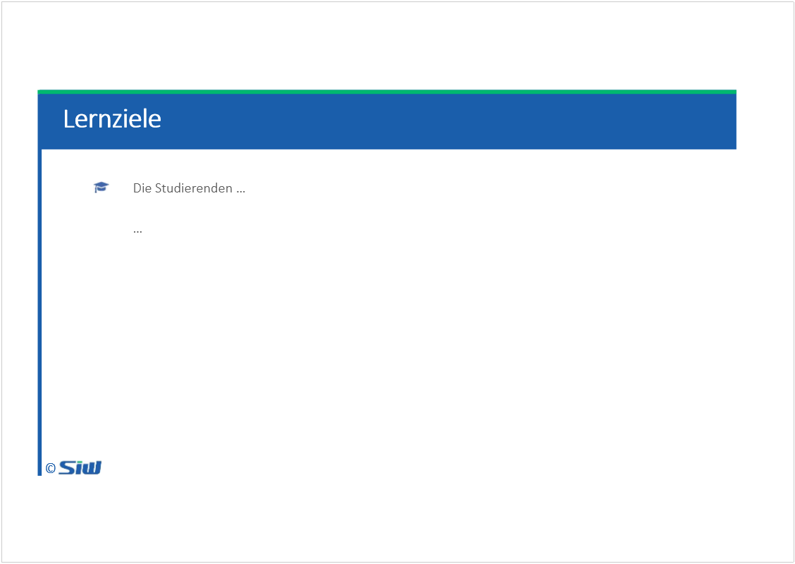
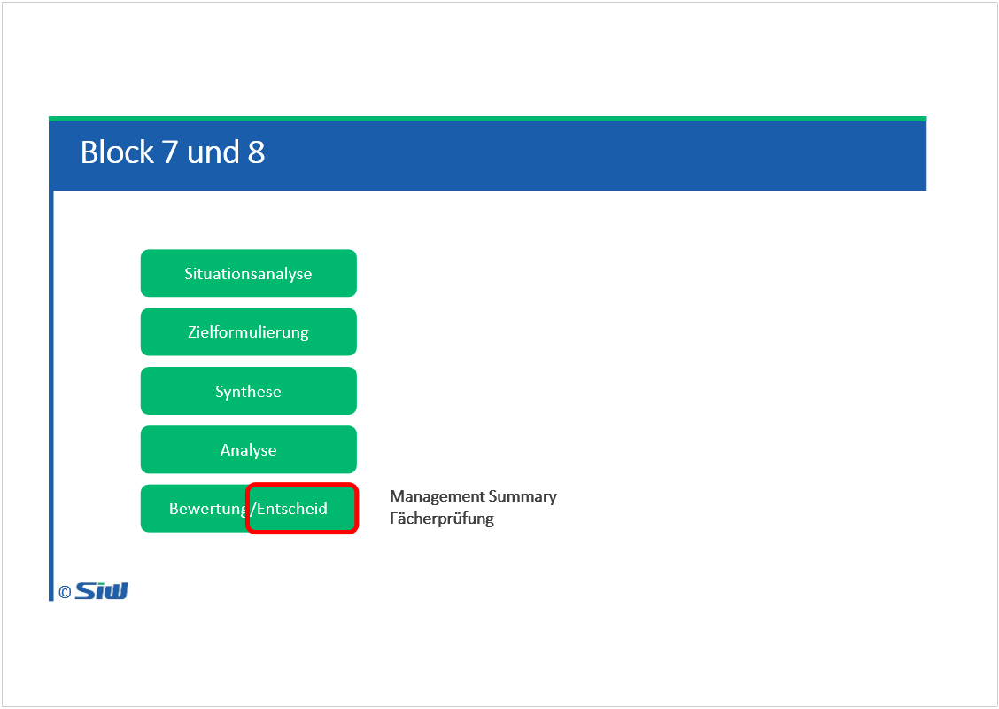

# SYEN: Block 7 und 8

Created: 2021-06-10 18:23:54 +0200

Modified: 2021-09-20 20:15:36 +0200

---

![Computergenerierter Alternativtext: Inhalte des Management Summary © 1.Ausgangslage und Handlungsanlass: Wie sieht die aktuelle Situation aus? Was ist der Anlass der Evaluation? Wichtig: Es muss sich hier nicht immer um eine Problemstellung handeln, es kann auch um die Realisierung von Chancen gehen! 2.Ziele: Was soll mit der Beschaffung/Erstellung erreicht werden? Welcher SOLL-Zustand wird angestrebt? 3.(Anforderungen: Welches sind die wichtigsten Anforderungen? Ausschnitte des Pflichtenheftes darstellen) 4.Vorgehen: Wie verlief die Ausschreibung? Wie hoch war die Responsequote? Nach welchen Kriterien wurden die Offerten bewertet? 5.Lösungsfindung: Welche Anbieter waren in der Endauswahl? Grobe Zusammenfassung der Angebote! 6.Entscheidungsfindung: Zusammenfassung der Entscheidungskriterien: Erfüllung der MUSS-Kriterien Ergebnisse der NWA Ergebnisse der Risikoanalyse Kosten Zeitplan/weiteres Vorgehen 7. Erforderliche Entscheidungen ](../media/S1_01_SYEN_System-Engineering-SYEN--Block-7-und-8-image6.png)![Computergenerierter Alternativtext: Szenario „Weingut Sangiovese" © Das Weingut „Sangiovese" befindet sich im Süden der italienische Insel Sardinien und wird in 3. Generation als Familienbetrieb geführt. Das Gut verfügt über zahlreiche Hektar Weinanbaugebiet, Verarbeitungsstationen (Pressen sowie Lagerung und Abfüllung), einen Hotelleriebetrieb mit 26 Doppelzimmern und drei Suiten, ein Restaurant und attraktive Aussenanlagen. Hotel und Restaurant sind grundsätzlich sehr gut ausgelastet. Zahlreiche Stammgäste suchen das Hotel seit Jahren auf, aber auch neue Gäste verbringen hier gern ihren Urlaub. In der Coronazeithaben das Hotel und das Restaurant nahezu ständig leer gestanden und damit nicht nur keinen Umsatz, sondern durch die laufenden Kosten auch hohe Verluste generiert. Im Sommer 2021 erholt sich der Betrieb langsam. Glücklicherweise lief der Vertrieb des Weins konstant gut, so konnte sich der Betrieb über Wasser halten. Der Tourismus zieht nun wieder an, die Hotels auf der Insel sind gut ausgebucht, die Restaurant freuen sich ebenfalls über hohe Besucherzahlen und Auslastungsquoten. Der Weinvertrieb läuft ebenfalls auf Hochtouren. Diverse Mitarbeiter haben in der Lockdownzeitdie Insel verlassen, die Personaldecke ist dünn. Viele Prozesse sind nicht optimal, aber niemand hat gerade Zeit, sich darum Gedanken zu machen. ](../media/S1_01_SYEN_System-Engineering-SYEN--Block-7-und-8-image7.png)![Computergenerierter Alternativtext: Aktuelle Situation „Weingut Sangiovese" © Giovanni, der Sohn des Inhabers, ist für den Weinvertrieb verantwortlich. Aktuelle läuft es so, dass Kunden (Restaurants oder Einzelhändler) per Telefon oder per Mail bestellen können. Giovanni nimmt die Bestellungen entgegen, schaut dann im Lager nach, ob der gewünschte Wein vorhanden ist in der bestellten Menge und gibt dem Kunden per Mail oder Telefon eine Rückmeldung. Ist der Wein nicht vorhanden oder nicht in ausreichender Menge verfügbar, fragen Kunden oft nach anderen Empfehlungen. Auch für diese muss Giovanni im Lager nachsehen --der Bestellprozess ist aufwändig. Auch das lästige Schreiben der Lieferscheine nervt ihn --und erst die Rechnungen... teilweise vergisst er diese in der Hektik des Alltags. Bei einem Besuch auf dem Weingut erzählt er dir von seinen Problemen. Du schlägst ihm vor, dass es dafür eine digitale Lösung gibt. Giovanni ist skeptisch --er hat wenig Budget zur Verfügung. Du schlägst ihm vor, bei der Problemlösung behilflich zu sein. ](../media/S1_01_SYEN_System-Engineering-SYEN--Block-7-und-8-image8.png)![Computergenerierter Alternativtext: Aufgaben „Weingut Sangiovese" © Aufgabe 1: Stelle die Situation als Bubble Chart dar. Verwende dabei die Begriffe des System Engineering. Aufgabe 2: Analysiere die aktuelle Situation mit einer geeigneten Methode! Aufgabe 3. Definiere 2 konkrete Ziele für die Lösung. Aufgabe 4: Formuliere 3 funktionale Anforderungen. Bewerte diese mit 1-3 Punkten (messbare Kriterien!) Aufgabe 5: Die formalen Kriterien machen in der Lösungsbewertung 40%Punkte aus, die finanziellen Kriterien entsprechend 60%Punkte. Bewerte die 3 Anbieter auf der folgenden Seite! ](../media/S1_01_SYEN_System-Engineering-SYEN--Block-7-und-8-image9.png)![Computergenerierter Alternativtext: Aufgaben „Weingut Sangiovese" © Alle Angaben in CHF: Anbieter A: • Projektkosten: 10'000 • Beschaffungskosten: 40'000 Anbieter B: • Projektkosten: 8'000 • Beschaffungskosten: 60'000 Anbieter C: • Projektkosten: 9'000 • Beschaffungskosten: 65'000 Vergeben werden Punkte von 1-3: Auf die Beschaffungskosten entfallen von den 60 Punkten 40 Punkte, auf die Projektkosten 20 Punkte. Der teuerste Anbieter erhält 0 Punkte, der günstigste alle Punkte. Der mittlere Anbieter erhält anteilige Punkte. ](../media/S1_01_SYEN_System-Engineering-SYEN--Block-7-und-8-image10.png)![Computergenerierter Alternativtext: Fächerprüfung © § Start: 20:15 Uhr (der Link und die Vorlage zur Lösung der Aufgaben erscheinen im Aufgabenkärtchen § Diese Prüfung ist nicht promotionsrelevant! Ihr erhaltet eine Aufgaben, welche ich korrigiere und euch dann ein Feedback gebe. Das ist für euch eine Übung für die Eidgenössische Prüfung und zudem eine Rückmeldung, wo ihr steht, was läuft gut, wo könntet ihr noch Wissenslücken schliessen. § Ihr könnt: diese Option morgen nutzen diese Option später nutzen und die Prüfung später lösen verzichten und die Prüfung nicht lösen. ](../media/S1_01_SYEN_System-Engineering-SYEN--Block-7-und-8-image11.png)

