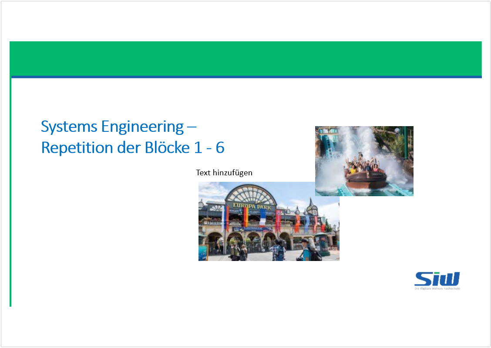
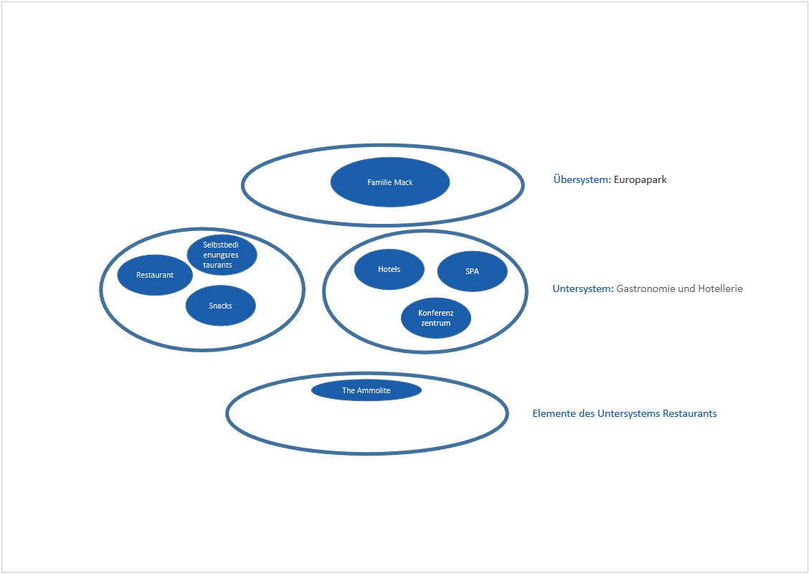

# Repetitionsaufgabe Europa Park

Created: 2021-06-22 17:30:44 +0200

Modified: 2021-06-22 17:31:11 +0200

---

![Computergenerierter Alternativtext: Szenario © DerEuropaParkinRust(D)öffnete1975undwirdaktuellbereitsinder3.GenerationdurchdieFamilieMackgeführt.Das Familienunternehmenistseitherstetiggewachsen.DasletzteGrossprojektwarderBauderWasserwelt„Rulantica",Europas grösstemWasserpark,inklusiveThemenhotelundApartments. NebendenFahrgeschäftenundAttraktionen,welchesichthematischaufeuropäischeLänderbeziehen,verfügtderParküber5 ThemenhotelsjeweilsinklusiveSpa,zahlreicheShows,einmodernesKonferenzzentrum,aufwändiggestalteteGartenanlagensowie vieleunterschiedlicheGastronomieangebote.DiesereichenvonSnacksundSelbstbedienungsrestaurantsimParkbishinzu gehobenerKücheinklusiveeinem2**Restaurant„TheAmmolite"indenHotels. AuchdieThemeneventserfreuensichgrosserBeliebtheit.ZuHalloweenundinderWeihnachtszeitwirdderParkkomplett themenbezogendekoriertundesfindenvieleVeranstaltungenstatt.DurchdasgrosseAngebotsspektrumziehtderParkein breitgefächertesPublikuman:FamilienmitkleinenKindernoderTeenagern,Paare,Singles--fürjedenistetwasdabei.DieLageim DreiländerecksorgtfürBesucherausDeutschland,FrankreichundderSchweiz.AuchausdemRestEuropasistBesuchernderPark eineReisewert. UmdenBesuchernimmerwiederneueAttraktionenanbietenzukönnen,wirdderParkkontinuierlichverändertunderweitern.Die Fahrgeschäfts(KarussellsundAchterbahnen)werdenmehrheitlichindemeigenenProduktionsstandortinderNäheangefertigt. UmimmerdenneuestenTrendsgerechtzuwerden,sindScoutsweltweitinFreizeitparksunterwegsundlassensichdort inspirieren.InsbesondereimBereich„VirtualReality"hatderParkeineVorreiterpositionundwurdemitdiversen Innovationspreisenausgezeichnet. ](../../media/S1_01_SYEN_System-Engineering-Repetitionsaufgabe-Europa-Park-image2.png)

![Computergenerierter Alternativtext: Ausgangslage NachdemdergesamteParkCoronabedingtwochenlangschliessenmusste,wurdedieseram21.Maiunter derEinhaltungeinesklardefiniertenHygienekonzeptswiedereröffnet,am03.JuniöffnetedieWasserwelt „Rulantica"wieder.DerAnsturmaufdieverfügbarenTicketsistenorm.AuchdieHotelssindsofort ausgebucht(diesedürfennurzu60%belegtwerden).BedingtdurchdiePandemieerlittderParkenorme Umsatzeinbussen.AufGrundderHygienemassnahmen(esdarfnureinesehrlimitierteAnzahlTickets herausgegebenwerden)kannderParkauchjetztnichtandieüblichenUmsatzzahleninderHauptsaison anknüpfen.ZahlreicheMitarbeitersindnochinKurzarbeitundkönnennurbegrenzteingesetztwerden.Dies sollbisaufWeiteresbeibehaltenwerden,dadieGesamtauslastungaufGrundderBestimmungengeringen istundsoKostengespartwerdenkönnen.DasbisherigePersonalkonzeptfunktioniertalsonichtmehr. BislangwareinMitarbeiterimmernurineinemEinsatzgebiettätig--nunistFlexibilitätgefragt!Die MitarbeitermüssenzwischenBahnenBetreuung,Restaurantservice,MitwirkenindenParaden, ZimmerserviceundReinigungindenHotelssowieBetreuungderSpaswechseln.Dabeihabensiezumeinen teilweiselangeräumlicheDistanzenzurückzulegen,zumanderenmüssensiedasKostümjenach Themenbereichwechseln.OftistdieZeitdafürzuknapp,sodasssieverzögertamneuenArbeitsplatz eintreffenundteilweisefürdieKundeninderGastronomie,andenBahnenoderanderswoWartezeiten entstehen.DieserZeitstressbelastetdieMitarbeiterundführtauchoftzuDiskussionen--dasBetriebsklima leidet,dieKundensindunzufrieden. ](../../media/S1_01_SYEN_System-Engineering-Repetitionsaufgabe-Europa-Park-image4.png)
![Computergenerierter Alternativtext: Ausgangslage/ Aufgabe 1 -3 • OftsinddieMitarbeiterindieneuenTätigkeitsfeldernichtwirklicheingearbeitet--esmussteebenalles schnellgehen,derMehrbedarfanPersonalwirdandeneinzelnenArbeitsstellenzuspäterkanntund auchnichtschnellgenugkommuniziert.SopassierenFehler:DieProzesseindenRestaurantslaufennicht rund:DieTischewerdennichtrechtzeitigabgeräumt,KundenwartenewigaufihreBestellungen.ImSpa- Bereichwirdnichtsorgfältiggereinigt--auchhierKundenbeschwerden. • Aufgabe1: • Stelle die Systemzusammenhänge grafisch dar. Verwendet dabei die relevanten • Begriffe des Systems Engineering • Aufgabe2: • Die Unternehmensleitung hat von den Beschwerden der Mitarbeiter und der Kunden Kenntnis genommen. Sie setzen dich als externen Unternehmensberater ein. Mit welchen Erhebungsmethoden verschaffst du dir einen Überblick über die aktuelle Situation? Begründe deine Antwort! • Aufgabe3: • Stelle die aktuelle Situation methodisch dar (Ursachen-/Wirkungsdiagramm ODER FishboneODER Stärken-/Schwächen-Analyse) und formuliere anschliessend die Problemstellung in einem Satz! ](../../media/S1_01_SYEN_System-Engineering-Repetitionsaufgabe-Europa-Park-image5.png)
![Computergenerierter Alternativtext: Aufgabe2: • Die Unternehmensleitung hat von den Beschwerden der Mitarbeiter und der Kunden Kenntnis genommen. Sie setzen dich als externen Unternehmensberater ein. Mit welchen Erhebungsmethoden verschaffst du dir einen Überblick über die aktuelle Situation? Begründe deine Antwort! Antwort 1.Fragebogen Anonym 2.Multimomentstudie 3.Interview Begründung: Der Anonyme Fragebogen wird an die Mitarbeiter, sowie die Kunden verteilt, welche eine Anmerkung machen wollen. Die Auswertung ermöglicht eine Momentaufnahme, das einfangen der aktuellen Stimmungslage und ist vermutlich Anschliessend kann in einer Multimomentstudie an verschiedenen im Fragebogen sowie von der GL bemängelten Situationen eine Abbildung und gegebenenfalls Auswertung der Aktuellen IST-Situation durch eine nicht Emotional oder Prozessual involvierte Person vorgenommen werden. Zum Abschluss kann durch gezielte Interviews die Tiefe der Probleme ermittelt werden und so eine umfassende Situationsanalyse ausführen zu können. ](../../media/S1_01_SYEN_System-Engineering-Repetitionsaufgabe-Europa-Park-image8.png)

![Computergenerierter Alternativtext: Ziele und Anforderungen / Aufgabe 4 -6 DieParkleitunghatentschieden,dasseinedigitaleLösungfürdieKoordinationdesPersonalsvorhandensein muss.JedeArbeitsstation(Gastronomie,Hotel,Fahrgeschäfte,Spa)verfügtübermindestenseinLaptop,alle MitarbeiterhabenzudemeinFirmenhandy.ProArbeitsstationgibtesinjederSchichteinenverantwortlichen Schichtleiter.DiesersollimRhythmusvon10'einStatementzurPersonalunter-oderÜberdeckungabgeben. DamitsollvoneinerzentralenStelleausdasPersonalundggf.Personalwechselzwischenden Arbeitsstationenkoordiniertwerden.EswerdenLizenzenfür1'500Mitarbeiterbenötigt. Aufgabe4: DubistweiterhinalsexternerBeratertätig.DefinieremessbareZielefürdieseApplikation. Aufgabe5: LeiteausdiesenZiele4funktionaleAnforderungenab. Aufgabe6: DefinierefüralleAnforderungenmessbareKriterien.(Punkte1--3). ](../../media/S1_01_SYEN_System-Engineering-Repetitionsaufgabe-Europa-Park-image10.png)
![Computergenerierter Alternativtext: Aufgabe4: DubistweiterhinalsexternerBeratertätig.Definieremessbare ZielefürdieseApplikation. ZielMUSS KANN Die Applikation muss gesichert werden. X Die Applikation muss Online Verfügbar sein X Die Applikation muss innerhalb der nächsten 4 Monate eingeführt werden. X Die Applikation muss durch jeden Mitarbeiter bedienbar sein. X Die Applikation muss auf Laptop und Smartphone laufen X Der Abgleich des Belegungssystems soll alle 10 Minuten ausgeführt werden. X Die Lizenzkosten sollen 150'000 € nicht überschreiten X Die Wartungsaufwand der Applikation soll 2h im Monat nicht überschreiten X ](../../media/S1_01_SYEN_System-Engineering-Repetitionsaufgabe-Europa-Park-image11.png)
![Computergenerierter Alternativtext: Aufgabe5: LeiteausdiesenZiele4funktionaleAnforderungenab. Aufgabe6: DefinierefüralleAnforderungenmessbareKriterien.(Punkte1-- 3). Funktionale Anforderungen Kriterien Die Software führt den Abgleich des Systems alle 10 Minuten automatischgüber alle Bereiche aus 1P: Kein automatischer Abgleich 2P: Automatischer Abgleich zwischen 10 und 15 Minuten 3P: Automatischer Abgleich alle 10 Minuten Die Applikation muss auf Windows, Android und IOS laufen 1P: Die Applikation läuft nur auf Laptops 2P: Die Applikation läuft auf nur 2 Betriebssystemen 3P: Die Applikation läuft auf allen 3 Betriebssystemen Die Applikation muss via Web und App verfügbar sein1P: Die Applikation ist nicht per Web Verfügbar 3P: Die Applikation ist via Web und Die Datensicherung muss einmal täglich eine Vollsicherung ausführen und alle 15 minuteneine differentielle Sicherung 1P: Die Datensicherung wird nicht nach den Vorgaben ausgeführt 3P:Die Datensicherung wird nach den Vorgaben ausgeführt ](../../media/S1_01_SYEN_System-Engineering-Repetitionsaufgabe-Europa-Park-image12.png)
![Computergenerierter Alternativtext: Bewertung / Aufgabe 7 NachderAusschreibungundSichtungderOffertenhabensich4AnbieterfürdieDetailauswahlqualifiziert. KostenangabensindinderfolgendenTabellezufinden.AlleAngabeninCHF: Aufgabe7: DieKostenwerdenzu50%PunktegegenüberdenfunktionalenAnforderungengewichtet.Dabeientfallen: 25PunkteaufdieBeschaffungskosten 10PunkteaufdieProjektkosten 15PunkteaufdieLizenzkosten. DieinderKategoriegünstigsteAnbietersolldievollePunktzahlerhalten,derteuersteAnbietersollkeine PunkteerhaltenunddiebeidenmittlerenAnbietersollenanteiligePunktebekommen.Berechneineiner TabellediePunktefürdie4AnbieterimKostenbereich.StellefürdiemittlerenAnbieterdieFormeldar! KriteriumAnbieter AAnbieter BAnbieter CAnbieter D Beschaffungskosten250'000180'000320'000360'000 Projektkosten90'00065'00050'00060'000 LizenzkostenPro 100 Lizenzen 400 CHF einmalig Pro 500 Lizenzen15 CHF einmalig Pro Einzellizenz 10frei ](../../media/S1_01_SYEN_System-Engineering-Repetitionsaufgabe-Europa-Park-image13.png)
![Computergenerierter Alternativtext: KriteriumAnbieter AAnbieter BAnbieter CAnbieter D Beschaffungskosten250'000180'000320'000360'000 Projektkosten90'00065'00050'00060'000 LizenzkostenPro 100 Lizenzen 400 CHF einmalig Pro 500 Lizenzen15 CHF einmalig Pro Einzellizenz 10frei Aufgabe7: Kriterien Stufe 1Kriterien Stufe 2Anbieter AAnbieter BAnbieter CAnbieter D Kosten 50P Beschaffungskoste n: 25P (360'000 --250'000) / (360'000 --180'000) * 25 16 25 (360'000 --320'000) / (360'000 --180'000) * 25 5P O Projektkosten 10P0 (90'000 --65'000) / (90'000 -- 50'000) * 10 6 10 (90'000 --60'000) / (90'000 -- 50'000) * 10 8 Lizenzkosten 15P (15000 --6000) / (15000 -0) * 15 9 (15000 --45) / (15000 -0) * 15 15 (durch rundung) 015 Summe:50P25P56P15P23P Formel:(grössteSumme-GeforderteSumme)/(grössteSumme --günstigstesumme)*gewichtungspunkte DiePunktewurdenaufgerundetbeirundungsdifferenzennach 0.75>undbei0.24< ](../../media/S1_01_SYEN_System-Engineering-Repetitionsaufgabe-Europa-Park-image14.png)

