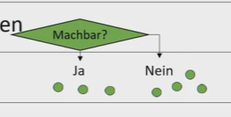

# Lernvideo 1 - Sequenz 1: Problemlösungszyklus

Created: 2021-05-24 11:19:49 +0200

Modified: 2021-09-20 20:12:41 +0200

---

Einfachste Behebung eines Problems durch Problemlösungszyklus.

SZSABE

Situationsanalyse

Zieldefinition

Synthese

Analyse

Bewertung

Entscheid

Situationsanalyse (IST-Zustand):

Ist Zustand bspw. Mittels Bubblechart

Stärken, Schwächen mittels Fishbone beispielsweisse

Zieldefinition (SOLL-Zustand):

Muss- und Kann Ziele unterscheiden

<table>
<colgroup>
<col style="width: 18%" />
<col style="width: 46%" />
<col style="width: 35%" />
</colgroup>
<thead>
<tr class="header">
<th></th>
<th>Muss-Ziel</th>
<th>Kann-Ziel</th>
</tr>
</thead>
<tbody>
<tr class="odd">
<td>Art des Ziels</td>
<td>K.O Ziel</td>
<td>Optional</td>
</tr>
<tr class="even">
<td>Zweck</td>
<td>
Wird Ziel nicht erreicht, ist gesamte Lösung

Nicht mehr interessant
</td>
<td>
Wird ein Kann-Ziel nicht erreicht,

wird nur ein

Mehrwert nicht erreicht
</td>
</tr>
<tr class="odd">
<td>Notwendig für:</td>
<td>Analyse</td>
<td>Bewertung</td>
</tr>
<tr class="even">
<td>Evaluation</td>
<td></td>
<td>Einfache Gewichtung 
Stufenweise Gewichtung 
Präferenzmatrix</td>
</tr>
</tbody>
</table>

Synthese:

Suche nach Lösungen

Kann mittels Kreativitätstechniken erreicht werden.

Brainstorming, Methode 6-3-5

Ziel: Möglichst viele Lösungen definieren (unabhängig von der Machbarkeit)

Analyse:

Einsetzen der Muss-Ziele. Überprüfung ob die definierten Lösungen bei Synthese machbar sind

Entfernen der Lösungen, welche nicht allen Muss-Zielen entsprechen.

Bewertung:

Machbare Lösungen gegenüberstellen und priorisieren

Bspw. Mit der Nutzwertanalyse und der Kosten / Nutzenanalyse --> Reihenfolge definieren

Entscheid:

Die Lösung aus der Bewertung mit der höchsten Bewertung

