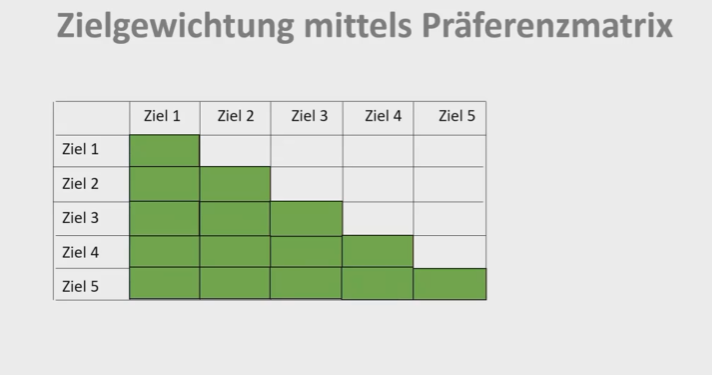

# Lernvideo 1 - Sequenz 1: Zielgewichtung mittels Präferenzmatrix

Created: 2021-05-24 11:20:01 +0200

Modified: 2021-09-20 20:12:28 +0200

---

Allgemeine Informationen

Ziele werden paarweise verglichen

Ziele zuerst vertikal, dann horizontal auflisten

Anschliessend Raster hinzufügen

Jedes Ziel wird mit anderen verglichen

Doppelter Teil wird deaktiviert (grün):

Ziele gegenüberstellen, anschliessend zusammenzählen

