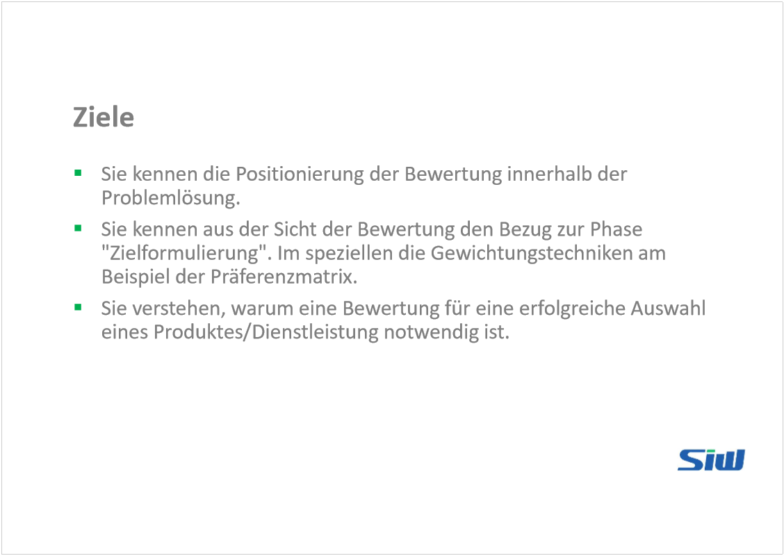
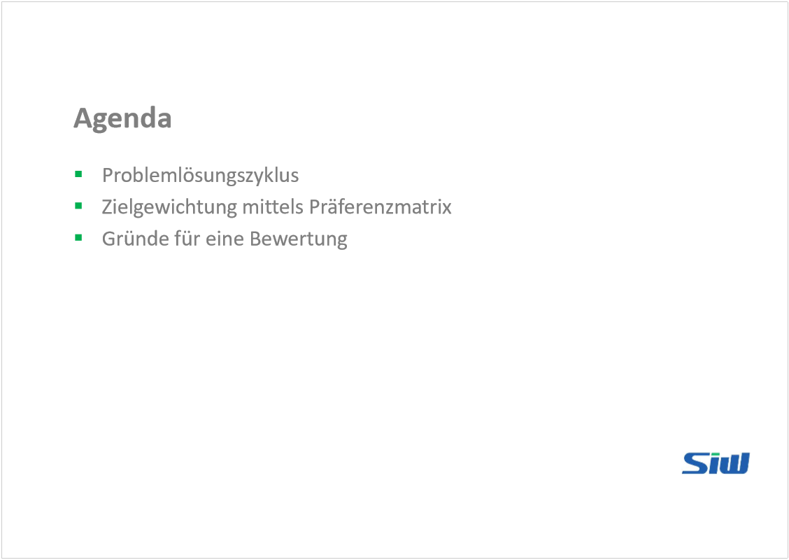
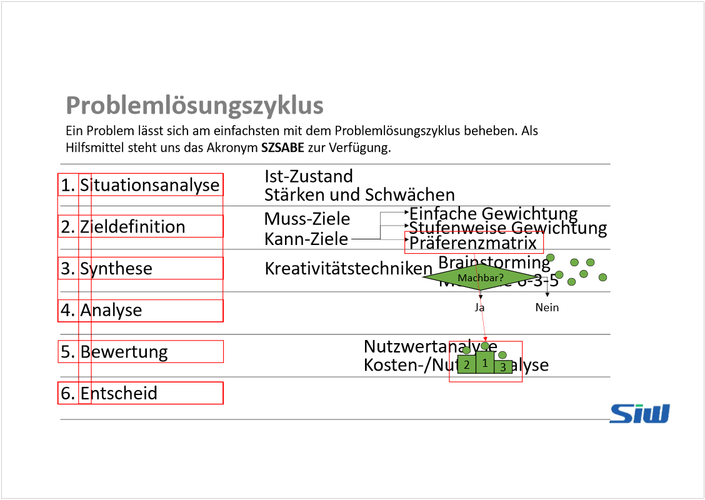
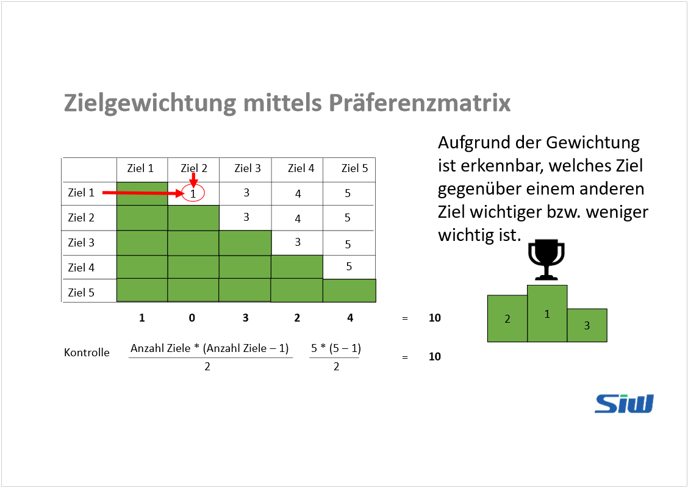
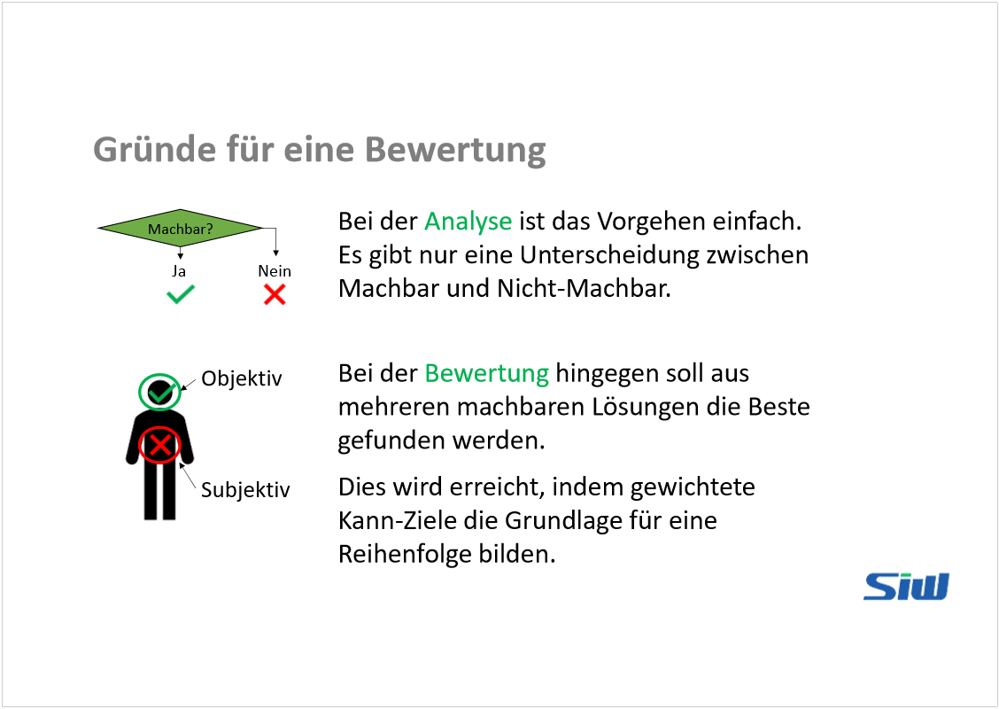
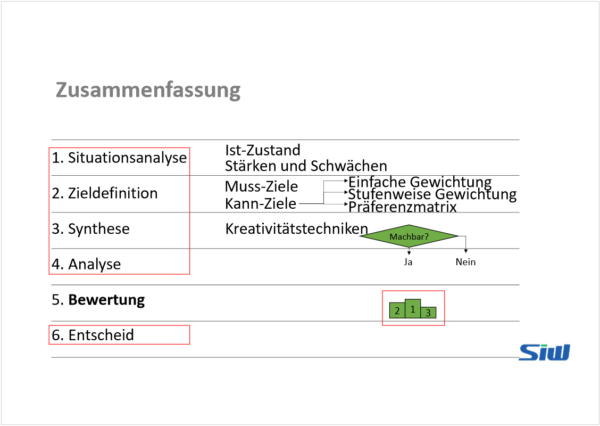

# Lernvideo 1 - Sequenz 1

Created: 2021-09-20 19:54:53 +0200

Modified: 2021-11-18 18:39:39 +0100

---

In Zelle steht keine Gewichtung, sondern das Ziel, wlches höher priorisiert ist.
Die Zahlen unter dem Diagramm stehen für die Anzahl des Ziels (in der Matrix befinden sich also 4x das Ziel Nr. 5)

