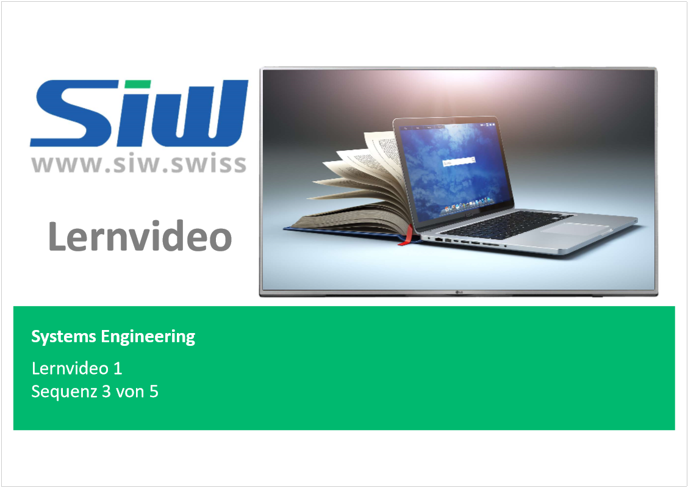
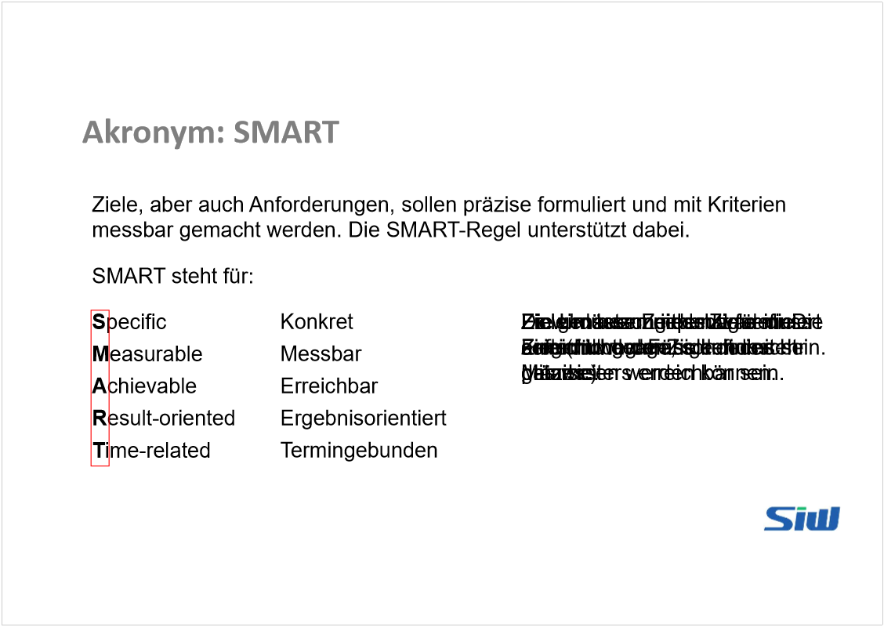

# Lernvideo 1 - Sequenz 3

Created: 2021-09-20 19:55:31 +0200

Modified: 2021-09-20 20:11:24 +0200

---

Specific: Ziele müssen eindeutig definiert sein, nicht wage, sondern sehr präzise

Measurable:Ziele müssen messbar sein. Die Erreichung der Ziele muss gemessen werden können

Achievable: Die Umsetzung der Ziele muss auf Grund der Fähigkeiten des MA erreichbar sein

Result-oriented: Es wird beschrieben, was erreichbar werden soll, nicht wie.

Time-related: Ein genauer Zeitpunkt für die Zielerfüllung muss definiert sein.

Sobald mehrere Interessengruppen Ziele formulieren, können Zielkonflikte entstehen.

Für eine Ferienreise wurden innerhalb einer Familie folgende Ziele definiert;

Es gibt:

**Neutrale Zielbeziehung**: Es bestehen keine Abhängigkeiten (Bsp. Zwischen "viel gutes Essen" und "Museumsbesuche"

**Komplementäre Zielbeziehungen**: Komplementäre Ziele unterstützen sich gegenseitig Bsp. "möglichst günstig" und "abnehmen"

**Widersprüchliche Zielbeziehung**: Die Ziele wiedersprechen sich und heben sich komplett gegenseitig auf. Bsp. "viel gutes Essen" und "abnehmen"

**Konkurrenzierende Zielbeziehung**: Wird das eine der konkurrenzierenden Ziele stark verfolgt, wird die Erreichung des anderen vernachlässigt. Bsp. "Museumsbesuche" und "Viel Spass und Spiel"

Warum gibt es einen Widerspruch zwischen 3 und 5?

