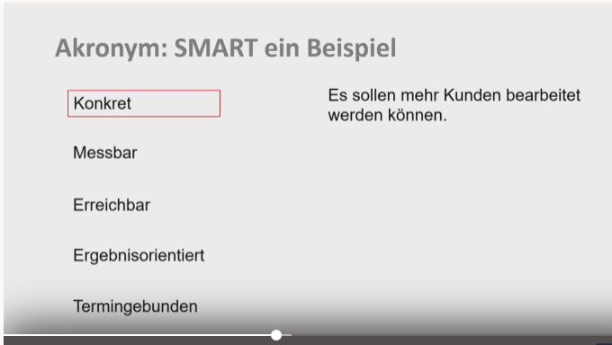
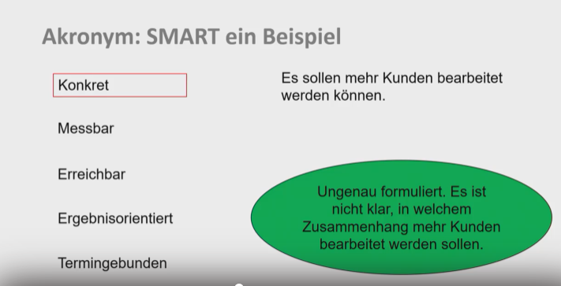
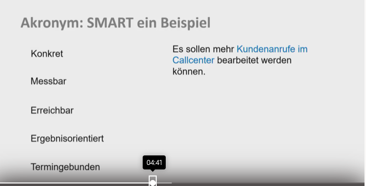
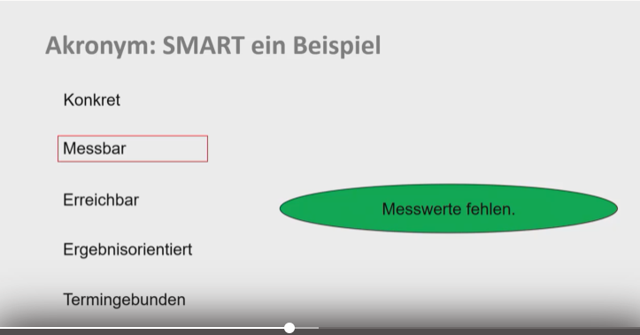
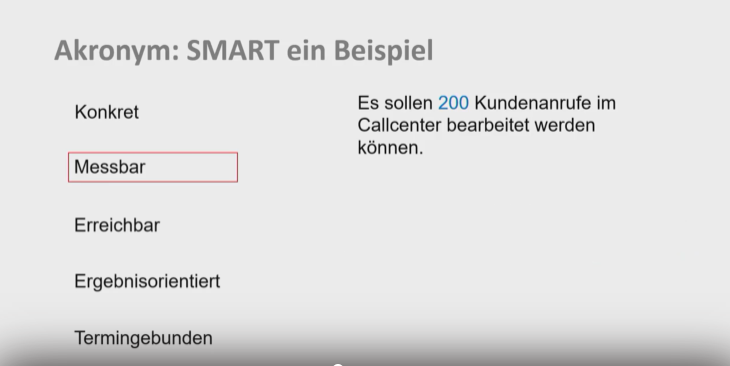
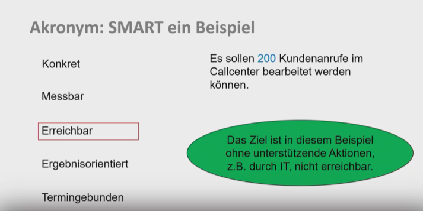
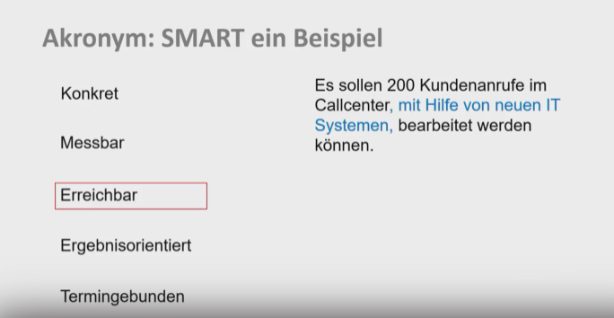
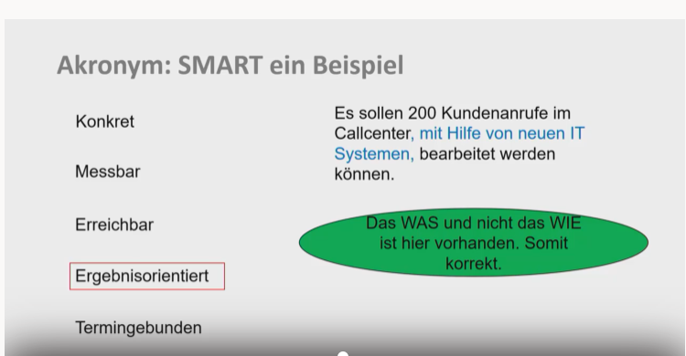
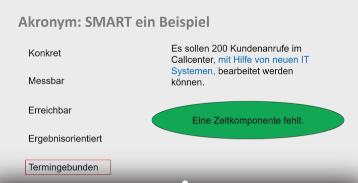
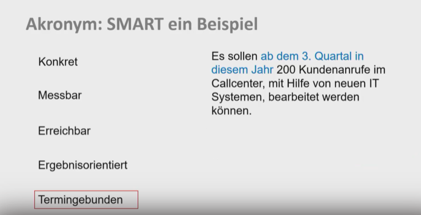

# SMART Beispiel ohne Folienfehler

Created: 2021-05-24 12:41:43 +0200

Modified: 2021-11-18 18:53:30 +0100

---

Besser:

Messbar:

Besser:

Erreichbar:

Besser:

Ergebnisorientiert:

Termingebunden:

Besser:

