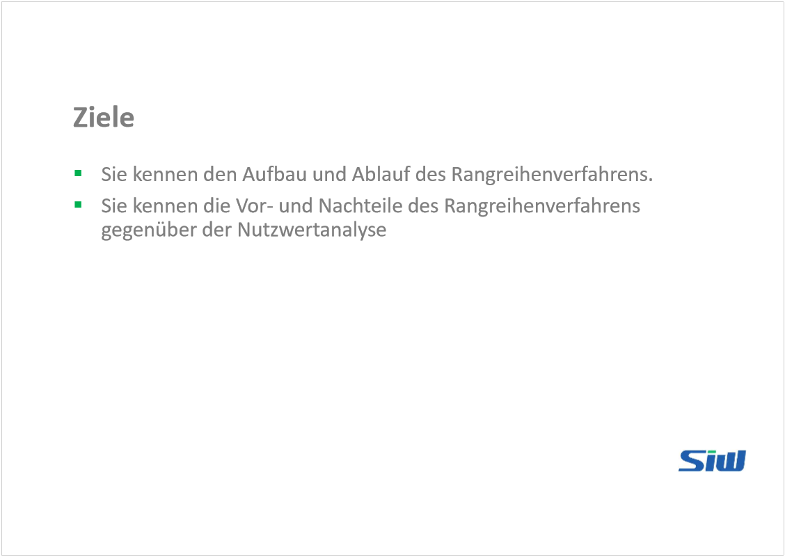
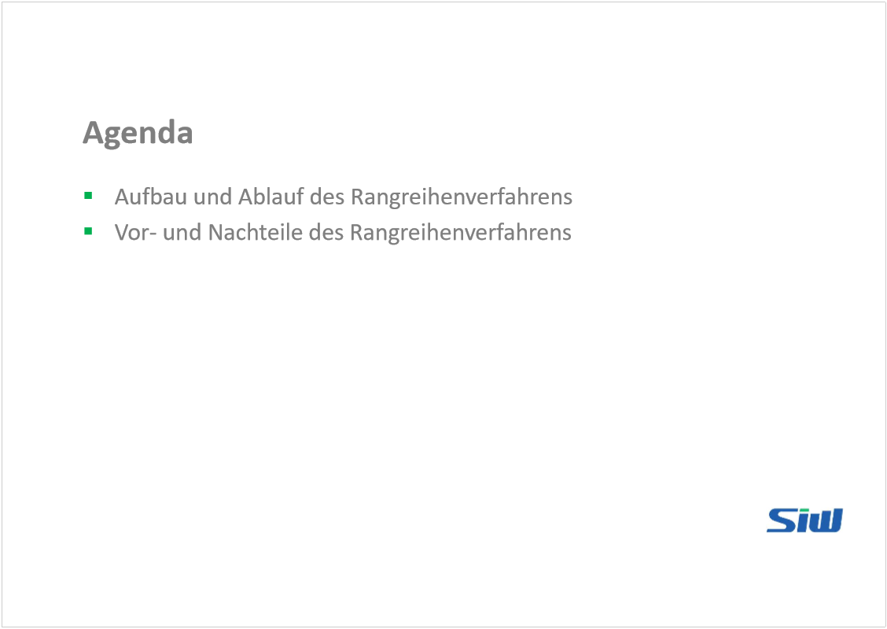
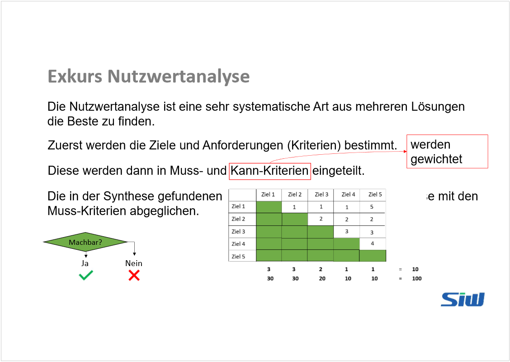
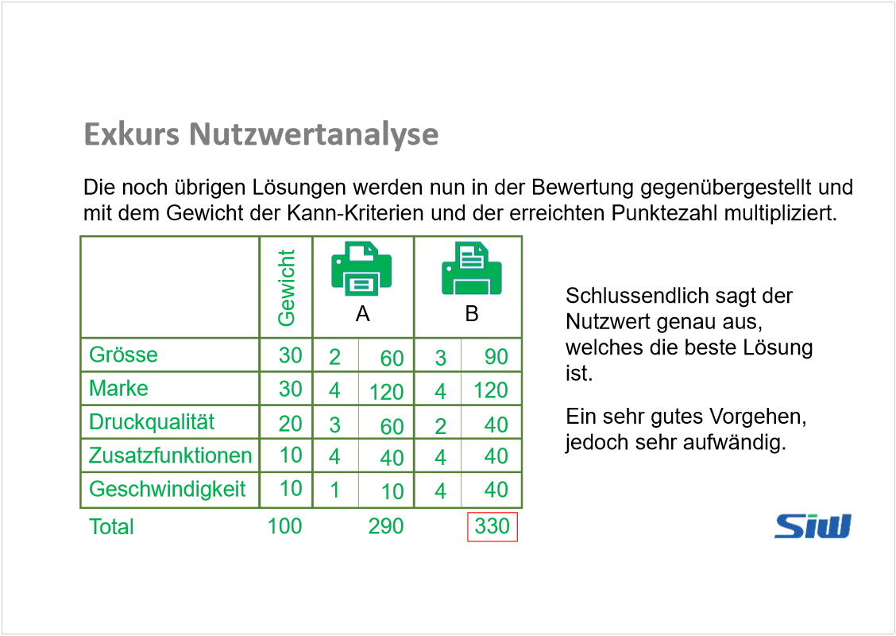
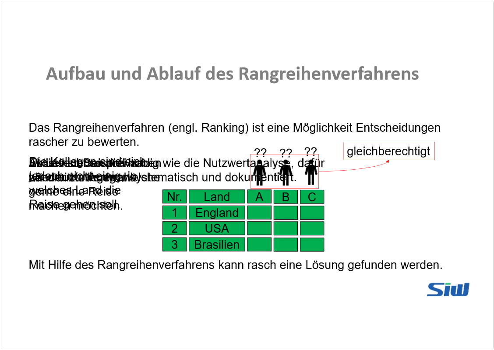
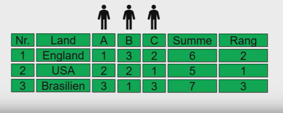
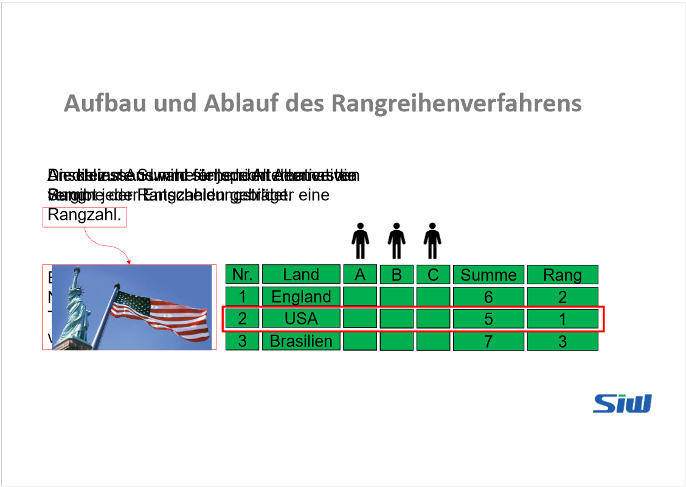
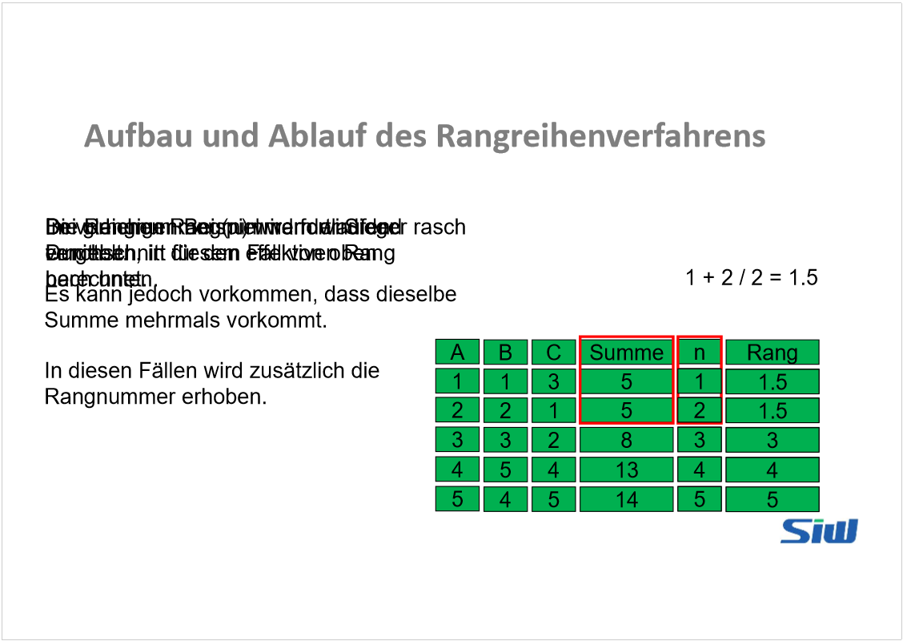
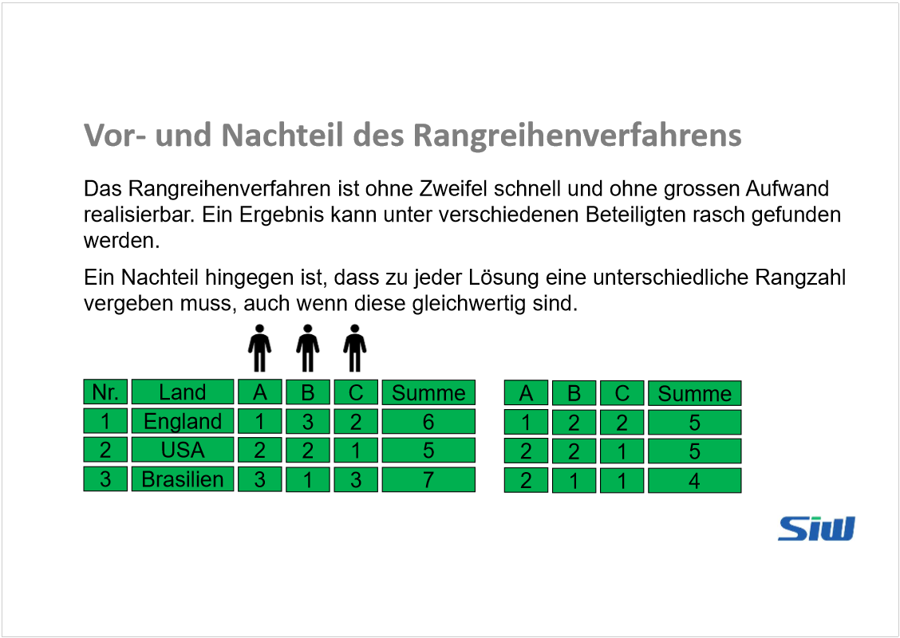
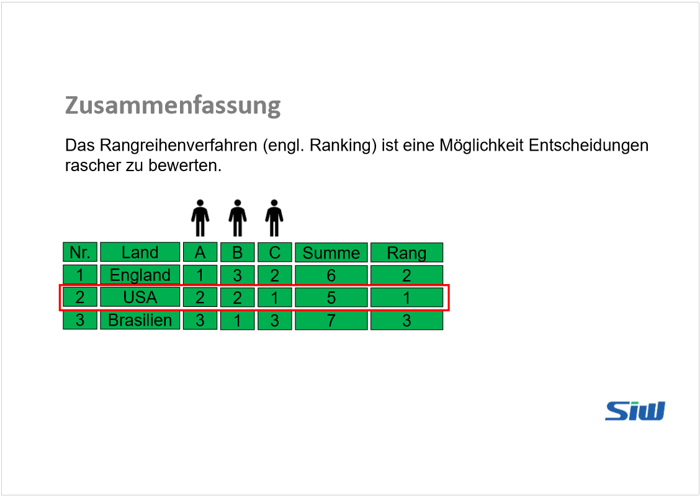

# SYEN_Folien_LV_1_5

Created: 2021-05-24 11:44:47 +0200

Modified: 2021-05-24 13:25:50 +0200

---

Alle Beteiligten haben das gleiche Stimmrecht: gleichberechtigt.

Es sgtehen 3 Länder zur Auswahl (In Tabelle ersichtlich

Die Kollegen sind sich nicht einig, in welches Land die Reise gehen soll.

Jeder Entscheidungsträger vergibt eine Rang-zahl an die verschiedenen Alternativen-

Fortlaufende Nummer, welche pro Teilnehmer nur einmal vorkommen kann.

Die kleinste Summer entspricht dem ersten Rang.

Um das Korrekte Ergebnis zu erhalten, wird bei gleicher Summe wie folgt vorgegangen.

Die Rangnummer (n) wird fortlaufend vergeben, in diesem Fall von oben nach unten.

Bei gleichen Rangnummern wird der Durchschnitt für den effektiven Rang berechnet.

