# ITIL: Block 1 und 2

Created: 2021-09-09 18:24:30 +0200

Modified: 2021-11-18 22:05:38 +0100

---

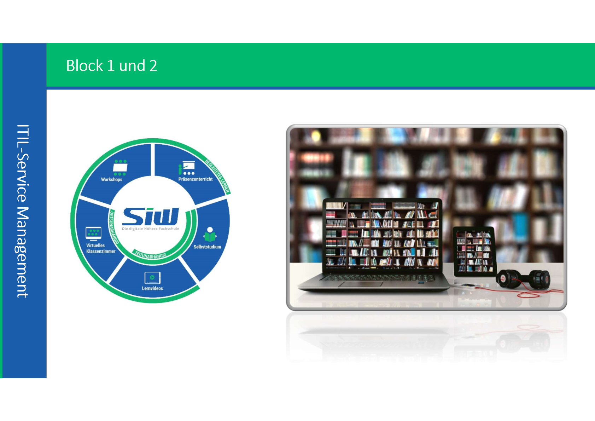

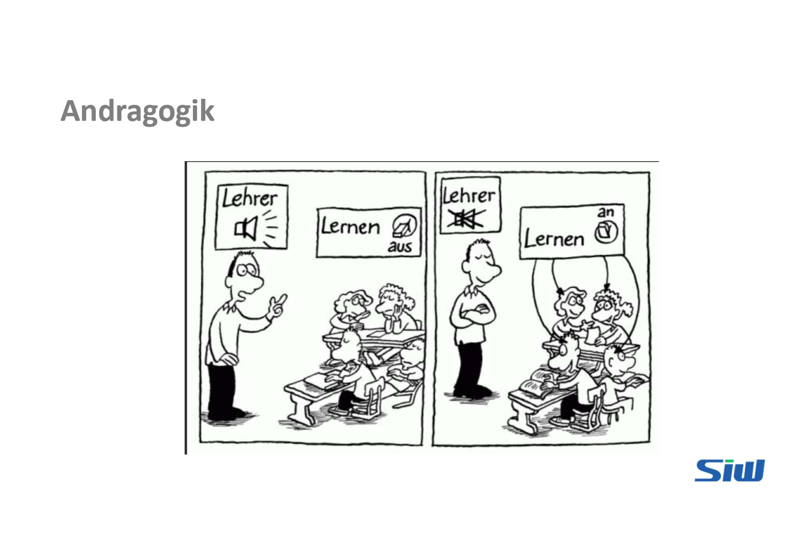

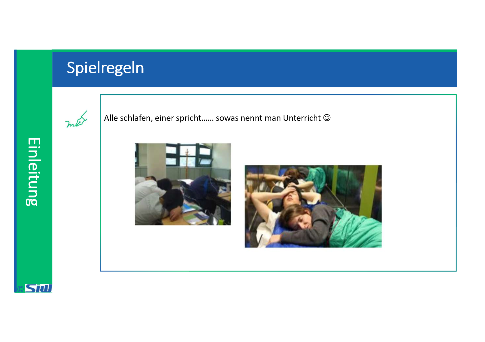

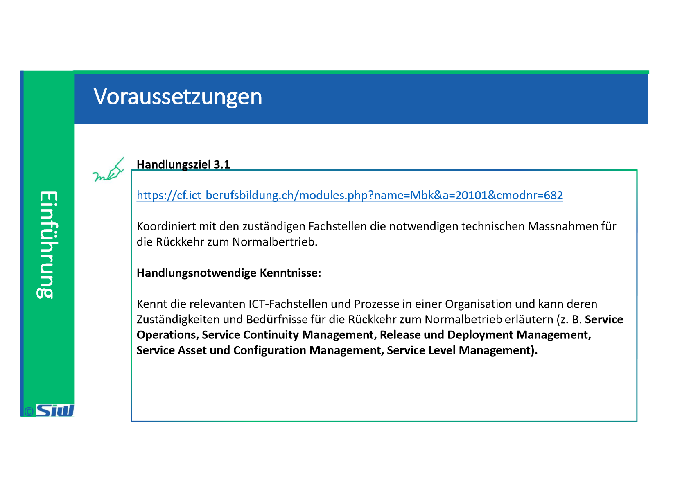

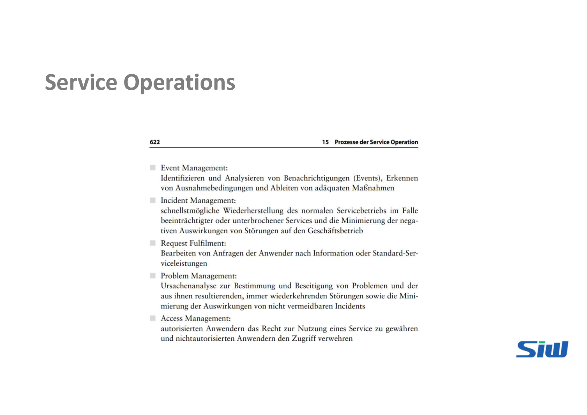

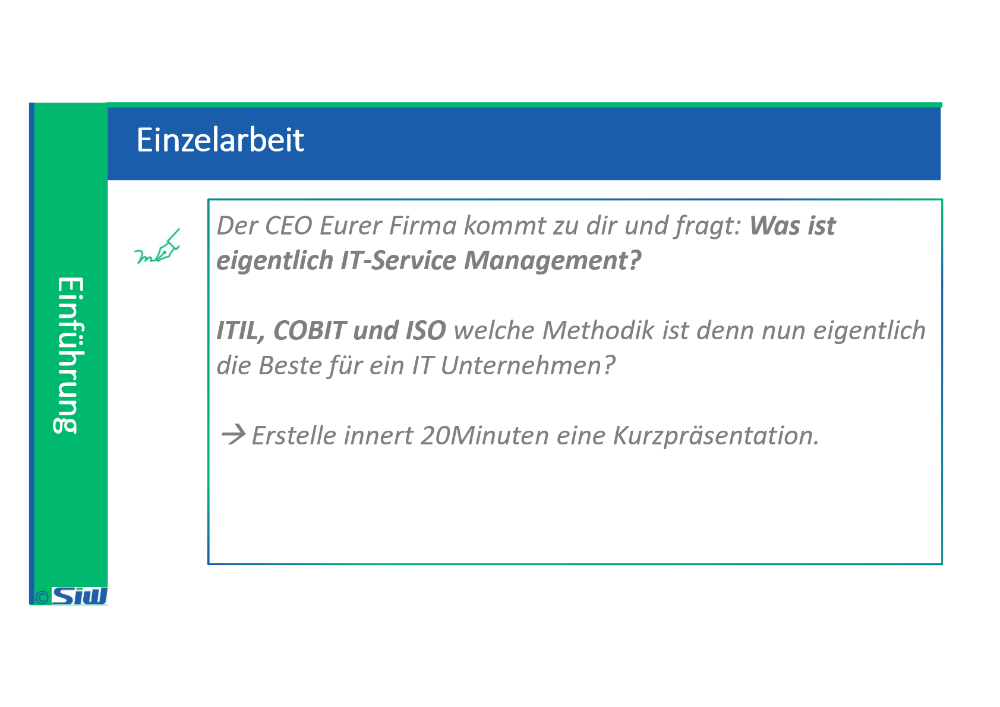

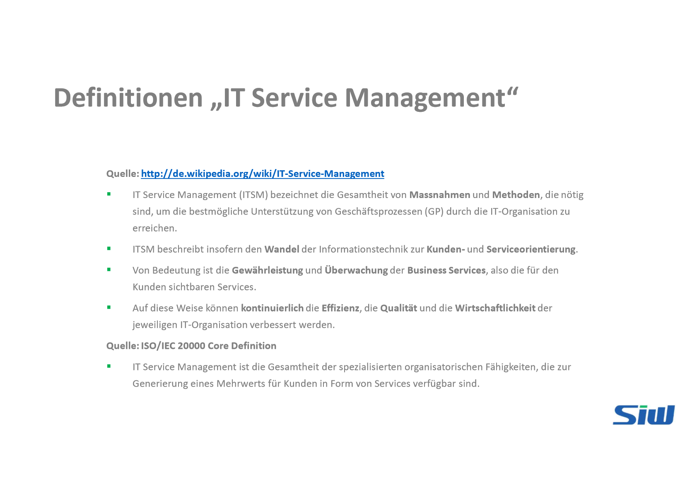

![Was sind IT Prozesse und wieso sind diese nötig? Definition nach DIN/ISO 9000 Ein Prozess ist ein Satz von in Wechselbeziehungen stehenden Mitteln und Tätigkeiten, die Eingaben in Ergebnisse umwandeln. Zu den Mitteln können Personal, Einrichtungen und Anlagen, Technologie und Methodologie gehören. Weitere Definition Ein Prozess ist eine Folge von definierbaren, wiederholbaren und messbaren Tätigkeiten, welcher zu einem nützlichen Resultat (Output) für einen externen oder internen Kunden führt. Vielfach wird der Prozess durch eine Eingabe (Input) angestossen. Prozess Verarbeitung Output Ein Prozess ist eine Folge von wiederholbaren Aktivitäten und charakterisiert durch: Definierten Input _ Wertschöpfung/Veredelung Messbaren Output SiUJ ](../media/S1_03_ITIL_Service-Management-und-Case-Study-ITIL--Block-1-und-2-image12.png)

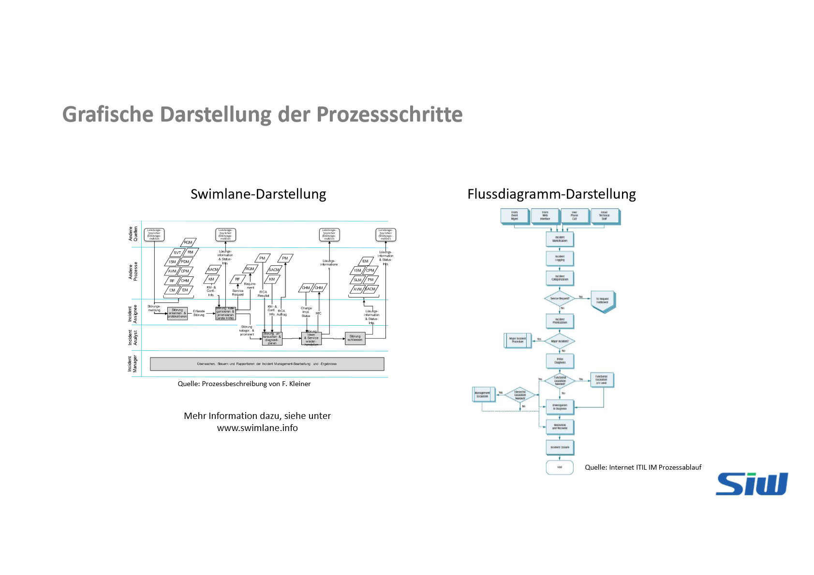

![Rollen im Prozess-Management Die Rollen für das Prozess-Management (in anderen Literaturen auch Process Governance genannt) sind sehr wichtig. Dazu werden grundsätzlich zwei Rollen etabliert: IT Process Owner (Prozesseigentümer) • Gesamtverantwortung für den entsprechenden IT-Prozess von der Definition bis zur Nutzung und Verbesserung • Rapportiert die einzelnen KPls in den regelmässigen Bereichs- oder Führungs-Meetings Stellt finanzielle Mittel für die Umsetzung oder Verbesserung des Prozesses zur Verfügung • Verfügt über ausreichende Autorität (ist vielfach Mitglied der obersten Führungsebene) Ist vielfach für mehrere Prozesse verantwortlich IT Process Manager (Prozessmanager) Verantwortlich für die Definition, Umsetzung, Schulung und Kontrolle des Prozesses Erstellt und wartet die Prozessbeschreibung, Prozessumsetzungsgrundlagen und die Arbeitsanweisungen (WINs) basierend auf dem eingesetzten Tool, welches den Prozess unterstützt Oft übernimmt der Process Manager auch die entsprechende Verantwortung für Anpassungen und Erweiterungen des eingesetzten Tools Misst die Einhaltung des Prozesses basierend auf den definierten KPls und berichtet diese dem IT Process Owner Leitet, falls nötig, Prozessverbesserungsmassnahmen ein SiUJ ](../media/S1_03_ITIL_Service-Management-und-Case-Study-ITIL--Block-1-und-2-image15.png)

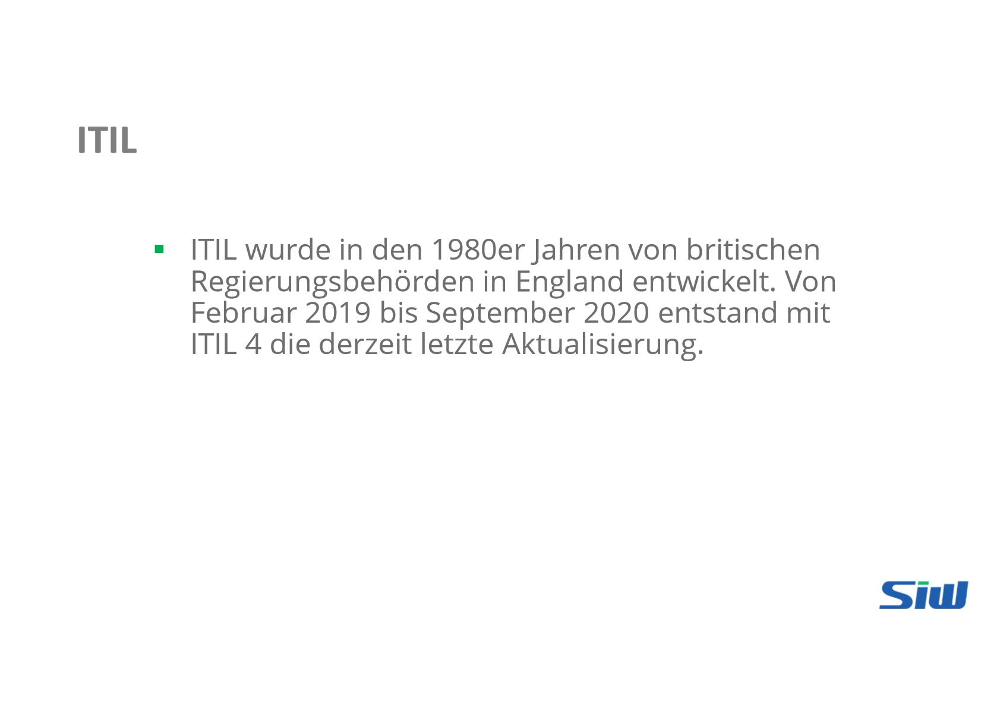

![ITIL V3 vs ITIL V4 I TIL V3 beschrieb den Service-Lifecycle und hat entsprechende Prozesse!! definiert. ITIL 4 beschreibt Prinzipien, Konzepte und Praktiken. Dies umfasst Schlüssel-Aktivitäten und die wichtigsten Inputs und Outputs für jede Praktik, aber nicht detaillierte Prozess-Spezifikationen. Diese Abkehr vom früheren prozess-orientierten Ansatz ist eine grundlegende Anderung in ITIL 4, die es Service-Providern besser ermöglicht, flexible Betriebsmodelle einzuführen I TIL 4 macht bezüglich der Prozesse also keine Vorschriften. ITIL 3 Prozesse ITIL V4-> Praktiken (Practices) SiUJ ](../media/S1_03_ITIL_Service-Management-und-Case-Study-ITIL--Block-1-und-2-image18.png)

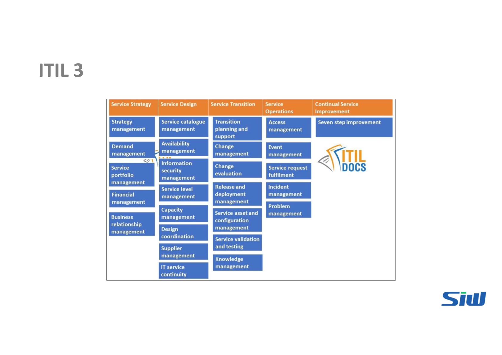

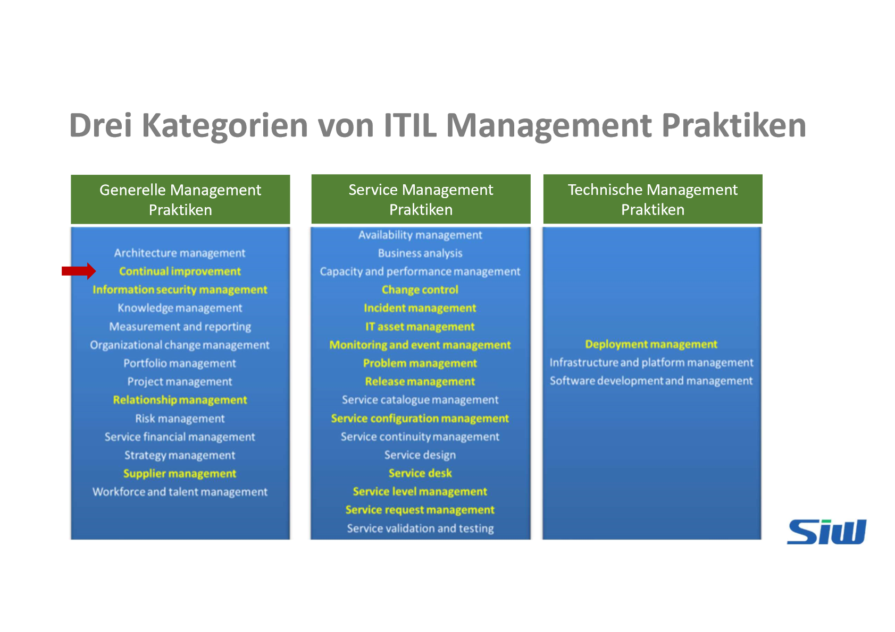

![Im Informatikumfeld gibt es verschiedene Modelle/Methoden ITIL@ Das ITIL (Information Technology Infrastructure Library) Framework ist ein Leitfaden für die Umsetzung von IT Service Management, welcher im Auftrag der britischen Regierung vom OGC (Office of Governance Commerce) entwickelt wurde. --- Im Laufe der Zeit hat sich ITIL zu einem weltweiten de-facto Standard im Bereich der Informatik entwickelt. Aktuell ist V4•. - Hat 7 Leitprinzipien - Besteht aus 31 Prozesse/Praktiken Stellt die Service- Wertschöpfungskette (Service- Value-Chain) in der Vordergrund Service Strategy (Servicestrategie) 2 COBIT Das COBIT Framework ist ein von der ISACA (Information Systems Audit and Control Association), dem internationalen Berufsverband der IT Prüfer, entwickeltes Modell zur Überwachung und Steuerung der IT. Es wird als Best Practice für IT Audits eingesetzt. --- Hat 5 Leitprinzipien COBIT stellt ein generisches IT Prozessmodell dar. --- COBIT kennt 5 „Process for Governance of Enterprise IT" Domänen: Evaluate, Direct & Monitor Align, plan, Organise --- Build, Acquire & Implement Deliver, Service & Support Monitor, Evaluate & Assess --- In COBIT werden 40 verschiedene Prozesse unterschieden. Weitere Modelle sind: Standards: - ISO/IEC20000 Ist eine international anerkannte basierend auf in dem die Anforderungen für ein IT SeNice Management sind. - ISO/IEC27002 (alt 17799) Ist ein internationaler Sta Von Empfehlu für verschie&ne nismen für Projekt Management: - PRINCE2 „Projects in Controlled Environments" ist eine prozessorientierte und skalierbare Projekt managementmethode. PMI, Hermes Maturitätsmodelle z.B. CMMI Capability Maturity Model Integration (CMM vom Software Institute und ist ein Reifegradmodell, welches zur Optimierung dienen kann (Stufe I «initial» bis 5 «optimiert»), Dieses wir auch verwendet, um den Reifegrad von Prozessen zu bestimmen. ES ist nicht die Frage, welche Methode die beste ist, sondern nehmt jeweils das Beste aus den Methoden! SiUJ ](../media/S1_03_ITIL_Service-Management-und-Case-Study-ITIL--Block-1-und-2-image22.png)

![Vergleich ITIL@ und COBIT @-Prinzipien Die 7 ML-prinzipien 1. Es muss immer direkt oder indirekt Wertzuwachs erzeugt werden. 2. Mit dem Ist-Stand beginnen (Start where You are) --- Die guten Fähigkeiten müssen behalten werden und wo notwendig verbessert werden. 3. Iterativer, mit Rückmeldung gesteuerter Fortschritt (Progress iteratively With feedback)--- Verbesserungen sind In kleinen, häufigen Schritten zu gestalten und zu bewerten. 4. Erkennbare Zusammenarbeit und Förderung (Collaborate and promote visibility) --- In jeder Zusammenarbeit mit Teams, Stakeholdern und Partnern muss Transparenz bestehen. 5. Ganzheitliches Denken und Handeln (Think and Work holistically) --- Die Verantwortung ist Ende•zu•Ende --- im Service und im Service Value Stream (SVS). 6. Halte es einfach und praktikabel (Keep it simple and ractical) --- Es kommt auf den richtigen Umfang bei rozessen, Werkzeugen und Ressourcen an. 7. Optimierung und Automatisierung (Optimize and automatei --- Manuelle Arbeit ist fehleranfällig. Menschliche Interaktionen sollen nur dort eingesetzt werden, wo es sinnvoll und notwendig ist. Die 5 COBlT-Prinzipien 2. 3. 4. 5. Erfüllung der Anforderungen der Anspruchsgruppen Abdeckung des gesamten Unternehmens Anwendung eines einheitlichen, integrierten Rahmenwerks Ermöglichung eines ganzheitlichen Ansatzes Unterscheiden zwischen Governance und Management und SiUJ ](../media/S1_03_ITIL_Service-Management-und-Case-Study-ITIL--Block-1-und-2-image23.png)

![Entstehungsgesichte auf P rülzOen Wid Fehl«n und nwgir* z & im Fc*us und inkl Business auf Ouditat Etfizénz d« I T prazßse Kmzaltrdion auf die Sanmlung Best Practie für IT- Betrieb IT Wert- Orientierung Service-Orientierung & Service Strategy Service- Orientierung & - Lebenszyklus Prozess- Orientierung Technologie- Orientierung Bücher 5 Bücher 5 Bücher 8 Bücher 34 Dokumente 1989 - 1998 von 2000 ITIL@ 2007 Edition 2011 2011 Fritz Kleine (ITSM Pruis) • n Ist per 01002019 unklar, nicht alle ITIL V4 Bucher 2019 SiUJ ](../media/S1_03_ITIL_Service-Management-und-Case-Study-ITIL--Block-1-und-2-image24.png)

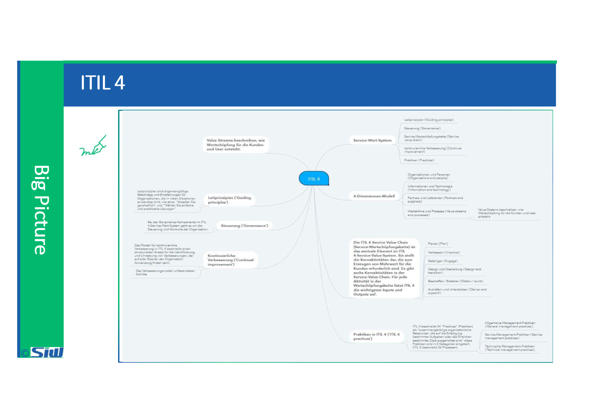

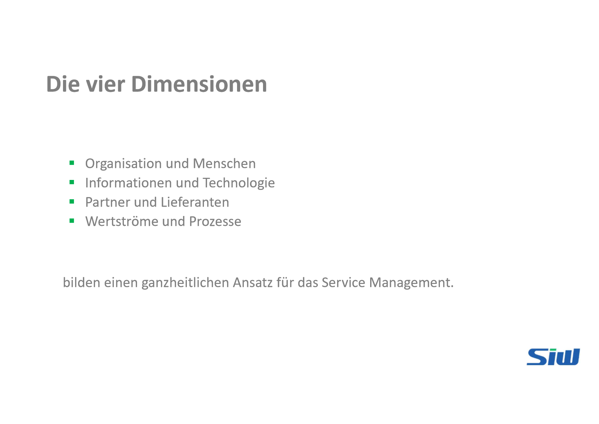

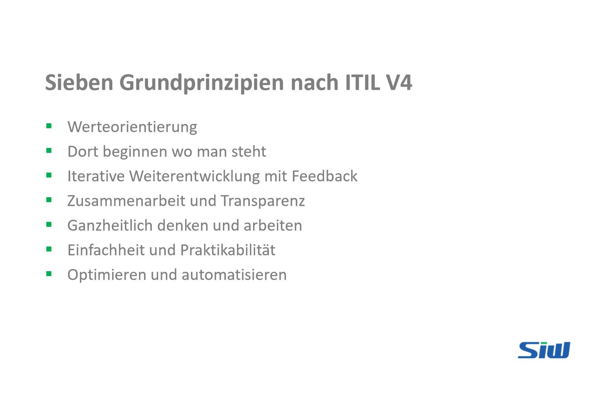

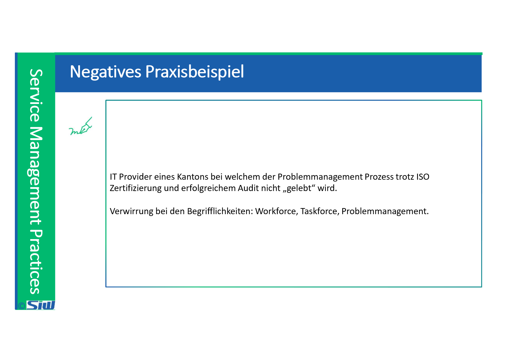

![Zulieferer Autos Bosch (Zündkerzen, Batterie) Magna (Schiebe- und Cabriodächer, Fahrwerksysteme, Elektronik und Sitze sowie Karosserien) Continental (Reifen) Denso (Auto-Elektronik, das Thermo-Management von Motoren, Klimaanlagen, Bauteile für Hybridantriebe, Airbags und Radar- sowie Laser-Sensoren) Aisin Seiki (Fahrwerk, Antriebs- und Motor-Bauteile sowie Bremsen) Hyundai Mobis (LED-Lichter, ESP, ABS, Hybrid-Motoren, Elektrik, Sensoren, Cockpits und Chassis-Teile.) Johnson Controls (Batterien) ZF Friedrichshafen (Getriebe, Kupplungen, Fahrwerksbauteile, Dämpfer, Sitz-Elemente und Lenkungen.) Michelin (Reifen) Faurecia (Cockpits, liefert Abgassysteme, Sitze und Teile der Karosserie) Autoindustrie: Die 10 wichtigsten Zulieferer - FOCUS Online SiUJ ](../media/S1_03_ITIL_Service-Management-und-Case-Study-ITIL--Block-1-und-2-image34.png)

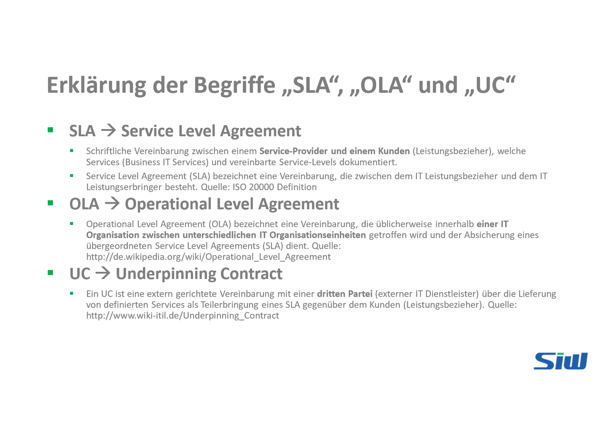

![Erklärung der Begriffe „Utility" und „Warranty" ITIL verwendet folgende beiden Begriffe im Bereich von Services: • Utility • „What the customer gets" Funktionalität eines Service z.B. • Ausführen von Reise-Buchungen Anlegen eines Kunden-Datensatzes Warranty „How is it delivered"Grad an Qualität, in welcher der Service zugesichert wird, z.B. • Service Time (Service-zeit Mo-Fr 6:00-19100 Uhr) • Availability (Verfügbarkeit von 99.5% pro Monat innerhalb der Services-Zeit gemessen) Performance (Antwortzeit < 1 Sek. für die Abfrage eines Kunden) • Continuity (Wiederherstellung im Disaster-Fall innert 4 Std. mit einem Datenverlust von max. 10 Min.) Die Warranty beinhaltet somit die verschiedenen Service Levels mit ihren jeweiligen Service Level Targets. SiUJ ](../media/S1_03_ITIL_Service-Management-und-Case-Study-ITIL--Block-1-und-2-image38.png)

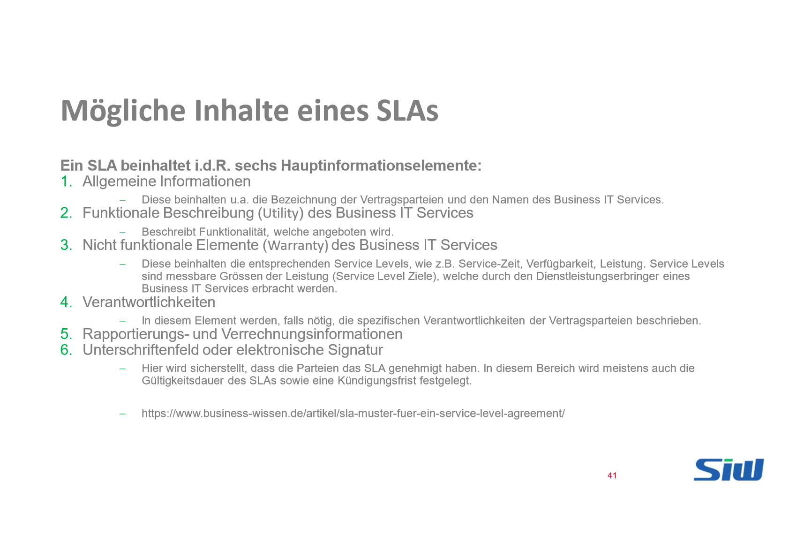

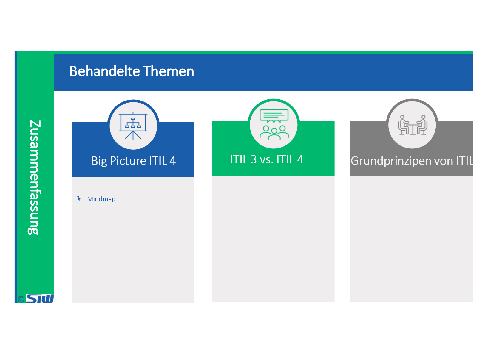

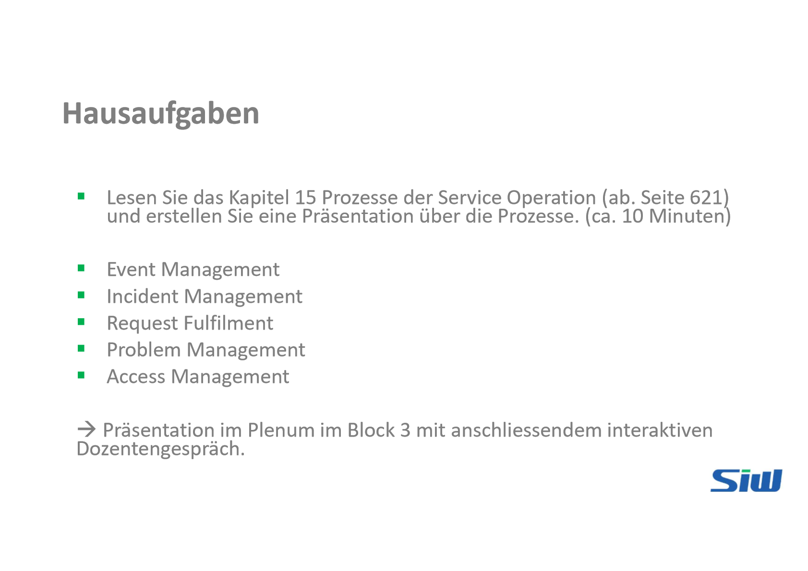

