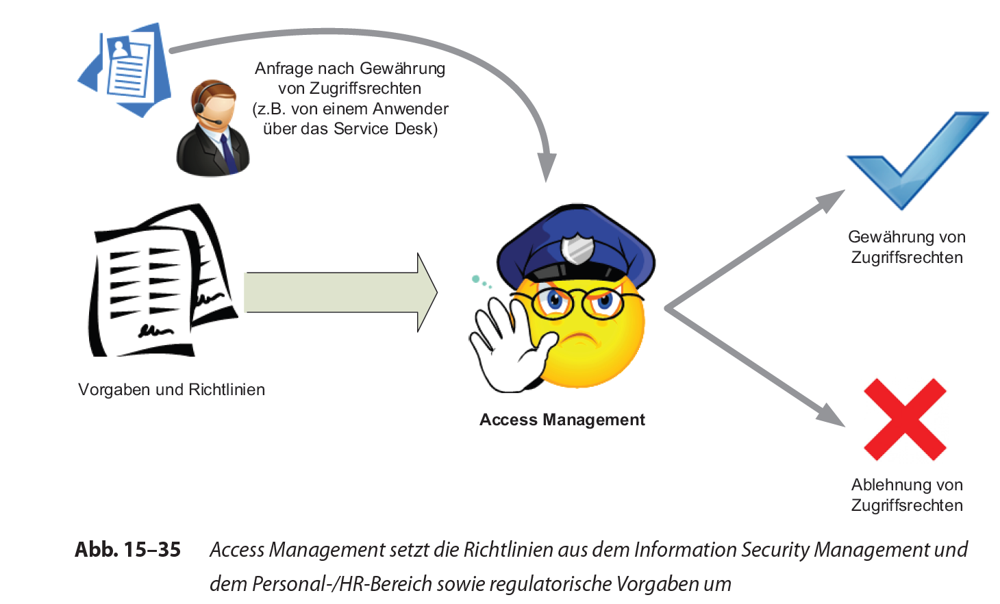
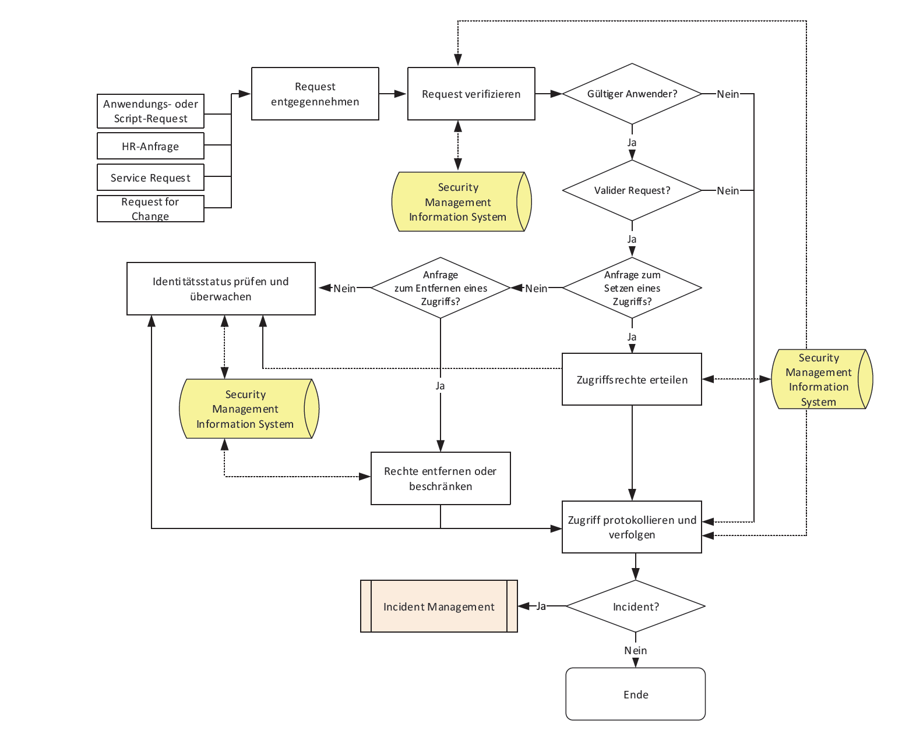

# Access Management

Created: 2021-09-20 17:38:15 +0200

Modified: 2021-09-20 19:39:22 +0200

---

**Allgemein:**

Access Management ist der Prozess, der an autorisierte Anwender Rechte vergibt, damit diese einen Service nutzen können, während nicht autorisierten Anwendern der Zugriff verwehrt wird. In manchen Organisationen wird diese

Aufgabe unter dem Begriff der Rechteverwaltung oder des Identity Management geführt.

Access Management adressiert die Zielsetzungen des Information Security Management, indem es die Vertraulichkeit, Verfügbarkeit und Integrität der Organisationsdaten und den intellektuellen Wert von Informationen und Wissen

wahrt (siehe Abb. 15--35). Dabei wird zwar sichergestellt, dass Anwender denrichtigen Zugriff auf einen Service bekommen. Das Availability Management kümmert sich darum, dass der Zugriff zu den definierten Zeiten prinzipiell möglichist. Dies ist nicht Aufgabe des Access Management.

**Begriffe**
-   **Zugriff (Access)**: bezieht sich auf die Ebene und das Ausmaß einer Servicefunktionalität oder der Daten, auf die ein Anwender zugreifen darf.
-   **Die Identität (Identity)** ist eine Information, die dazu dient, einen Anwender (als Individuum) eindeutig zu identifizieren und von einer anderen Person abzugrenzen. Die Identität wird eingesetzt, um einer Person bestimmte Rechte zu gewähren und ihren Status innerhalb der Organisation sicherzustellen. Obwohl beispielsweise zwei Anwender den gleichen Vor- und Nachnamen haben können, muss gewährleistet sein, dass eine eindeutige Zuordnung zur richtigen Person möglich ist, z.B. über die Personalnummer. In vielen Unternehmen haben sich mittlerweile Sicherheitsüberprüfungen über die Personal- oder die Sicherheitsabteilung etabliert, die überprüfen, ob der (interne oder externe) Mitarbeiter wirklich der ist, der er zu sein scheint. Diese Maßnahmen sind z.T. sogar gesetzlich vorgeschrieben.
-   **Rechte bzw. Privilegien oder Berechtigungen** beziehen sich auf die tatsächlichen Einstellungen, durch die einem Anwender der Zugriff bereitgestellt wird. Typische Rechte oder Zugriffsebenen sind beispielsweise Lesen, Schreiben, Löschen, Ausführen oder Ändern Services oder Servicegruppen: Viele Anwender nutzen nicht nur einen Service; Anwender mit ähnlichen Aufgaben verwenden meist eine gemeinsame Menge von Services (z.B. im Personalbereich oder in der Buchhaltung). Anstatt jedem einzelnen Anwender Zugriff auf den jeweiligen Service zu geben, kann es effizienter sein, einem Anwender oder einer definierten Gruppe Zugriff auf eine Gruppe von Services zu gewähren. Dazu ist meist ein entsprechendes **Rollenkonzept und Rollenmanagement** notwendig.
-   **Rollen** stellen Assoziationen her zwischen dem, was getan werden darf, und Personen, die etwas tun dürfen. Rollen sind also zunächst nur eine Abstraktionsschicht, die die Zugriffsverwaltung vereinfacht. Statt für jeden Benutzer einzeln festzulegen, welche Rechte er hat, werden Identitäten mithilfe von Rollen zusammengefasst. Der Rolle können wiederum Tasks oder Berechtigungen zugeordnet werden. Dabei sind unterschiedliche Ansätze denkbar, um ein Rollenkonzept für das Unternehmen auf die Beine zu stellen. Beispielsweise kann man bei einer kleinen Zahl von Rollen beginnen, die relativ grob sein können, um diese nach und nach zu verfeinern und an die Bedürfnisse des Unternehmens anzupassen. Andere Konzepte versuchen, Rollen sehr detailliert zu beschreiben. Solche theoretischen Ansätze sind in einigen Bereichen, die stark durch definierte Prozesse geprägt sind, sinnvoll. Meist lässt sich nur ein kleiner Teil der Rollen auf diese Weise effizient abbilden. Eine weitere Option bilden **Business-orientierte Rollen**, die sich an Job-Funktionen, projektzugehörigkeiten, organisatorischen Zuordnungen und Geschäftsprozessen ausrichten (siehe Abb. 15--37), und die **technischen Rollen**, die von den Tasks, Transaktionen und erforderlichen Zugriffsrechten geprägt sind. Egal, welcher der Ansätze verwendet wird -- es empfiehlt sich, Top-down zu definieren und Bottom-up zu verifizieren.
-   **Directory Services** sind ein essenzielles, technisches Werkzeug, um Zugriffe und die Berechtigungen der Anwender zu verwalten.

**Syllabus-Referenz**

Die folgenden Begriffe und Themen sollten Sie im Zuge Ihres Wissensaufbaus für die ITIL-Basiszertifizierung besonders gut verstanden haben und erklären können:
-   Zweck, Ziele, Umfang und Aktivitäten der Prozesse Incident Management und Problem Management sowie deren grundlegende Konzepte, Aktivitäten und Schnittstellen
-   Zweck, Ziele und Umfang der Prozesse Event Management, Access Management und Request Fulfilment
-   Event und Alarm
-   Incident
-   Auswirkung, Dringlichkeit und Priorität
-   Service Request
-   Problem, Workaround und Known Error
-   Known-Error-Datenbank (KEDB)

Diese Themenfelder sollten Sie mindestens kennen. Diese Liste erhebt keinen Anspruch auf Vollständigkeit.

