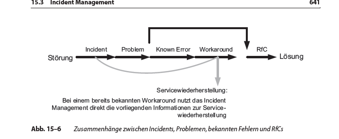

# Incident Management Prozess

Created: 2021-09-16 19:25:55 +0200

Modified: 2021-09-23 18:54:41 +0200

---

**Allgemein**

Die Ziele des Incident-Management-Prozesses sind:
-   Sicherstellung, dass alle Beteiligten die standardisierten Methoden und Verfahren innerhalb der Aktivitäten des Prozesses nutzen und so eine effiziente und zielgerichtete Reaktion auf Incidents und die weitere Incident-Bearbeitung erfolgt
-   verbesserte Transparenz und Kommunikation von Incidents in Richtung IT-Support und Kunde, z.B. über das Intranet oder E-Mails bei Major Incidents
-   Bessere Wahrnehmung des Kunden und seiner Mitarbeiter durch die IT. Dies bedeutet leider in vielen Fällen, dass die Service-Desk-Mitarbeiter »zu spüren bekommen«, was die Anwender verärgert und welche Beeinträchtigungen für sie am schwersten wiegen.
-   Abstimmung der Aktivitäten und Prioritäten des Prozesses mit geschäftskritischen Aktivitäten und Prioritäten
-   Erhaltung bzw. Steigerung der Kundenzufriedenheit durch eine hohe Qualität der IT Services

**Workarounds**

Ein Workaround ist eine Umgehungslösung und kann die Folgen von Incidents mindern - muss aber nicht.

Ein Workaround ermöglicht das Weiterarbeiten trotz eines bestehenden Problems. Der Workaround wird eingesetzt, bis eine Lösung für den bestehenden Incident gefunden und implementiert wurde.

**Known Error**

Ist die Ursache einer Störung zwar bekannt und dokumentiert, aber noch nicht behoben, spricht man von einem bekannten Fehler (Known Error).

**Fachliche Eskalation**

Typischerweise an einen Mayor Incident Manager weitergeben des Incidents, des Problems oder des Changes.

**Funktionale Eskalation**

Weiterleiten eines Incident, Problems oder Change an ein technisches Team mit einem erweiterten Erfahrungsschatz, das Unterstützung bei einer Eskalation bieten soll

**Störungen**

Ein solcher Incident (Störung) ist definiert als eine nicht geplante Unterbrechung eines IT Service oder eine Qualitätsminderung eines CI ggf. ohne bisherige Auswirkungen auf einen IT Service. Solche Incidents können von Mitarbeitern der IT-Organisation erkannt oder durch Event-Monitoring-Tools automatisch ermittelt und weitergeleitet werden. Auch Anwender, Dienstleister oder Lieferanten können Incidents melden. Dies geschieht meist über einen Anruf beim Service Desk als Kontaktstelle oder über ein Frontend im Intranet, das über ein Webformular die Störungsmeldung entgegennehmen kann

**Probleme**

Ein oder mehrere Incidents lassen sich in der Regel auf ein Problem als Ursache zurückführen.

Ein Problem wird als die Ursache für einen oder mehrere Incidents bezeichnet. Zum Zeitpunkt der Erstellung eines Problem Records ist die Ursache in der Regel unbekannt.

**Anfragen**

**Major Incident**

Die höchste Kategorie eines Incidents in Bezug auf die Auswirkung wird als Major Incident bezeichnet. Major Incidents führen zu einer erheblichen Serviceunterbrechung für das Business und werden daher mit separaten Verfahren und hoher Dringlichkeit bearbeitet. Was allerdings unter einer »erheblichen« Serviceunterbrechung zu verstehen ist, wird unternehmensindividuell festgelegt. Dies ist stark von der Klassifizierung der IT-Services (z.B. hinsichtlich der Kritikalität) abhängig, die sich an den unterstützten Geschäftsprozessen orientiert. Die Definition eines Major Incident und die notwendigen Maßnahmen für den Eintrittsfall eines Major Incident können daher von Unternehmen zu Unternehmen variieren.

