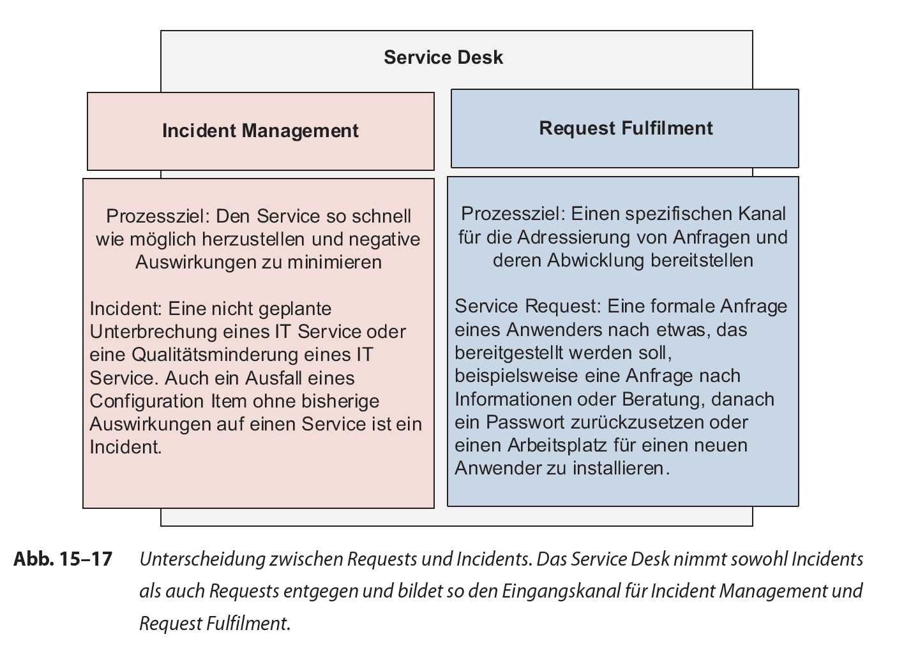
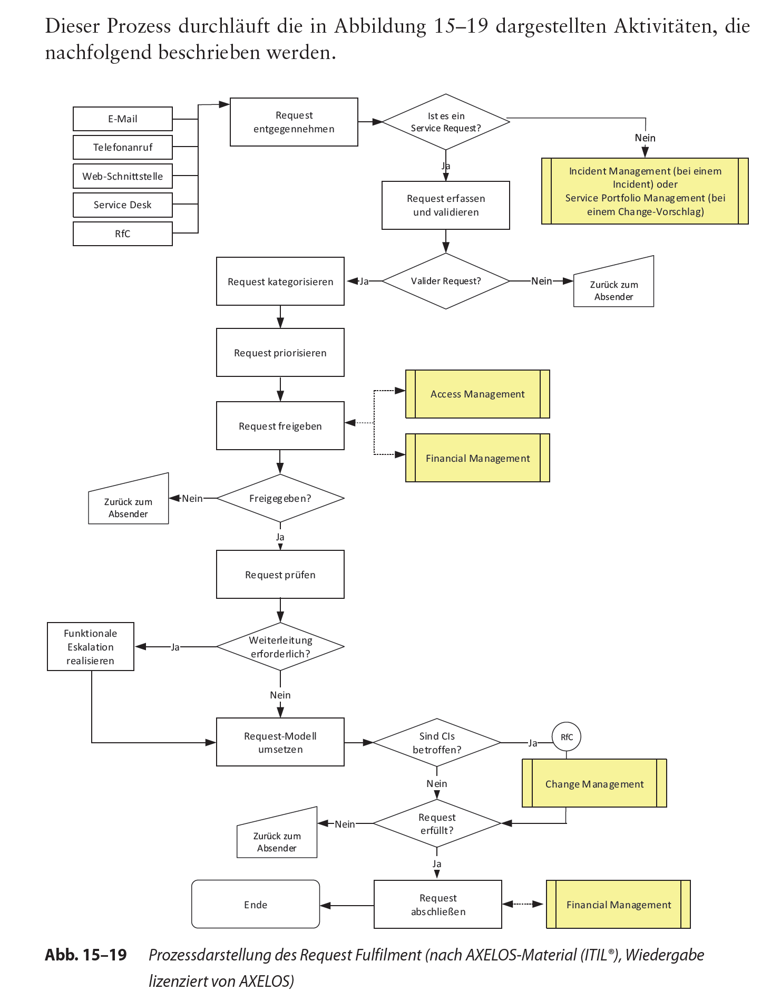
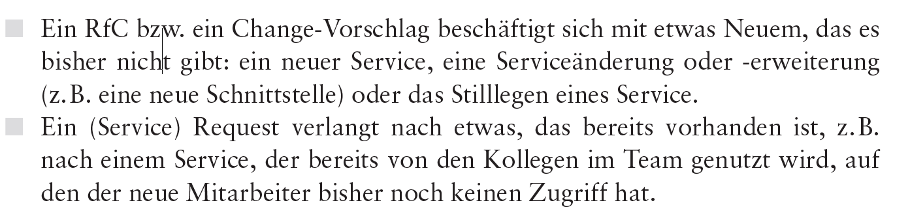

# Request Fulfilment

Created: 2021-09-20 17:38:31 +0200

Modified: 2021-09-20 19:38:33 +0200

---

**Allgemein:**

Anwenderanliegen, die:

vielfach mit einem geringen Risiko verbunden sind

Häufig vorkommen

nicht direkt mit einer Störung in Verbindung

wird ein eigener Prozess zur Verfügung gestellt

-   Bereitstellung eines Kanals für Anwender, um Standardservices anzufordern und zu erhalten, unter der Voraussetzung, dass für diese ein vordefiniertes Genehmigungs- und Bewertungsverfahren gibt
-   Bereitstellen von Informationen für Anwender und Kunden hinsichtlich der Verfügbarkeit von Services und dazu, wie sie diese Leistungen beziehen können
-   Ermitteln und Bereitstellen von Komponenten für angeforderten Standardservices (z.B. Lizenzen und Medien)
-   Allgemeine Unterstützung der Anwender durch Informationen, Bearbeitung von Beschwerden, Kommentaren und Vorschlägen

}

**Begriffe**

**Service Request**

Verschiedene Varianten von Anwenderanfragen gegenüber der IT-Organisation

Eeher kleine Änderungswünsche mit geringem Risiko, häufiges vorkommen und geringe bzw. definierte Kosten

Service Requests werden über Standard-Changes und entsprechenden Verfahren umgesetzt (geringes Risiko, überschaubare und/oder gleichbleibende Kosten, gilt daher als »vorgenehmigt« durch das Change Management).

Beispiele für solche Standard-Changes:
-   Einrichten eines neuen IT-Arbeitsplatzes für neuen Mitarbeiter
-   Installation zusätzlicher Software auf einem Arbeitsplatz-PC
-   Umzug eines Arbeitsplatz-PC in ein anderes Büro

Welche Anfragen als Service Request behandelt werden, ist unternehmensindividuell zu entscheiden.

Requests können mit Statuscodes versehen werden, zum Verfolgen und Steuern der Requests über ihren gesamten Lebenszyklus hinweg

**Request-Modell**

Vordefinierten Schrittfolgen, Zeitzyklen und Verantwortlichkeiten

Bsp: Im Rahmen der IMAC-Aktivitäten werden IT-Systeme installiert (Installation), Umzüge abgewickelt (Move), Hoch- und Umrüstungen (Add/Change) übernommen, IT-Systeme deinstalliert und einer gesetzlichen Wiederverwertung zugeführt. Request-Modelle kann es u.a. geben für:
-   Tonertausch (falls die Anwender dies nicht selber umsetzen)
-   Passwortrücksetzungen nach den unterschiedlichen Systemen oder Services aufgegliedert
-   Zugriff auf Standardservices, aufgegliedert in die unterschiedlichen Services
-   Unterstützung für Videoconferencing-Räume
-   Hardwarebestellung (IT und Telekommunikation), aufgegliedert in die unterschiedlichen ITK-Typen
-   Beantragung von Intranetseiten
-   Beantragung von Mailgruppen
-   neue Anwender
-   Ausscheiden von Mitarbeitern aus dem Unternehmen
-   IMACs unterschiedlicher Form

So können Requests konsistent und effizient umgesetzt werden. Diese Modelle sind bereits im Vorfeld zu ermitteln, festzulegen, bereitzustellen und zu kommunizieren.

**Self Help**

Self Help bezeichnet Selbsthilfepraktik --> Möglichkeit für Anwender, Service Request zu erstellen - Bspw. Via Intranet

Mittels Tool werden Anfragen (meistens) direkt in ITSM Tool integriert und verarbeitet über vordefiniertes Formular

Ein dahinterliegender Workflow für Weitergabe des Requests und um die ggf. notwendige Freigabe durch Vorgesetzten oder einen anderen Verantwortlichen (Therefore)

Vorteile:
-   Kostenreduzierung durch Automation
-   Vermeidung von Calls
-   Reduzierung von Vor- Ort-Einsätzen
-   Erhöhung der IT-Sicherheit durch strikte Einhaltung der implementierten Sicherheitsrichtlinien
-   Produktivitäts- und Effizienzsteigerung der Endanwender durch Verkürzung von Ausfallzeiten
-   Reduzieren Aufwand für Eingreifen eines IT-Mitarbeiters auf Minimum.

Self Help wird vom Unternehmen definiert

**Richtlinien**

Auch für den Request-Fulfilment-Prozess sind Richtlinien notwendig. Dazu gehören beispielsweise:
-   Möglichst viele der Aktivitäten im Request Fulfilment sind über Request-Modelle abzuwickeln. Sie stellen den vordefinierten Abarbeitungsworkflow, die beteiligten Teams oder Rollen, zeitliche Vorgaben und Eskalationspfade dar, die im Rahmen der Umsetzung des jeweiligen Request zum Einsatz kommen.
-   Die Verantwortlichkeit für den Prozess ist im Service Desk zu verankern. Sie behält die Ownership für die Requests über Aktivitäten wie Überwachung, Eskalation, Weiterleitung und Bearbeitung durch andere Supportgruppen hinweg. Somit steht den Anwendern eine singuläre Kontaktstelle zur Verfügung, über die nicht nur Requests (und Incidents) erfasst werden, sondern auch eine Instanz, die für Rückfragen, Statusinformationen und Beschwerden zur Verfügung steht.
-   Service Requests, die CIs betreffen, werden in der Regel über einen Standard- Change realisiert. So lassen sich Änderungen nachverfolgen.
-   Für das Management und die Bearbeitung der Requests ist ein zentrales System zur Verfügung zu stellen, über das alle Prozessaktivitäten abgewickelt werden. Dies erleichtert nicht nur eine konsistente Vorgehensweise, und
-   Requests gehen nicht verloren, sondern es steht auch ein zentrales Repository für das Berichtswesen zur Verfügung.
-   Alle Requests sind vor der Durchführung und Umsetzung freizugeben. So werden Ressourcen effizient eingesetzt und den Vorgaben aus dem Access Management und dem Information Security Management entsprochen. Gleichzeitig kann so sichergestellt werden, dass Compliance-Anforderungen erfüllt sind. Bei einigen Request-Arten wird darüber hinaus eine finanzielle Genehmigung vorgenommen. Eine Vielzahl von Requests ist mit Kosten verbunden (z.B. Lizenzen). Im Vorfeld sind daher die Kosten im Zuge der Request-Modell-Definitionen festzulegen. Wichtig ist in diesem Zusammenhang auch eine Verknüpfung mit der internen Leistungsverrechnung.
-   Ähnlich wie im Incident Management legen die Prozessverantwortlichen des Request Fulfilment für Requests eine einheitliche Regelung für die Vergabe von Priorität und Kategorisierung fest, die sich an den Inhalten der SLAs, Ucs und OLAs sowie den Servicezielen orientieren. zu Unternehmen unterschiedlich. Dabei spielen Unternehmenskultur, Medienakzeptanz und der etablierte Einsatz neuer elektronischer Tools und Hilfsmittel eine wichtige Rolle, aber auch die Benutzerfreundlichkeit und die intuitive Bedienbarkeit der Self-Help-Technologien stellen relevante Aspekte dar.

**Request-Eingang**

