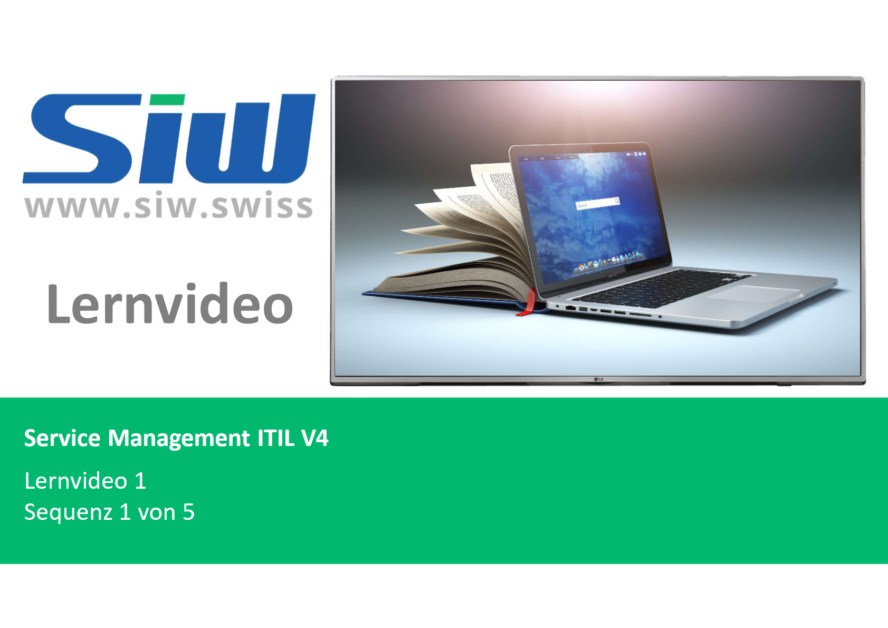
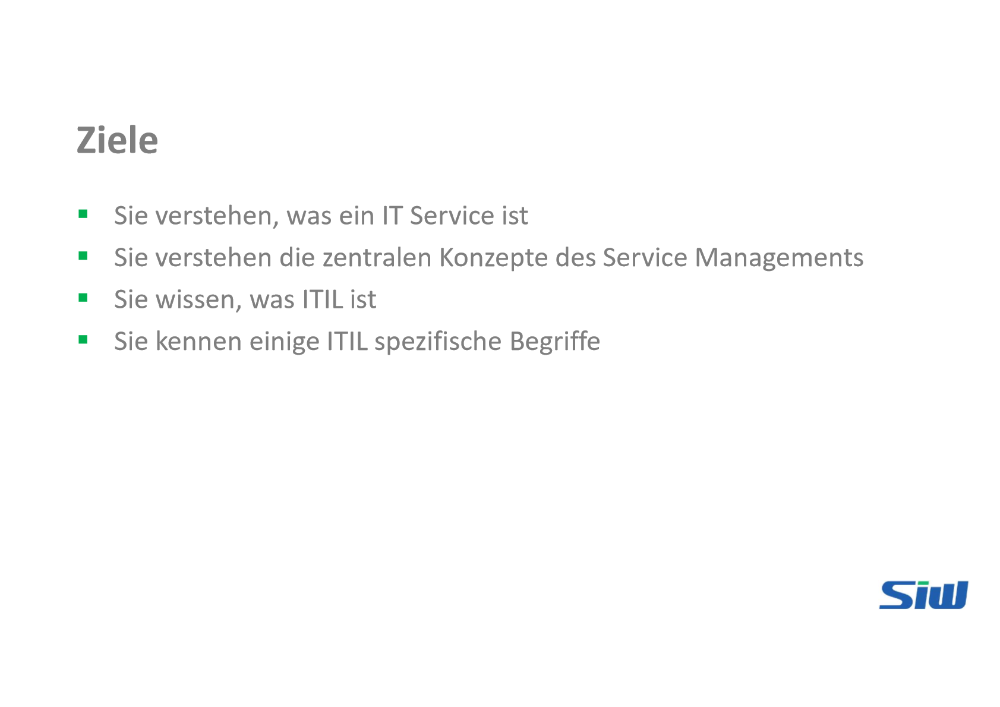
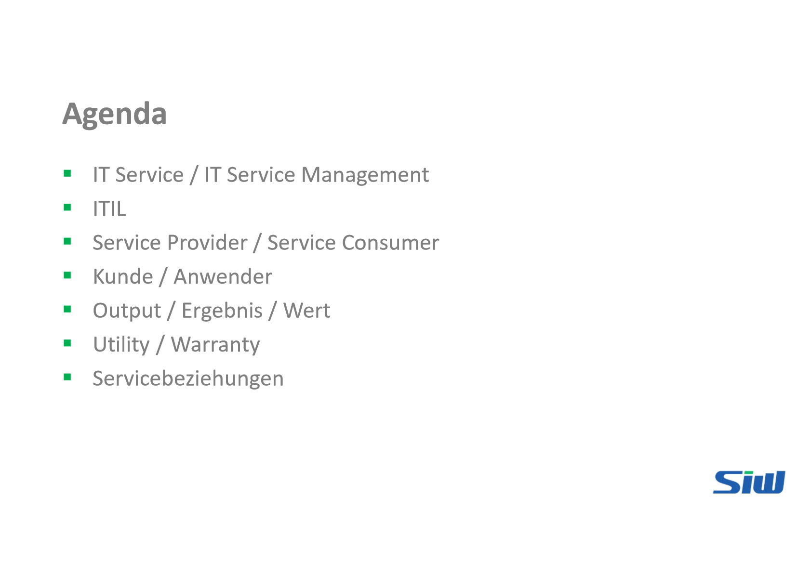
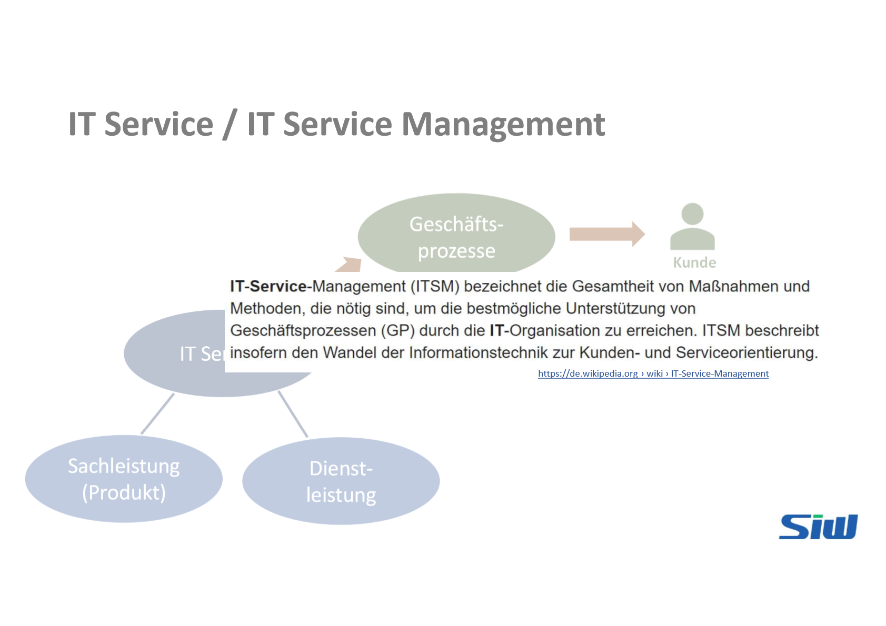
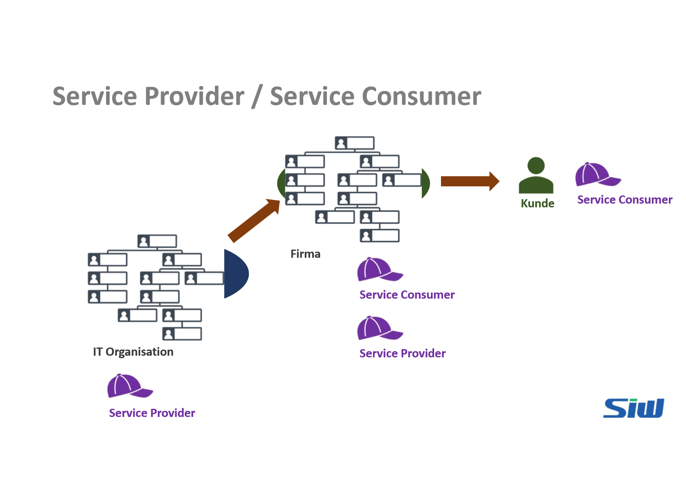
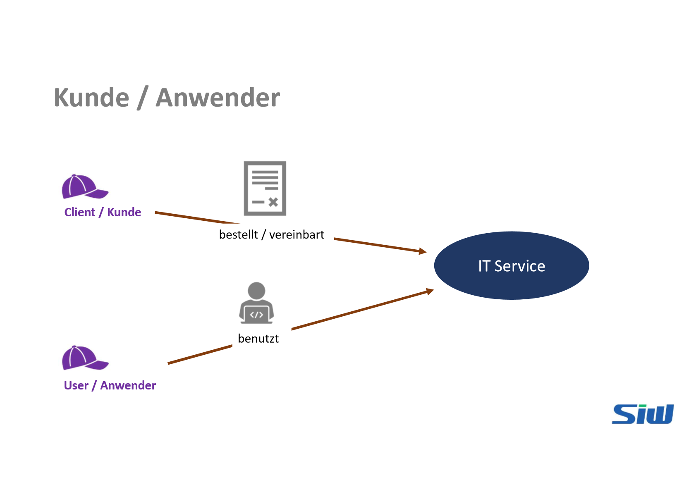

# Lernvideo 1 - Sequenz 1

Created: 2021-09-16 19:26:08 +0200

Modified: 2021-09-16 19:34:47 +0200

---

![ITIL (IT Infrastructure Library) 1980's British government assigned CCTA (Central Computer and Telecommunication Agency, later: OGC, Office of Government Commerce, today: Cabinet Office) to find an approach for the effective and efficient use of IT resources in the public sector 1990's ITILS VI: Best Practices of the IT industry 40 books 2002 2007 2011 2019 ITIL• V2: Process orientation 8 books (Service Support and Service Delivery recognized most) ITIL• V3 published: Service Lifecycle approach (5 books: Service Strategy, Service Design, Service Transition, Service Operation, Continual Service Improvement) ITIL• Edition 2011: Improved V3 (5 books) ITIL' 4 Edition: from demand to value (Service Value System --- SVS) SiUJ ](../../../media/S1_03_ITIL_Service-Management-und-Case-Study-Lernvideo-1---Sequenz-1-image5.png)

