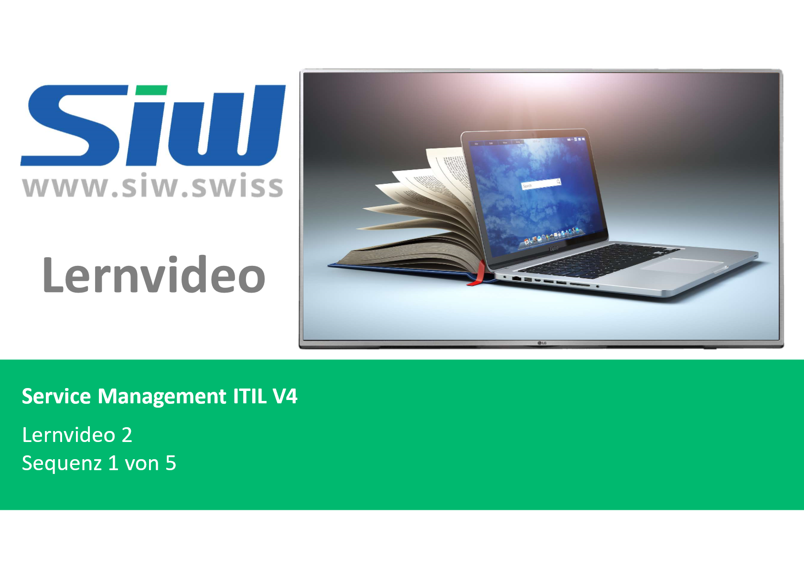
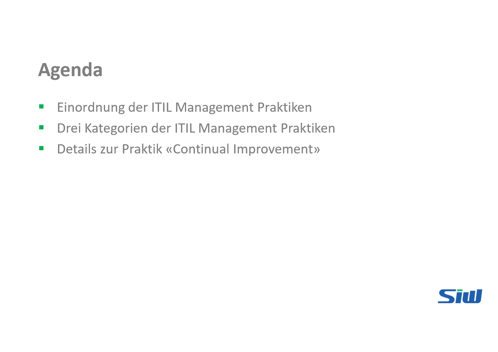
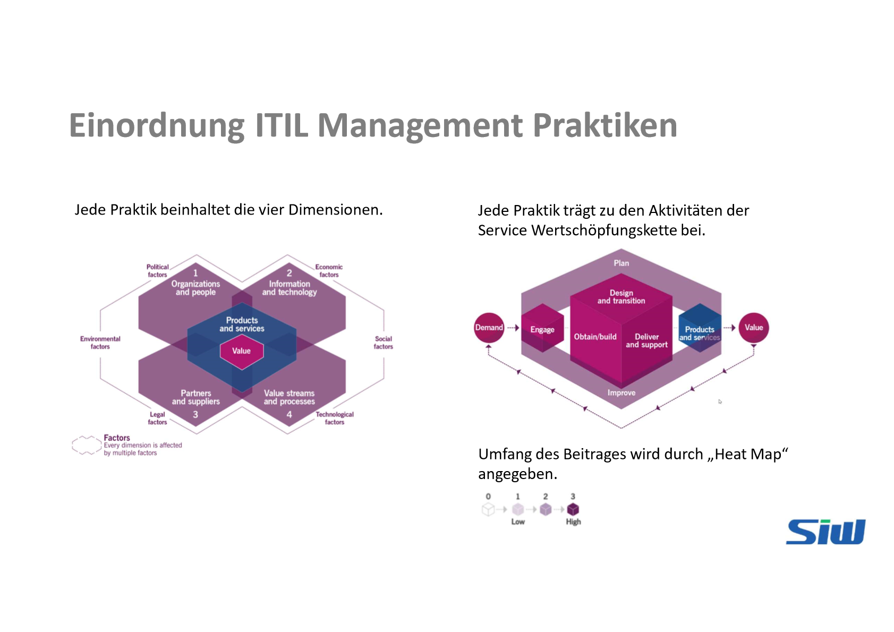
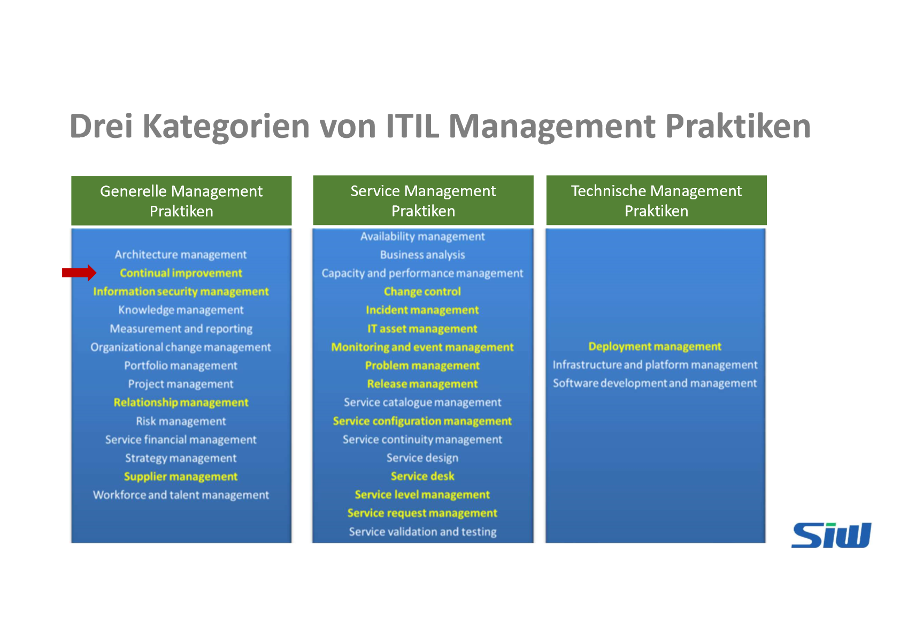
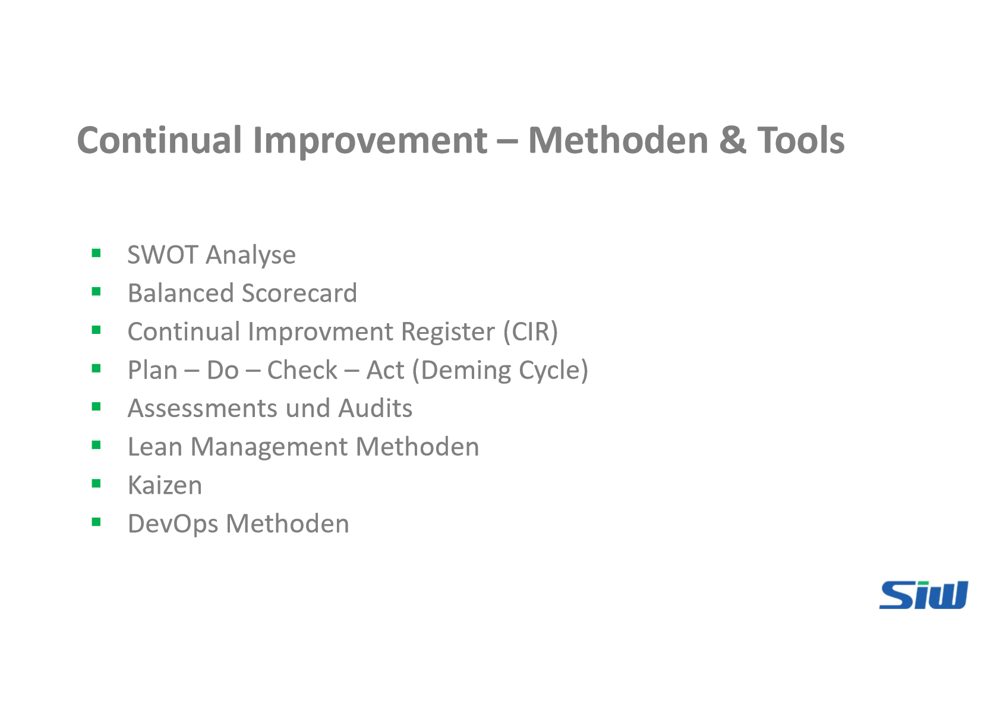

# Lernvideo 2 - Sequenz 1

Created: 2021-09-16 19:26:08 +0200

Modified: 2021-11-14 11:50:52 +0100

---

![Continual Improvement - Hauptaktivitäten Ermutigen der ganzen Organisation für kontinuierliche Verbesserung, jedoch soll sich mindestens ein kleines Team aktiv dafür engagieren. Zeit und Geld für kontinuierliche Verbesserung bereitstellen Identifizieren und festhalten von Verbesserungsmöglichkeiten Beurteilen und priorisieren von Verbesserungsmöglichkeiten Erstellen von Business Cases für Verbesserungsvorhaben Planen und umsetzen von Verbesserungsmassnahmen Messen und bewerten von Resultaten aus Verbesserungen Koordination aller Verbesserungsmassnahmen im ganzen Unternehmen SiUJ ](../../../media/S1_03_ITIL_Service-Management-und-Case-Study-Lernvideo-2---Sequenz-1-image8.png)

