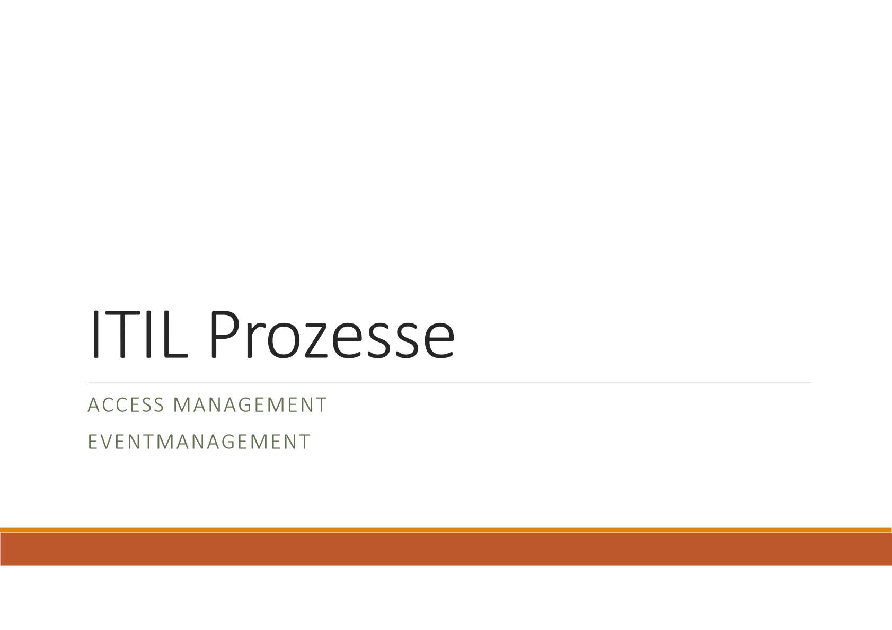
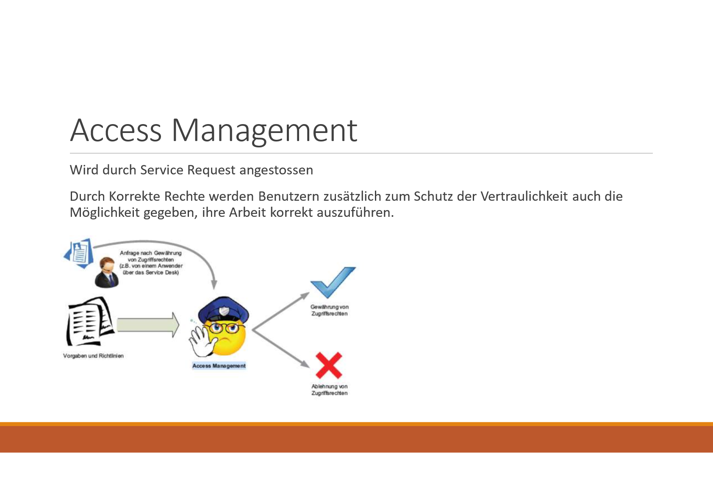
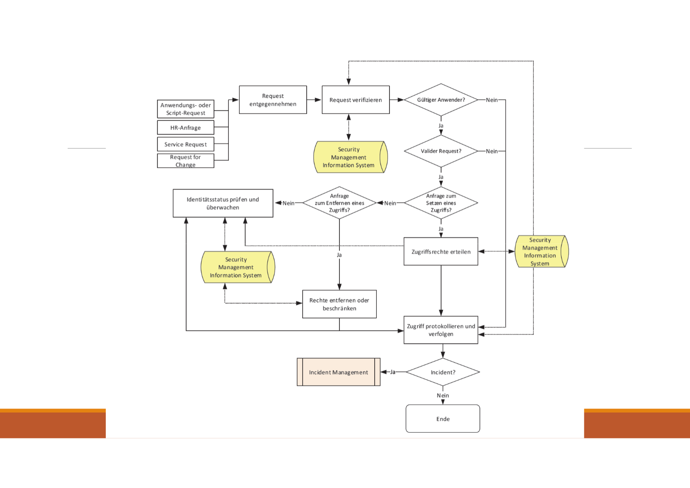
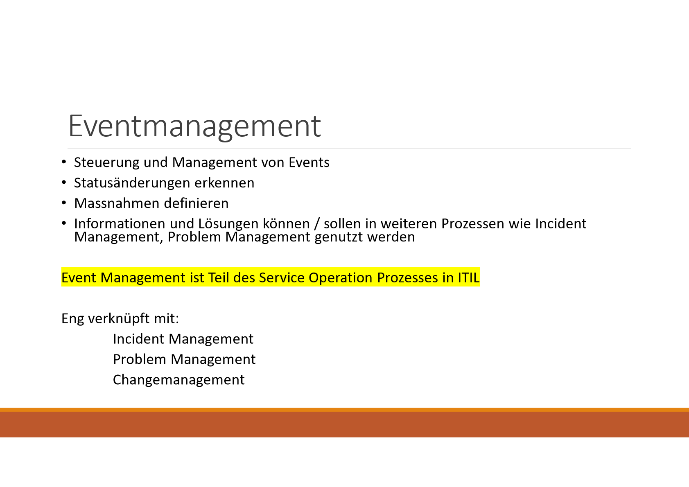
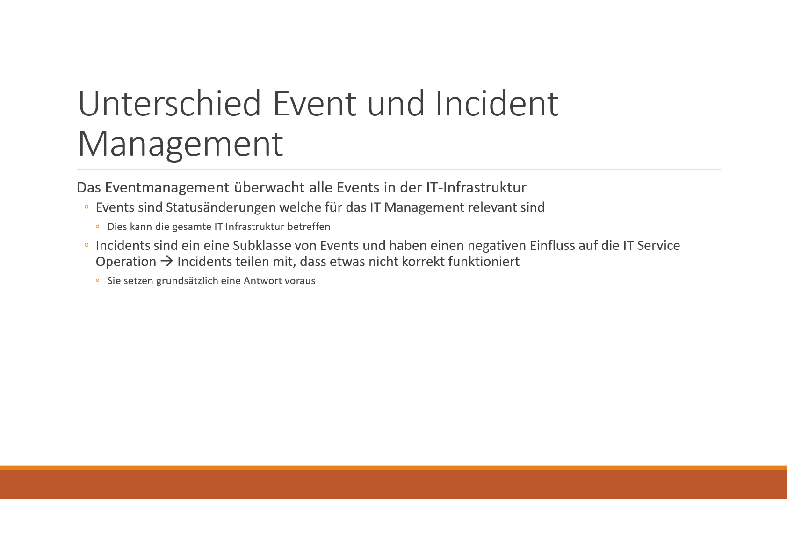
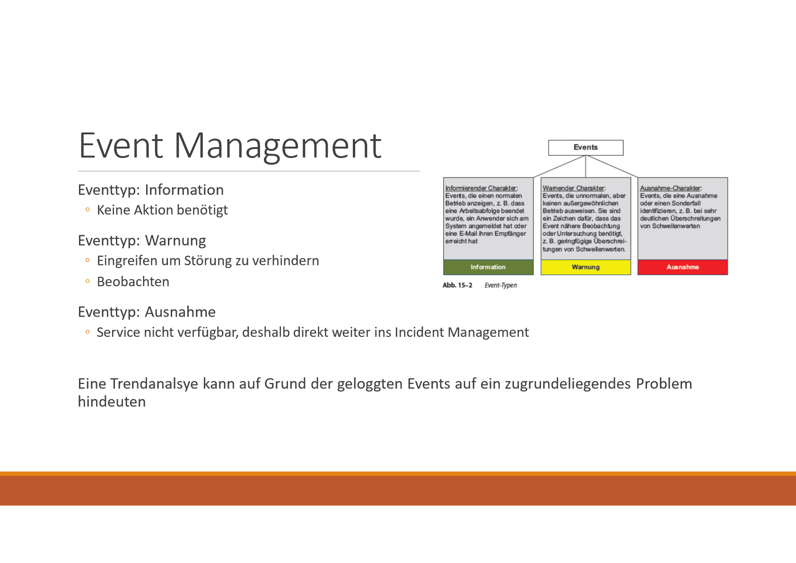
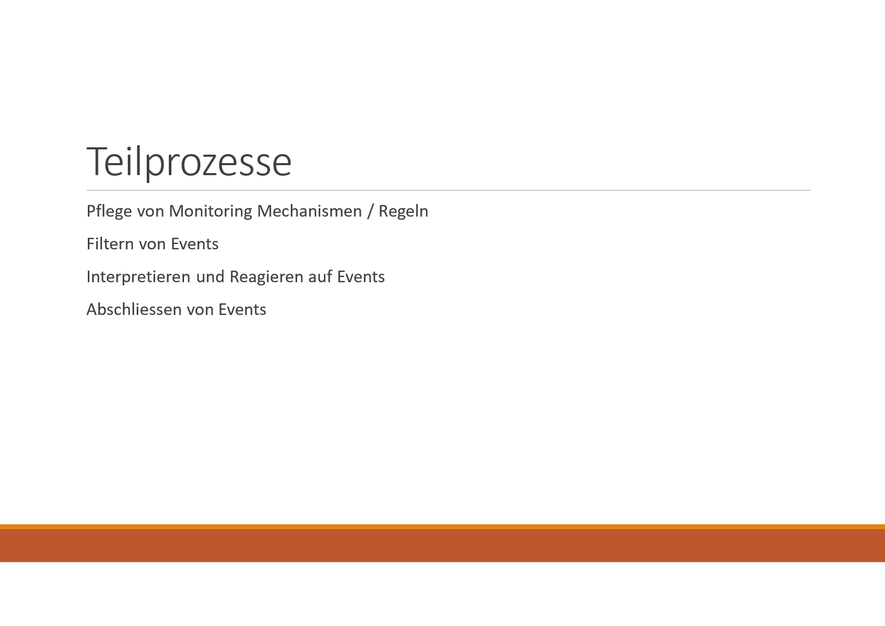
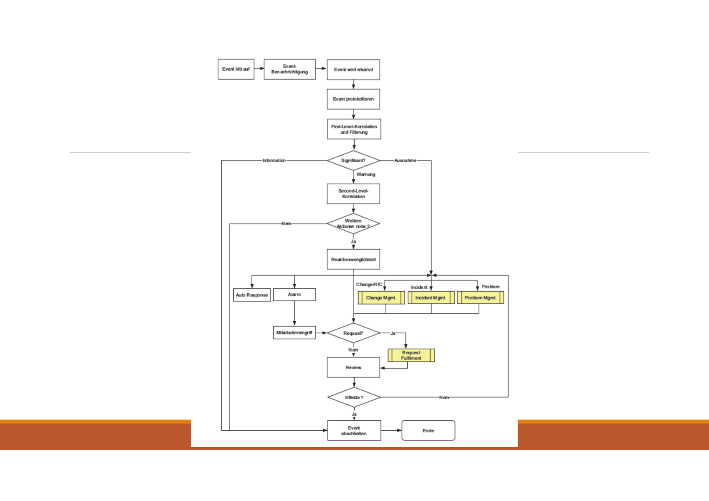

# Präsentation Access Management & Event Management

Created: 2021-09-23 21:29:15 +0200

Modified: 2021-09-23 21:29:44 +0200

---

![Access Management Begriffe Zugriff: bezieht sich auf die Ebene und das Ausmaß einer Servicefunktionalität oder der Daten, auf die ein Anwender zugreifen darf Identity: Eindeutiges Identifizieren von Anwendern (Personalnummer etc.) Rechte / Privilegien / Berechtigungen: Tatsächliche Einstellungen der Zugriffe. Read, write, execute Werden häufig auf Service Gruppen angewendet Rollen: Assoziation zwischen was getan werden darf, und welche Person das tun darf. Vereinfachte Zugriffsverwaltung Directory Services: Tool zum Verwalten von Berechtigungen und Zugriffen der User ](../media/S1_03_ITIL_Service-Management-und-Case-Study-Präsentation-Access-Management-&-Event-Management-image5.png)

