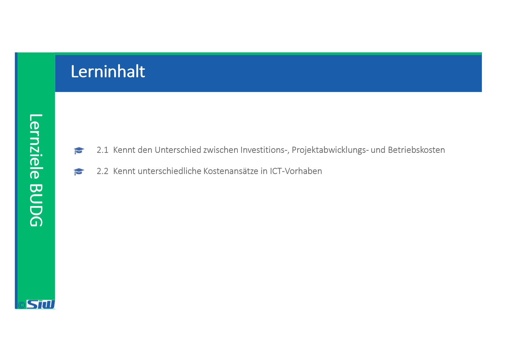
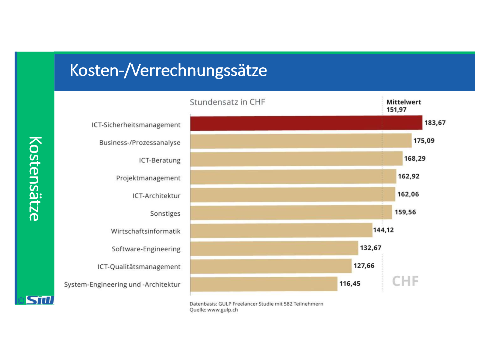
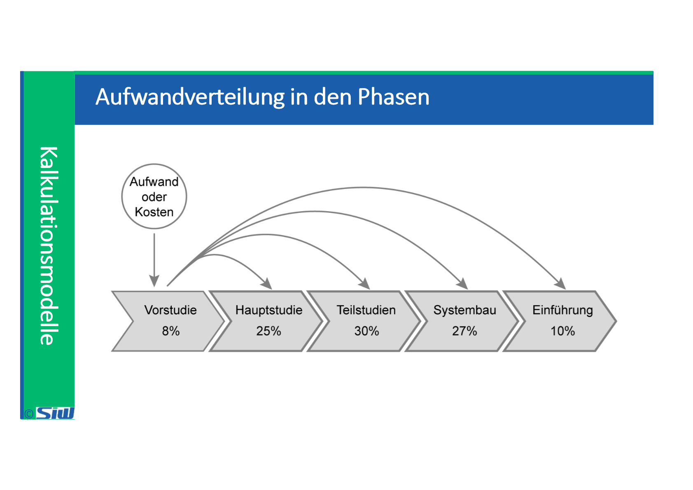

# BUDG: Block 1

Created: 2021-09-20 20:28:52 +0200

Modified: 2021-11-03 15:31:54 +0100

---

![Externe und interne Kosten erfolgswirksame Kosten (werden nicht abgeschrieben) Externe Kosten (out of pocket costs) bilanzwirksame Kosten (werden abgeschrieben) Kosten der internen Projektmitarbeiter Interne Kosten (internal costs) Intern verrechnete Leistungen Forderungen 1.000,00 Euro an Umsatzerlöse 1.000,00 Euro. Dienstleistungen Hardware Softwa re Daten (Einkauf von Daten) Reisekosten die Begleichung einer Forderung durch den Kunden Primårkosten Sekundär kosten Interne Leistungen, die das Projekt in Anspruch nimmt und die Ober die Leistungs- verrechnung dem Projekt belastet werden. Projektabwicklungskosten, wenn explizit nur für die Projektzeit relevant ](../media/S1_04_BUDG_Budgetierung-BUDG--Block-1-image8.png)

![Externe und interne Kosten - Details Kosten nehnw-' von außenstehen&n Vertrags- partnern in Rechnung #steUt. Kosten für • Kosten für C cnsulting / Beratung • Kosten fot • Kosten • Kosten für SchulunF' Tr"rvs • Wetere (2.8 Erstelkn vcm Dokurrentat•onen) • Kosten für Mit- Kosten für Anschaffungen • Kosten • Kosten Hudwue • Kosten Daten Kosten urd we&n im R*vnen on nterr*n Mitut*iter (Primårkosten) • Lohne & Gehalter • Inter'* Kosten for de New-tw•erbung • Kosten für „Backfil• (wenn Mit- arEeitet des Proiektteams durch andere M'tæbeter ersetzt müssen: ZB damit das Tages*schaft • Anteibge Kosten Mitutkiter eines _ die Tätigkeiten fur das Prøekt Personalkosten (Sekundårkosten) • umla*n (ZB. anteige Kosten fcn • IT-bezcoene Umla%n (z & PC Spekher. werk-Anschluss. eV) Intern verrechnete Leistungen • Leistun#n Servxes) internen Senoce-Funktimen Infras tru kturkosten • Raumkosten (ZB. für und Schulun%n) • Art*itsplatzkosten in und Geh&tern ](../media/S1_04_BUDG_Budgetierung-BUDG--Block-1-image9.png)

![Sachbezogene Investitionskosten Arbeits- bzw. Dienstleistungsaufwand Aufwendungen für Beratung / Consulting Aufwendungen für die Anforderungsanalyse • Aufwendungen für Entwicklung / Programmierung Aufwendungen für externe Mitarbeiter Aufwendungen für Software- und Hardware-Anpassungen Aufwendungen für die Implementierung Aufwendungen für das initiale Frontend bzw. Client-Engineering und die Soft- ware-Verteilung Aufwendungen für die Einführung / Installation (Roll-out) Aufwendungen für de Schulung der technischen Mitarbeiter Aufwendungen für de Schulung bnv. Einweisung der Anwender • Software-Lizenzen Hardware-Anschaffungen (z.B. Entwicklungs-. Test- und Produktiv-Urngebung) AufwendunF1 für die Einrichtung von Arbeitsplätzen OCkr Gebäuden Sonstige einmalige Kosten • Unkosten für die vorzeitige Auflösung/Kündigung von Leasing-Vertragen. Wartungs•v'erträgen und Outsourcing-Vertragen • Reisekosten ](../media/S1_04_BUDG_Budgetierung-BUDG--Block-1-image11.png)

![Personenbezogene Investitionskosten Aufwendungen für Verbleibe-Boni (Retention bonus) Umzugskosten und Verlegekosten (Relocation costs) Abfindungen (Severance payn-ents) • Kosten für Früh-Pensionierungen (Retirement costs) • Kosten für die Einlernung von Mitarbeitem nach einem Job-Wechsel (Re-Training costs) Personalvermittlungskosten (als Angebot für Mitarbeiter, die das Unternehmen verlassen) Personalvermittlungskosten für die Anwerbung neuer Mitarbeiter (Recruitment costs) • Bonuszahlungen (für Projektteam-Mitglieder; z.B. bei erfolgreicher Projekt- abwtcklung) ](../media/S1_04_BUDG_Budgetierung-BUDG--Block-1-image12.png)

![Kosten-/Verrechnungssätze Budgetpositionen I nterne Arbeitsleistungen Leistungen externer Berater Hard- und Software Verbrauchsmaterialien Spesen Berechnungsgrundlage Stundensatz für die interne Verrechnung Honorar/Entschädigung gemäss Vertrag Offerte von Hersteller. Lieferant, Provider Offerte gemäss Händler- katalog Interne Richtline Ansitze / Beträge in CHF 100.--- pro Mitarbeiter 140.--- für Projektleiter 200.--- pro Stunde 1500.--- pro Tag Server: 2500.--- Hosting: 25.--- pro • 200.--- für Kleinprojekt 400.--- für Kleinprojekt Bemerkung Gemäss Vorgaben des Unter- nehmens (des Controllings) Annahme für die Budgetkal- kulation Systemvoraussetzungen gemäss Pflichtenheft Gemäss Erfahrungen aus abgeschlossenen Projekten Gemäss Erfahrungen aus abgeschlossenen Projekten ](../media/S1_04_BUDG_Budgetierung-BUDG--Block-1-image16.png)

![Mini-Case IT-Projektkalkulation (1/2) Die Musterunternehmen AG plant, ihre betriebliche Informationsverarbeitung teilweise oder vollständig auszulagern. Sie sind der Projektleiter für dieses Outsourcing-Vorhaben. Ihre Aufgabe ist es, die einzelnen Schritte bis zur Vorbereitung der Vertragsverhandlung zu kalkulieren: Das Projekt startet mit einer Kick0ff-Veranstaltung aller Beteiligten (Dauer: 1 Tag), in der die Ziele und Vorgehensweise im Projekt vereinbart werden. Neben Ihnen nehmen noch 5 weitere Personen aus Ihrem Unternehmen teil. Im Anschluss daran realisieren zwei Ihrer Mitarbeiter die Aufnahme der Ist-Situation. Dabei erfolgt zuerst eine Inventarisierung der Hardware (Aufwand: 14 Mitarbeitertage (MT)), dann die Katalogisierung der installierten Software-Systeme (Aufwand: 8 MT) und dann die Dokumentation des Netzwerkes mit allen Verbindungen zu den Unternehmensstandorten. Die zwei Mitarbeiter benötigen für letztere Aufgabe 3 Kalendertage. Die detaillierte Beschreibung der Anforderungen an die Betriebsfunktionen erstellen Sie parallel zur Aufnahme der Ist-Situation (Dauer: 12 Tage). Der nächste Schritt ist die Ausschreibung. Dabei bilden die Ist-Aufnahme und die Beschreibung der Anforderungen die Voraussetzungen. Die Ausschreibungsunterlagen erarbeiten Sie als Projektleiter an 4 Tagen gemeinsam mit einem Mitarbeiter der Einkaufsabteilung formuliert. Der anschließende Versand der Ausschreibung an die potenziellen Anbieter wird durch die Projektassistentin vorgenommen (Aufwand: 1 MT). Die Frist für die Angebotsabgabe beträgt 10 Tage. Nach Ablauf dieser Frist erfolgt die Auswertung der eingegangenen Angebote. Bei der Angebotsvorauswahl untersuchen Sie mit 2 Mitarbeitern die Angebote und Outsourcing-Konzeptionen hinsichtlich Ihrer fachlichen und kommerziellen Ziele (Aufwand: 30 MT). ](../media/S1_04_BUDG_Budgetierung-BUDG--Block-1-image25.png)

![Mini-Case IT-Projektkalkulation (2/2) Das Ergebnis ist eine Liste der Anbieter, die zur Angebotspräsentation eingeladen werden. Die Präsentationen von insgesamt 5 Anbietern dauern jeweils einen Tag und finden an aufeinanderfolgenden Tagen statt. Teilnehmer an diesen Präsentationen sind der Projektleiter, der Leiter der Einkaufsabteilung sowie die zwei Geschäftsführer und die Projektassistentin (Aufwand: 25 M T). Die Angebotsauswahl erfolgt im Anschluss an die Präsentationen. Hier werden zwei Unternehmen aufgefordert ein konkretes Angebot abzugeben. Die Kommunikation mit den jeweiligen Unternehmen übernehmen Sie zusammen mit Ihrer Projektassistentin (Aufwand: 8 MT). Nach Angebotspräzisierung durch die Anbieter prüfen Sie zusammen mit dem Leiter der Einkaufsabteilung die Angebote und entscheiden nach mehreren Gesprächen über eine zukünftige Outsourcing-Partnerschaft (Dauer: 7 Tage, Aufwand für beide: 2 MT). Die anschließenden Vertragsverhandlungen sind nicht mehr Bestandteil Ihrer Projektplanung. Aufgabe Erstellen Sie eine Projektkalkulation für das Outsourcing-Vorhaben. Füllen Sie dazu das Excel "BUDG_Lektion_2_Excel-Vorlage-Projekt-Kalkulation-blanko.xIsx" aus. ](../media/S1_04_BUDG_Budgetierung-BUDG--Block-1-image26.png)

