# BUDG: Block 2

Created: 2021-09-20 20:28:52 +0200

Modified: 2021-11-03 15:47:43 +0100

---

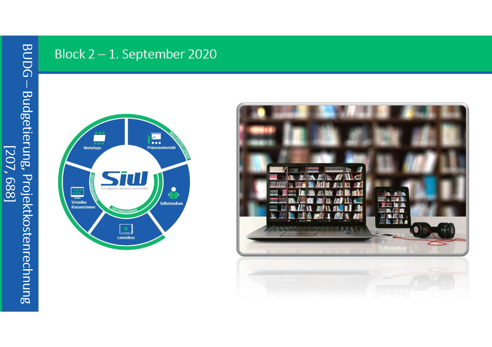

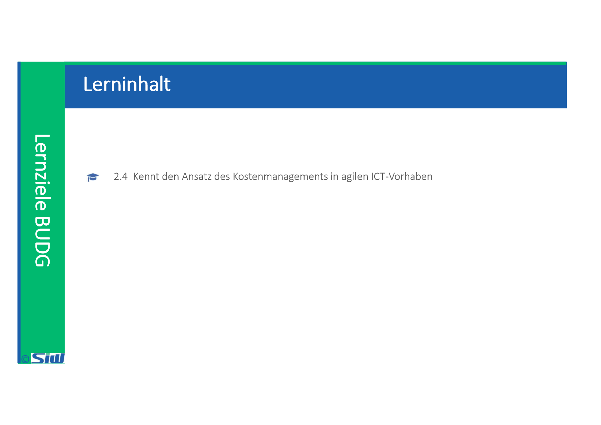

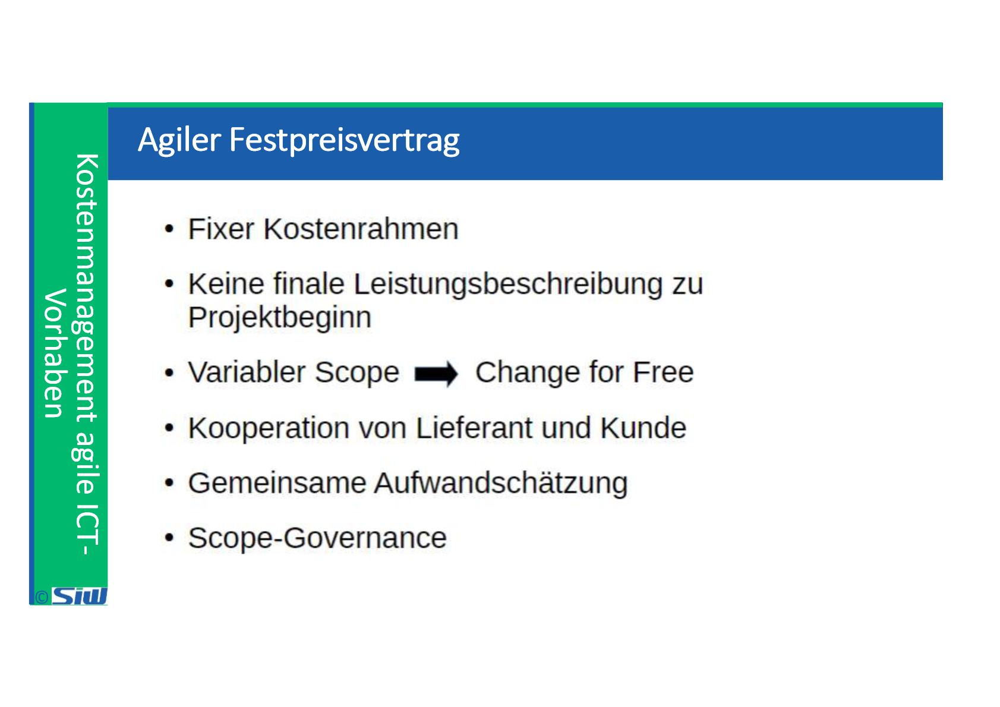

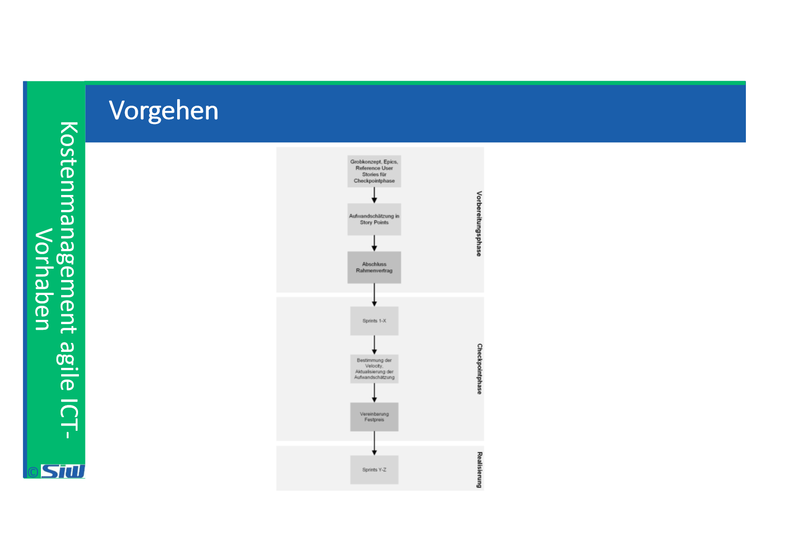

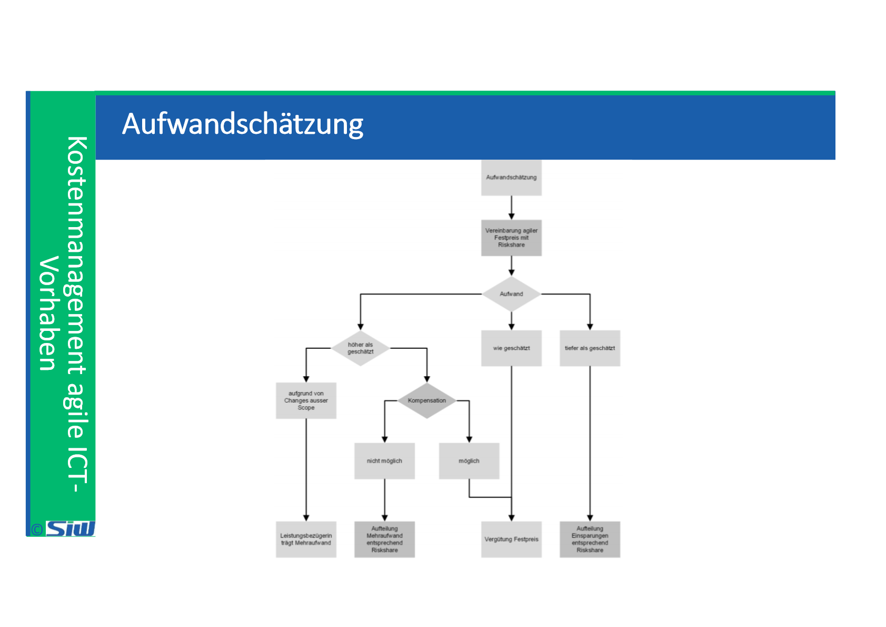

![Story Points Story-Points • Virtuelles Mass, das auf dem Vergleich des Aufwandes einer Anforderung mit einer Referenzstory basiert • Vergleich durch Team mit einer Aufgabenstellung, deren Umsetzung für alle nachvollziehbar ist • Der Aufwand der Referenzstory wird dabei als I Story-Point gesetzt Wenn nun andere Anforderungen geschätzt werden sollen, so wird lediglich verglichen, wie deren Aufwand in Relation zur Referenzstory ist Ein Beispiel aus dem Alltag mag die Vorgehensweise weiter erläutern. Nehmen wir an, Ihr Team wäre Ihre Familie. Als Referenzstory wählen Sie das Decken des Tisches für die ganze Familie mit jeweils Gabel und Messer, einem Teller, einem Salatteller, Trinkglas und Serviette. Alle in der Familie können sich vorstellen, wie gross der Aufwand dafür ist. Soll nun eine andere Anforderung, beispielsweise das Zubereiten eines gemischten Salats mit drei verschiedenen Sorten Salat, erfüllt werden, so würde die Familie womöglich genauer zurückfragen, welche Salatsorten denn vorgesehen seien und ob die Salatsauce selbst hergestellt oder eine gekaufte verwendet werde. Anschließend haben alle eine Vorstellung vom Umfang der Aufgabe und es werden womöglich Schätzungen, zwischen 2 und 5 Story-Points, genannt werden. ](../media/S1_04_BUDG_Budgetierung-BUDG--Block-2-image11.png)

![Aspekte Aufwand-/Kostenmanagement Schätzen mit... Story Points (Abstrakte Einheit, die die Grösse einer User Story beschreibt) Stunden (Aufwand für eine User Story in Stunden) Positive Aspekte Relatives Schätzen wird einfacher Ermöglichen Aussage zum Volumen der Stories Story Points schützen das Team, sind teamfähiger Geben dem Team die Möglichkeit, ein gemeinsames Verständnis über die Stories zu erreichen Geeignet für kleinere Stories (2-12h), da Aufwand besser konkret abschätzbar Tendenziell einfacher anwendbar bei Firmen- internen Projekten, wenn der Aufwand weniger kritisch kontrolliert wird Negative Aspekte Sind schwierig zu erklären / verstehen Generell abstraktes Konzept Ermöglicht sehr detailliertes Controlling, darum kann das Team weniger gut geschützt werden Zeigen am deutlichsten eine Scheinwahrheit, denn Schätzungen sind per se ungenau ](../media/S1_04_BUDG_Budgetierung-BUDG--Block-2-image12.png)

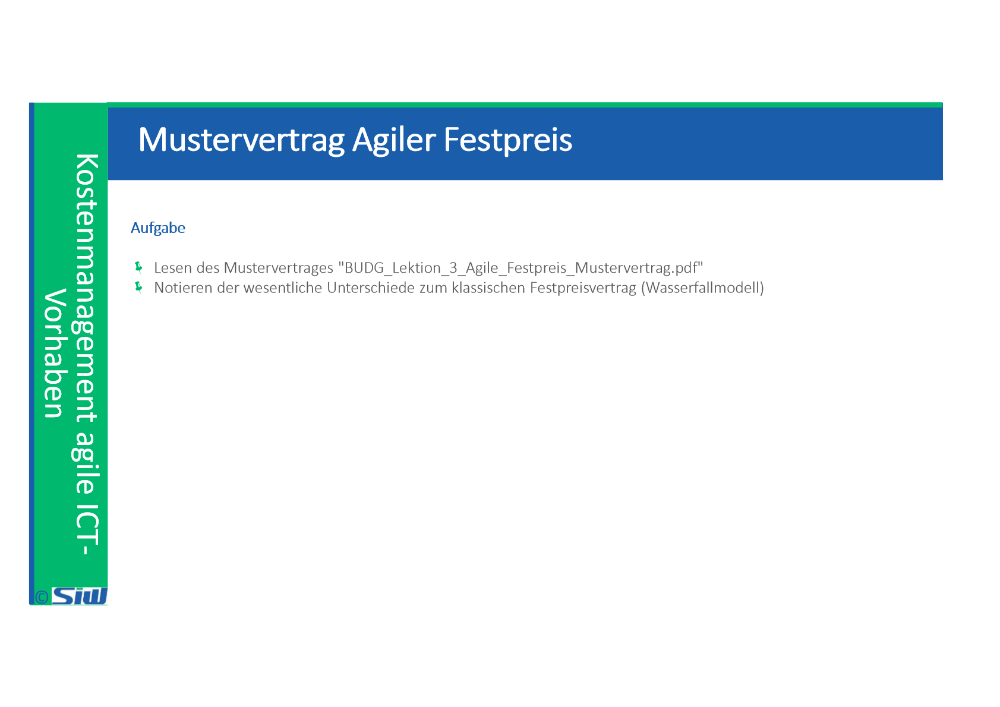

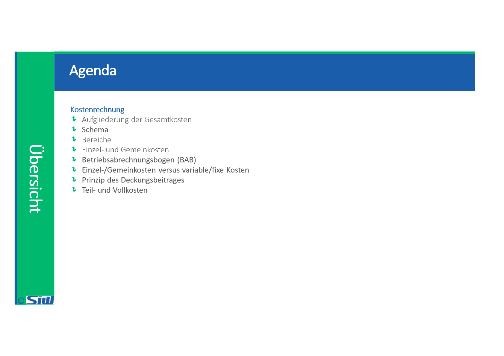

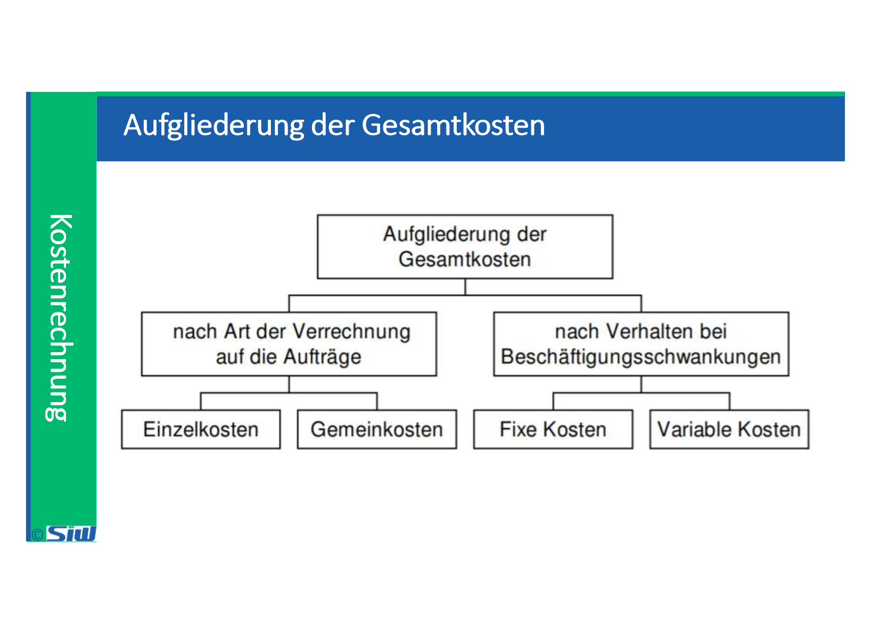

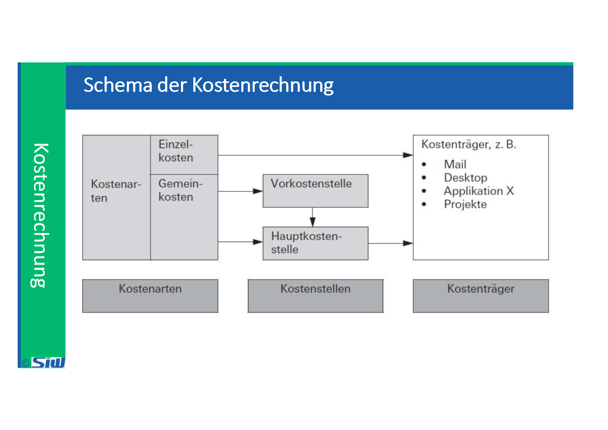

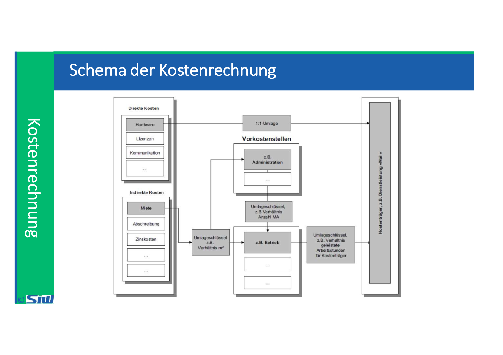

![Bereiche der Kostenrechnung Kostenartenrechnung Welche Kosten fallen an? Aufgaben: Aufwand gemäss Buchhaltung wird in Kosten überführt. Ertrag in Leistun- gen (Erlöse): • Ermittlung der effektiv für die betriebliche Leis- tungserstellung entstan- denen Kosten sowie der Erlöse (Grundlage sind Aufwand bzw. Ertrag nach der Finanzbuchhal- tung, die abzugrenzen sind) • Aufteilung in Einzel- und Gemeinkosten Gliederung der Kostenarten aufgrund des Kontenplans Kostenstellenrechnung Wo fallen die Kosten an? Aufgaben: Ubernahme der Gemeinkosten und deren Verrechnung (Umlage) auf die Kostenträger: Kostenträgerrechnung Wofür fallen die Kosten an? Aufgaben: Kosten der Pro- dukte/Dienstleistungen wer- den ermittelt: • Zuordnung der Gemein- kosten (GK) auf die Ab- teilungen und Betriebs- stellen, wo sie entstan- den sind Ermittlung der Verteil- schlüssel für die GK, mit denen eine Umlage der GK von den Kostenstei- len auf die Kostenträger vorgenommen wird • Zuteilung sämtlicher Kosten auf die Kostenträ- ger (Einzelkosten direkt ab Kostenartenrechnung und Gemeinkosten indi- rekt via Kostenstellen- rechnung) Die Differenz zum Netto- erlös des Kostenträgers ergibt den Erfolg (Ge- Winn oder Verlust) je Kostenträger (je Produkt) Gliederung der Kostenstellen aufgrund der Organisations- struktur Gliederung der Kostenträger aufgrund der Leistungsstruk- tur ](../media/S1_04_BUDG_Budgetierung-BUDG--Block-2-image19.png)

![Einzel- und Gemeinkosten Aufwände & Erträge Filter zeitliche Abgrenzung Filter sachliche Abgrenzung Einzelkosten werden auch als direkte Kosten bezeichnet. Sie können mengen- und wertmäßig einem einzelnen Kostenträger (Produkt) zugerechnet werden. Sie fließen daher direkt in die Kostenträger- rechnung ein. Alle anderen Kosten sind Gemeinkosten und werden in der Kostenstellenrechnung auf Kostenstellen (Organisations- einheiten, Abteilungen) verteilt. • Kosten • Leistungen Damit wirklich diejenigen Werte einfliessen, die zu der gehören Aufwände und Erträge, die nicht unmittelbar mit der Erbringung einer Dénstleistung in Zusarnmenhang stehen Einzelkosten Weiter- verarbeitung in der Kosten- stellen- und Kostenträger- rechnung Gemeinkosten ](../media/S1_04_BUDG_Budgetierung-BUDG--Block-2-image20.png)

![Betriebsabrechnungsbogen (BAB) - Beispiel Betriebsabrechnungsbogen der Tisch AG für das Jahr 20 _ 1 mit Ist-Vollkosten Oberleitung der Arten Abgren- BEBU Kostenstellen Kostentråger Tische M aterial- Fertigung V«waltlmg Ange- Fertige Einzel material kosten Personalkosten Diverse Gemeinkosten Abschreibungen Umlage Materialstellen Fertigung HK der Produktion HK fertige Tische HK verkaufte fische Nettoerlöse Bestandesånderungen Bezeichnung 10000 16000 13000 5 000 44 000 -42500 -7800 -6300 Betriebs- - 200 - 200 - 200 10000 16000 13000 4 800 43 800 -42 soo -7800 Ist- Gewinn stellen 500 200 800 Vertrieb fangene 12000 11000 4 000 27 000 -27000 3 500 1 800 - 6000 10000 10 000 27 000 37 800 - 36000 -1800 36 om -30 000 o Verkaufte 30 000 6 000 36 -42 soo -6 soo Ist- ](../media/S1_04_BUDG_Budgetierung-BUDG--Block-2-image23.png)

![Einzel-/Gemeinkosten versus variable/fixe Kosten riterien Einzelkosten (direkte Kosten) Gemeinkosten (indirekte Kosten) ariable Kesten Viele Einzelkosten verändern sich mit dem Absatz, sind also varia- bel. Sie sind so häufig, dass oft (fälschlicherweise) Einzelkosten mit variablen Kosten gleichge- setzt werden. Nicht wenige Gemeinkosten ver- ändern sich mit dem Absatz, sind also variabel. Sie sind doch so häufig, dass es falsch wäre, Gemeinkosten ein- fach mit fixen Kosten gleichzuset- fixe Es kann aber auch Einzelkosten geben, die unabhängig von der Absatzmenge anfallen, und somit fix sind. Vorkommen allerdings seltener. Die Gemeinkosten fallen zu einem grösseren Teil unabhängig von der Absatzmenge an, sind also fix. Vorkommen, das zwar überwiegt; es wäre aber falsch, Gemeinkos- ten mit fixen Kosten gleichzuset- zen. ](../media/S1_04_BUDG_Budgetierung-BUDG--Block-2-image24.png)

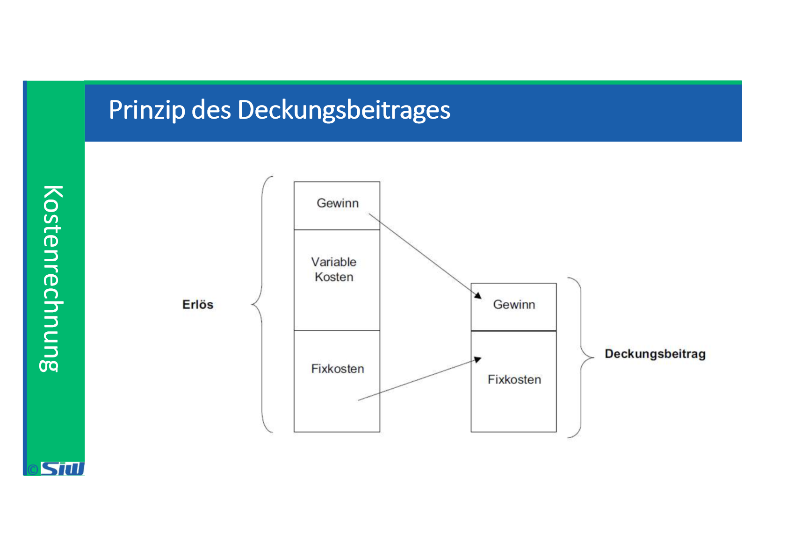

![Vollkosten Alle Belastungen und Gutschriften erfolgen in der BEBU zu Ist-Werten. Dieses Verfahren eignet sich für einmalige oder unregelmåssige Auswertungen. Die Darstellung erfolgt in der Praxis und im unterricht in Form eines Betriebsa brech nungsbogens. Auf den Kostentrågern wird der Ist-Erfolg ausgewiesen. 'Ian•wtkosten Die Belastungen und Gutschriften auf den Kostentrågem erfolgen teilweise mit geplanten Werten (an Stelle von Ist-Werten), wobei folgende Verfahren unter- schieden werden: Die Belastungen auf den Kosten- trägem erfolgen zu Normal- Kosten. Die BEBU-Objekte werden in der Praxis in Formularform dargestellt. Für den Unterricht eignet sich auch der Betriebsabrechnungsbogen. Auf den Kostentrågem wird ein Normalerfolg ausgewiesen. Die Belastungen auf den Kosten- trägern erfolgen zu Standard- Die BEBU-Objekte werden in der Praxis in Formularform dargestellt. Für den Unterricht eignet sich auch der Betriebsabrechnungsbogen. Auf den Kostentrågem wird ein Standarderfolg ausgewiesen. ](../media/S1_04_BUDG_Budgetierung-BUDG--Block-2-image27.png)

