# BUDG: Block 3

Created: 2021-10-12 16:59:04 +0200

Modified: 2021-11-03 15:49:10 +0100

---

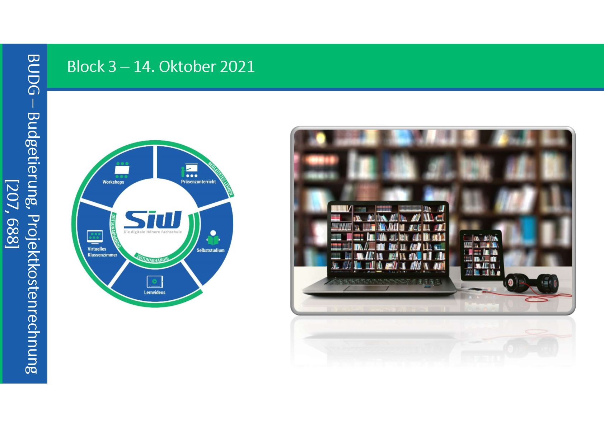

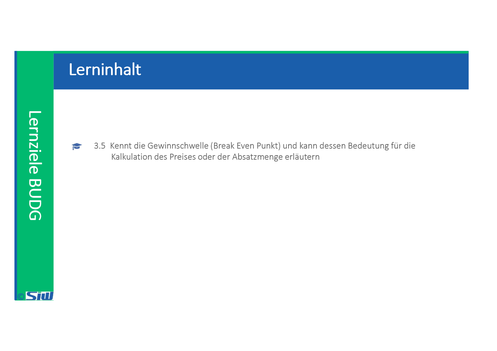

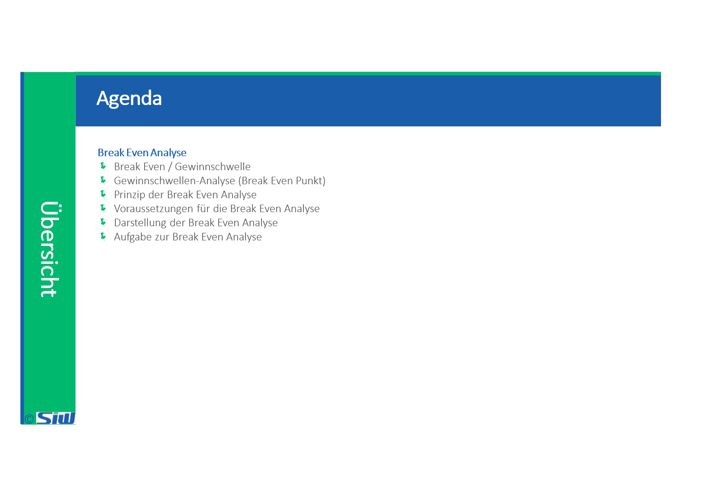

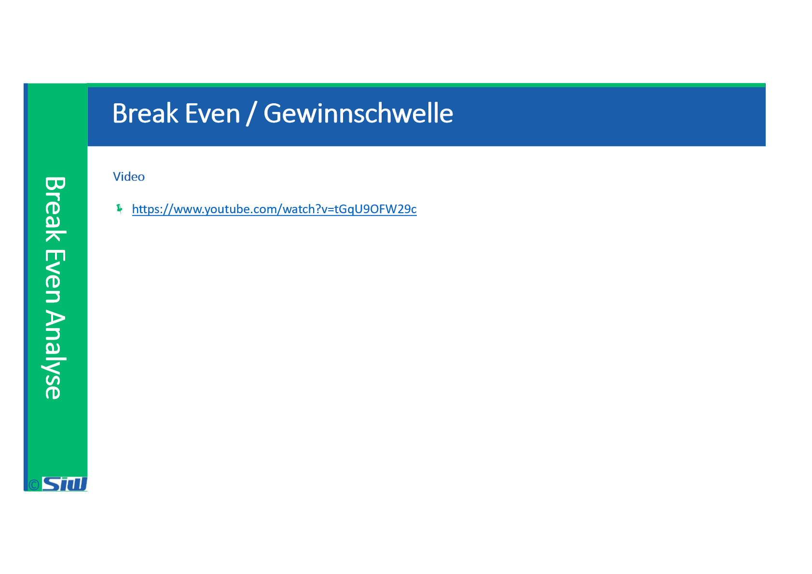

![Gewinnschwellen-Analyse (Break Even Punkt) Ermittlung der Absatzmenge (des Umsatzwertes), die (der) erreicht werden muss, um Gewinne realisieren zu können. Die Break-Even- analyse wird oft auch als Gewinnschwellenanalyse bezeichnet. Der Break-Even-Point (BEP) ist jener Punkt (Umsatzniveau oder Mengeneinheiten), bei dem gilt: Gesamterlös = Gesamtkosten Übergang von der Verlust- in die Gewinnzone Gewinn = O jener Umsatzwert, bei dem die bisher erlösten Deckungsbeiträge gerade ausreichen, die Gesamt- fixkosten der Unternehmung zu decken; jeder zusätzliche Umsatz bringt einen Gewinn in Höhe des vollen Deckungsbeitrages. ](../media/S1_04_BUDG_Budgetierung-BUDG--Block-3-image6.png)

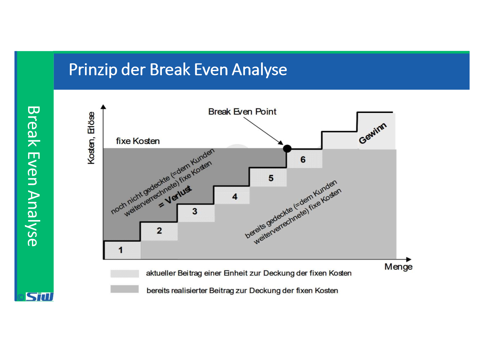

![Voraussetzungen für die Break Even Analyse Folgende Ausgangsdaten müssen bekannt sein: Der Preis pro verkaufte Einheit Brutto-Verkaufspreis abzüglich Erlösminderungen und Erlösschmälerungen Die variablen Kosten pro produzierte Einheit beschäftigungsabhängige Kosten, z.B. Rohstoffe, Komponenten mittels Stückliste, ev. Lohnkosten laut Arbeitsgangtabellen und Verrechungssätze Die Fixkosten pro Abrechnungsperiode beschäftigungsunabhängige Kosten, z.B. Gehälter, Abschreibungen, Mieten, Versicherungen etc. Die Menge der verkauften Einheiten ](../media/S1_04_BUDG_Budgetierung-BUDG--Block-3-image8.png)

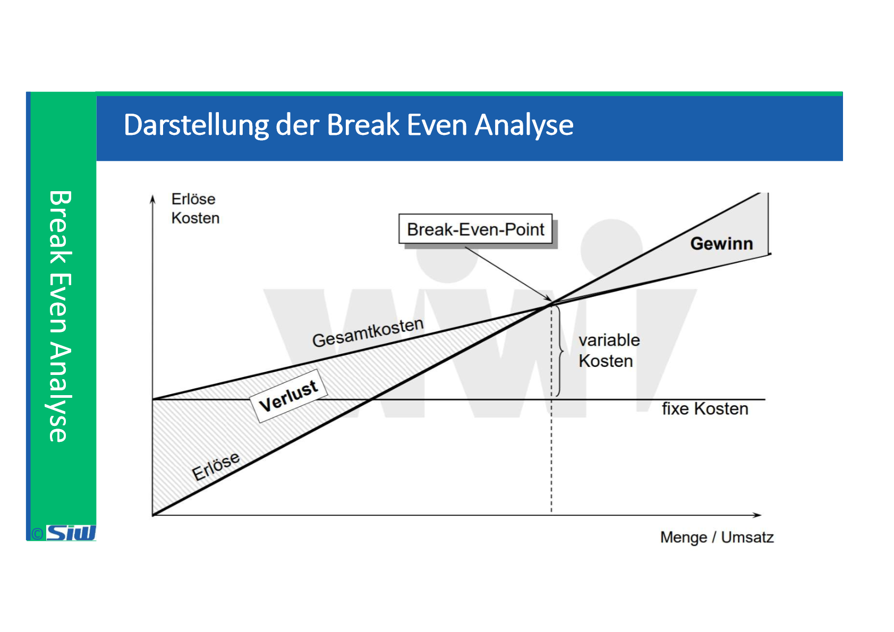

![Aufgabe zur Break Even Analyse Die Phone AG stellt kleine elektronische Steckverbindungen für schnurtose Telefone her. Im vergangenen Monat wurden 6.000 Stück produziert und zu insgesamt 120.000 EI-JR verkauft. Die monatlichen Fixkosten beliefen sich auf 70.000 EUR. Die proportionalen Kosten betrugen 6 EI-JR pro Stock. Die Kapazitätsgrenze der Phone AG betragt derzeit 6.500 Stock pro Monat. a) Wie hoch war das Betriebsergebnis des vergangenen Monats wenn Mehrwertsteuer- Aspekte unberücksichtigt bleiben! a) Betriebsergebnis Lösung: b) Bestimmen Sie den Break even-Punkt des vergangenen Monats! b) Break even-Punkt Lösung: c) Erläutem Sie kurz die Bedeutung des Break even-Punkts! c) Lösung: ](../media/S1_04_BUDG_Budgetierung-BUDG--Block-3-image10.png)

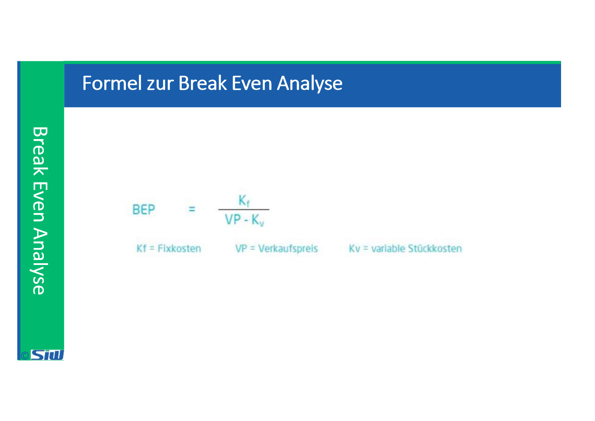

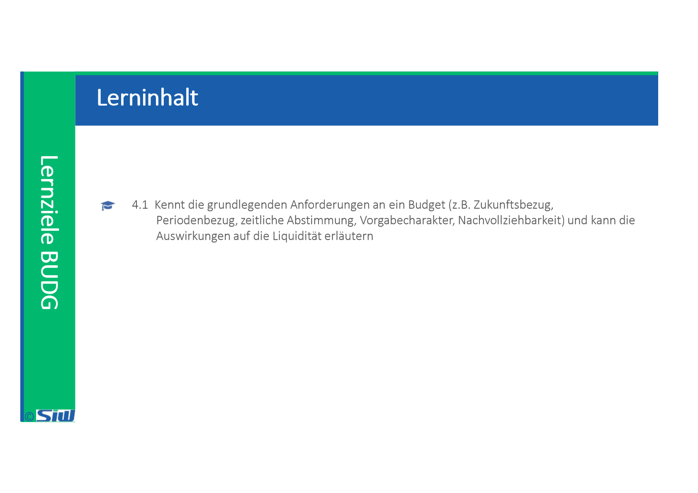

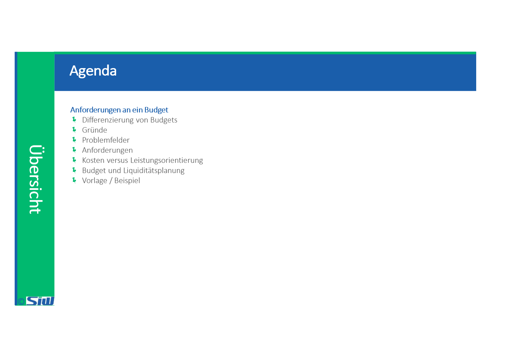

![Differenzierung von Budgets Budgetierungsobjekte Budgetzeiträume Wertekategorien Verbindlichkeitsgrade Bindung an Bezugsgrössen • • • • • • • Funktionen. Prozesse, Produkte, Regionen oder als hori- zontale Differenzierung Hierarchieebenen der Unternehmung als vertikale Differen- zierung Projekte als «zeitlich begrenzte» Budgets Monatsbudget Quartalsbudget Jahresbudget Mehrjahresbudget Ausgabenbudget Kostenbudget Deckungsbeitragsbudget Umsatzbudget Investitionsbudget Vorgabe fester Zielgrössen (Etat) Vorgabe von Orientierungsgrössen Starre Budgets für einen bestimmten Beschäftigungsgrad Flexible Budgets für schwankende Beschäftigungsgrade ](../media/S1_04_BUDG_Budgetierung-BUDG--Block-3-image14.png)

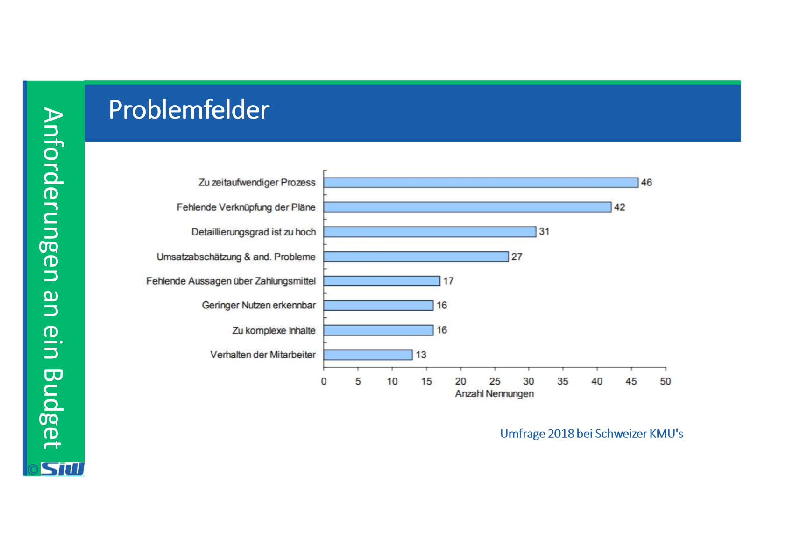

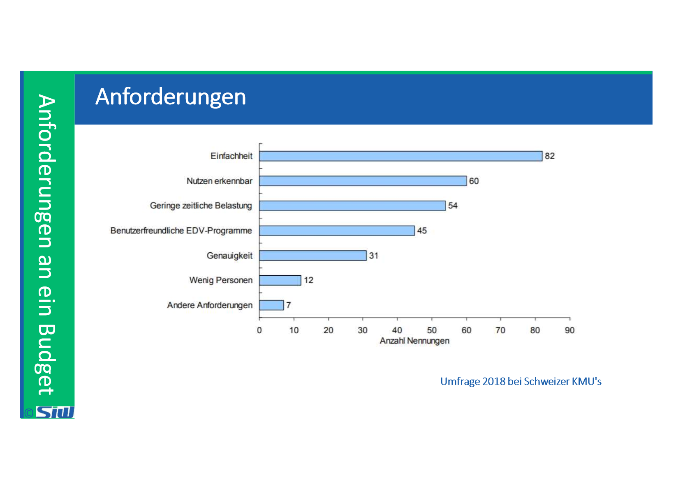

![Kosten versus Leistungsorientierung Typische Maßnahmen Kosten- orien- tierter Ansatz Leistungs- orien- tierter Ansatz • Auslagerung der IT-Abteilung (oder Teile) • Stellenkiirzungen in der I T • IT-Kostenverrechnung per Gemeinkostenumlage • Rol als alleiniger Maßstab für Projekte • Festlegung IT-Budget als %-Satz vom Umsatz • Ausrichtung und Steuerung der IT an Unternehmenszielen • Standardisierung von IT-Leistungen • Optimierung Von IT-Prozessen • Verursachungsgerechte IT-Kosten- und Leistungsverrechnung • Beitrag zu Unternehmenszielen als Maßstab für IT-Projekte und IT-Budget Gewünschte Wirkung Senkung der IT-Kosten Erhöhung der Leistungs- fihigkeit des Unternehmens ](../media/S1_04_BUDG_Budgetierung-BUDG--Block-3-image19.png)

![> Budget und Liquiditätsplanung Neun von zehn Konkursen werden durch Liquiditätsengpässe verursacht. Eine sorgfältige Budgetplanung sichert das Überleben der Firma. Das Budget zeigt, mit welchen Aufwendungen und Erträgen man über das ganze Jahr rechnen kann Kosten und Einnahmen fallen in den meisten Fällen aber nicht einfach gleichmässig über das Jahr Es ist daher absolut zwingend, eine möglichst genaue Liquiditätsplanung aufzustellen Budget zeigt, wann welche flüssigen Mittel vorhanden sein müssen Ist die Zahlungsfähigkeit nicht jederzeit gesichert, drohen Mahnungen, Betreibungen und im schlimmsten Fall der Konkurs ](../media/S1_04_BUDG_Budgetierung-BUDG--Block-3-image20.png)

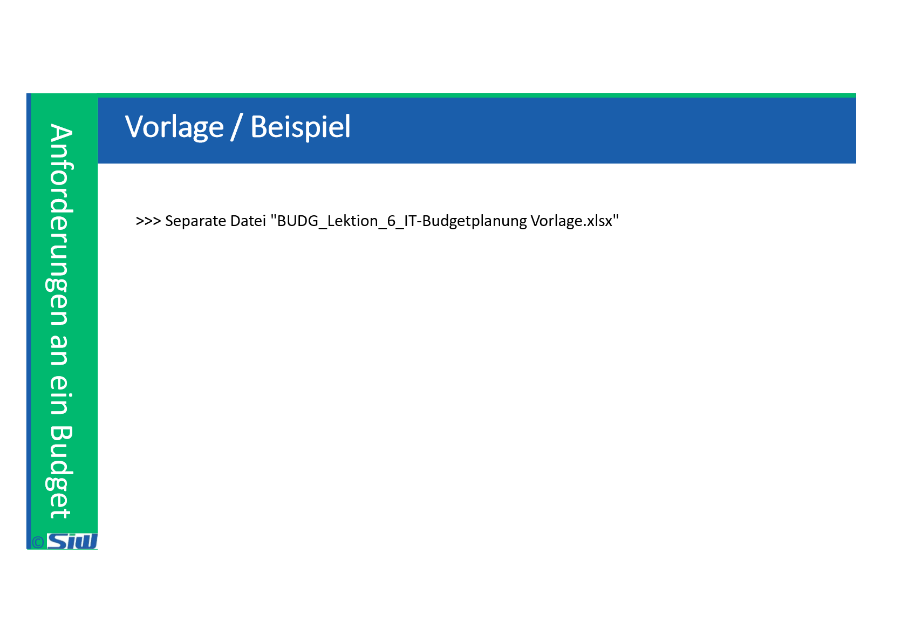

