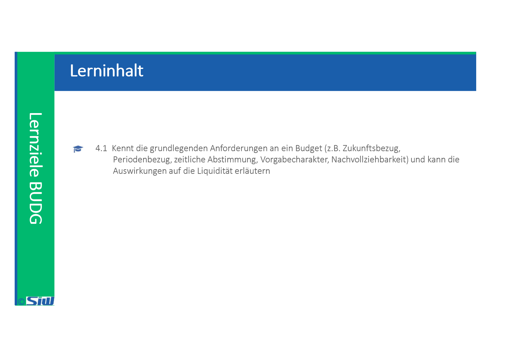

# BUDG: Block 4

Created: 2021-10-12 16:59:18 +0200

Modified: 2021-11-03 15:58:42 +0100

---

![Beispiel Roboter-Schweissanlage Anschaffungskosten Roboterzelle mit 3 Schweißro- botecn Sicherungs- und Steuerungs- elektronik Transport und Inbetriebnahme Gesamt Personalkosten zum Betrieb der Anlage Energiekosten Wartungskosten (extern) Laufende Kosten beim Anwender (z. B. Anwender- schul ungen) Opportunitätskosten für Platzbedarf (15 EUR pro qm:) Opportunitätskosten aufgrund von unterschiedlichen Anlagenvertügbarkeiten und Ausschussraten (höhere OEE der Alternative B) Gesamt kosten Alternative A 600.000 EUR 120.000 EUR 80.000 EUR 800.000 EUR 120.000 EUR (2 Mitarbeiter) 120.000 EUR 100.000 EUR 6.000 EUR 3.000 EUR 360.000 EUR 1.509.000 EUR Alternative B 1.000.000 EUR 140.000 EUR 60.000 EUR 1.200.000 EUR 60.000 EUR (1 Mitarbeiter) 50.000 EUR 40.000 EUR 3.000 EUR 1.800 EUR 120.000 EUR 1.474.800 EUR ](../media/S1_04_BUDG_Budgetierung-BUDG--Block-4-image11.png)

![Beispiel Vergleich IT-Infrastruktur-Lösungen Variante eigene Server Infrastruktur I Server ink'. 3 Computer (PC / Notebook), Inbetriebnahme Hosted Exchatve Care Pack Server (CHF 50/Monat) (geschåtzt. CHF CHF 3 5/Mo:ut) Total S Durch%hnitt pro 'ahr (Total Cut of Variante Cloud Låsung im Rechencenter PC Oder (geschåtzt. CHF 1 pro Geråt) Zugar* für 3 Benutzer ink'. MS Host ed CHF Total S Jame Ourchschnitt pro Jahr 3 201 g 2020 s 252 2020 2021 3 s 252 2021 2022 s 252 2022 1 6S6 40010 8 002 2 280 28 560 ](../media/S1_04_BUDG_Budgetierung-BUDG--Block-4-image12.png)

![Budget und Forecast • Planung und Budgetierung (Jahresplanung) sind Zielsetzungsinstrumente und damit eine Willensäusserung des Managements Der unterjährige Forecast stellt hingegen keine Zielsetzung dar, sondern bildet den Wissensstand im Unternehmen über die aktuelle Geschäftsentwicklung ab Ein Beispiel zeigt den Unterschied zwischen Budget und Forecast: Im Oktober 2019 wird ein Gewinn von TCHF 100.--- für das Jahr 2020 budgetiert. Der aktuelle Forecast im März 2020 zeigt dagegen an, dass 2020 voraussichtlich nur ein Gewinn von TCHF 90.--- erzielt wird. Das Ziel der Geschäftsleitung bleibt nach wie vor ein Gewinn von TCHF 100.---. Der Forecast liefert zeitnah die Information, dass zur Zielerreichung Massnahmen notwendig sind (z.B. die vorgezogene Einführung einer neuen Produktlinie oder die Senkung von Personalkosten). ](../media/S1_04_BUDG_Budgetierung-BUDG--Block-4-image13.png)

![Aufgabe 1 Ein IT-Leiter beauftragt ein externes Beratungshaus damit, Massnahmen zur Reduzierung der Total-Cost- of-Ownership (TCO) der Informationssysteme des Unternehmens zu erarbeiten. Das Beratungshaus empfiehlt u. a. folgende Massnahmen: Streichung der IT-SchuIungen für alle Mitarbeiter Verlängerung der Nutzungsdauer für Personal-Computer von 3 auf 5 Jahre sowie für Bildschirme von 4 auf 6 Jahre, Zukünftig nur noch Beschaffung von gebrauchten Laptops die mindestens 2 Jahre alt sind, da deren Anschaffungskosten deutlich geringer sind, Verzicht auf tägliche Datensicherungen, da diese nur Speicherplatz belegen, der für anderen Zwecke besser genutzt werden kann, Reduzierung der Störungshotline-lnanspruchnahme durch Einführung einer „Beratungsgebühr" von 10 CHF je Anruf zzgl. 2 CHF/min Beratungszeit. Der IT-Leiter fragt sie um ihre Meinung. Nehmen Sie zur Tauglichkeit der jeweiligen Massnahmen Stellung. ](../media/S1_04_BUDG_Budgetierung-BUDG--Block-4-image14.png)

| **Kategorie**      | **Position**                  |           | **Betrag**           | **Berechnungsgrundlage**   | **Hochrechnung auf 3 Jahre** |
|----------|------------------|------|-----------|-----------------|------------|
|                   |                              |           |                     |                           |                             |
| *Direkte Kosten*   |                              |           |                     |                           |                             |
| Hard und Software  | Hardware für Anwenderprozesse |           | CHF 100'000.00       | Rechnungen                 | CHF 100'000.00               |
| Hard und Software  | Hardware für IT-Abteilungen   |           | CHF 10'000.00        | Rechnungen                 | CHF 10'000.00                |
| Hard und Software  | Software für Anwenderprozesse |           | CHF 1'500'000.00     | Rechnungen                 | CHF 1'500'000.00             |
| Hard und Software  | Software für IT-Abteilung     |           | CHF 5'500.00         | Rechnungen                 | CHF 5'500.00                 |
| Intern Ausbildung  | Schulung                      |           | CHF 10'000.00        | Hochrechnung letztes Jahr  | CHF 30'000.00                |
|                   | Planung und Prozessmanagement |           | CHF 40'000.00        | Annahme                    | CHF 120'000.00               |
|                   | Datenbankmanagement           |           | CHF 50'000.00        | Annahme 100 CHF pro Stunde | CHF 150'000.00               |
|                   | Endanwenderschulung           |           | CHF 12'000.00        | Annahme                    | CHF 36'000.00                |
|                   |                              |           |                     |                           |                             |
| *Indirekte Kosten* |                              |           |                     |                           |                             |
|                   | Help Desk (1&2)               |           | CHF 12'000.00        | Annahme                    | CHF 36'000.00                |
| Support            | Technischer Support (3)       |           | CHF 7'500.00         | Annahme                    | CHF 22'500.00                |
|                   |                              |           |                     |                           |                             |
|                   |                              | **Total:** | **CHF 1'747'000.00** |                           | **CHF 2'010'000.00**        |
|                   |                              |           |                     |                           |                             |

