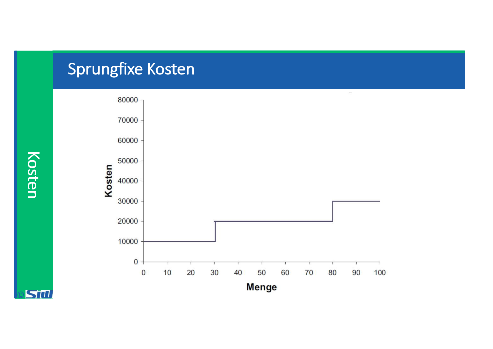

# BUDG: Block 5

Created: 2021-10-21 15:55:44 +0200

Modified: 2021-11-03 16:02:15 +0100

---

![IT Kostenstruktur 100 90 80 70 60 50 40 30 20 10 55 13 17 8 IT-Kosten Produktivitätsverluste IT-Personal Externer IT-Service Software Hardware Produktivitätsverluste: Unproduktive Nutzung durch den Endanwender, wie z. B.: Entwicklung von eigenen Applikationen (beispielsweise auch Excel-Tabellen uvm.) Nicht-Verfügbarkeit des betrachteten Systems (Personalkosten bzw. incl. Kosten für entgangene Geschäftstätigkeiten Selbsthilfe und Gelegenheitstraining (Casual Learning and Self-Support) Trainingsmassnahmen zur Schulung des Endanwenders in einer bestimmten Applikation (Formal Learning) Unterstützung eines anderen unbedarften Anwenders (Peer Support) ](../media/S1_04_BUDG_Budgetierung-BUDG--Block-5-image5.png)

![Berechnung TCO (Beispiel Service Mail) Kategorie Direkte TecMischer Supp«t Hardware & Sotwae Indirekte User mwntirne Total TCO Position hterrE Ausbildjng Ka-n m Betrieb urxi Ser.er (inkl. Projüt und Maisonware Beschafung Lizenzgemren 3 hhre Adnülistration Führung 4Ø User 2 cbwntirne I Jahr Betrag 20 40 300 5 50 200 400 263 1598 Berechnungsgrundlage Statistischer Wert der der MA-Kosten Rech nuW1 RechnurW1 Lizenzgebüren Annahme Annahme Annahme MA -Stundel Direkte und indirekte Kcsten Gemäss Buch „IT-Dienstleistungen budgetieren (207)", Seite 41, Firma Servact AG ](../media/S1_04_BUDG_Budgetierung-BUDG--Block-5-image7.png)

![Aussage TCO (Beispiel Service Mail) Was kann Sepp nun aus diesem TCO-Wert herauslesen? Er kann abschätzen, was dieser Service pro Jahr für die Servact kosten wird, nämlich rund Fr. 311 000 (TCHF 935 / 3 Jahre) an direkten, budgetierten Kosten. Berücksichtigt man ausserdem die Schätzung der indirekten, nicht-budgetierten Kosten, so sind für den Service pro Jahr rund Fr. 532 000 (TCHF 1 598 / 3 Jahre) zu veranschlagen. Er kann abschätzen, was die Handels Holding pro Benützer und Jahr zu bezahlen hat, nämlich rund Fr. 777 bei 400 Benützer 311 / 400). Gemäss Buch „IT-Dienstleistungen budgetieren (207)", Seite 41, Firma Servact AG ](../media/S1_04_BUDG_Budgetierung-BUDG--Block-5-image8.png)

