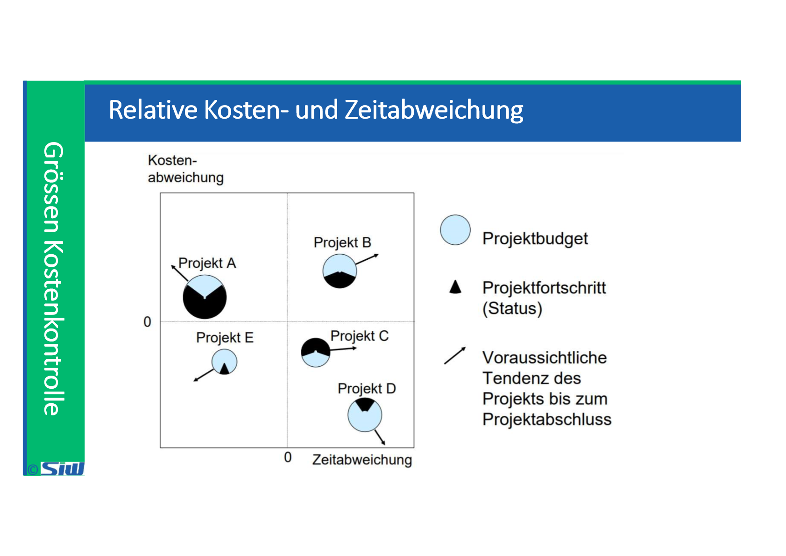

# BUDG: Block 7

Created: 2021-11-02 17:34:13 +0100

Modified: 2021-11-02 17:35:22 +0100

---

![50/50 Methode Die 50/50 Methode ist ein Kompromiss zwischen der 0/100 und der relativen Methode. Wenn das AP geplant ist wird der FG mit 0% bewertet • Sobald mit der Arbeit begonnen wird, nimmt der FG den Wert 50% ein • Den FG Wert 100% bekommt das AP erst nach der vollständigen Fertigstellung Beurteilung der Methode: Die Methode eignet sich sehr gut (auch Projekte mit wenigen AP's), da sie erfahrungsgemäss den Fortschritt über alle APIs gut beurteilt. Die Projektmitarbeiter haben keinen Einfluss auf die Berechnung des FG, was zu einer objektiveren Bewertung führt. c» 20% 'cm AP I im 2 AP im 3 ](../media/S1_04_BUDG_Budgetierung-BUDG--Block-7-image10.png)

![0/100 Methode Der FG kann bei dieser Methode nur den Wert 0% oder 100% annehmen Das AP ist solange auf 0% gesetzt bis es fertiggestellt ist Das kann bedeuten, das ein AP mit einem effektiven FG von 95% immer noch auf 0% steht Beurteilung der Methode: Die Methode arbeitet mit einer extrem vorsichtigen Beurteilung. Sie ist daher in Projekten mit wenig AP's d.h. kleine Projekte ungeeignet, da es zu erheblichen Wirklichkeitsverzerrungen kommen kann. Es kann passieren, dass die Bewertung des FG immer 0% ist, dann werden fast gleichzeitig mehrere AP's fertig und der FG "springt" auf 100%. AP 1 im Zetg»nkt 1 AP 1 Zetg»nh 2 1 im Zetpnkt 3 FG 100% ](../media/S1_04_BUDG_Budgetierung-BUDG--Block-7-image11.png)

![Ursachen für Kostenüberschreitungen • ungenaue Abgrenzung des Projekts; unnötige Arbeiten • Management-Entscheid, tief zu offerieren, um Auftrag zu erhalten • unkontrollierte Abänderung oder Erweiterung der Zielsetzung (offeriert wurde ein VW, nachträglich wird ein Rolls-Royce verlangt) • Verteuerung der Ressourcen (interne/externe Leistungen, Mitarbeiter, Werkzeuge, etc.) • Aufholen von zeitlichen Verzögerungen (Überzeit, externe Kapazität, etc.) • unrealistisch tiefe Schätzung • unvorhersehbare technische Schwierigkeiten • Verrechnung von projektfremden Kosten auf das Projekt ](../media/S1_04_BUDG_Budgetierung-BUDG--Block-7-image17.png)

