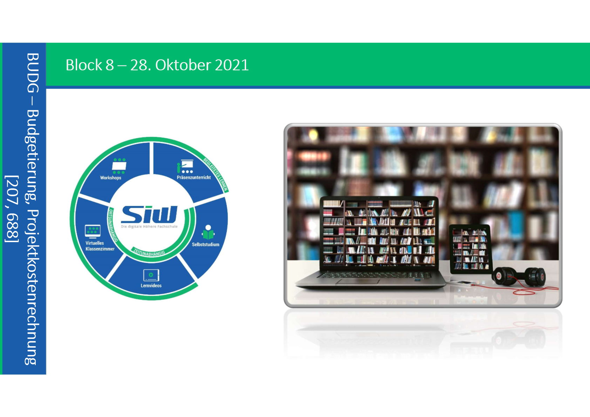
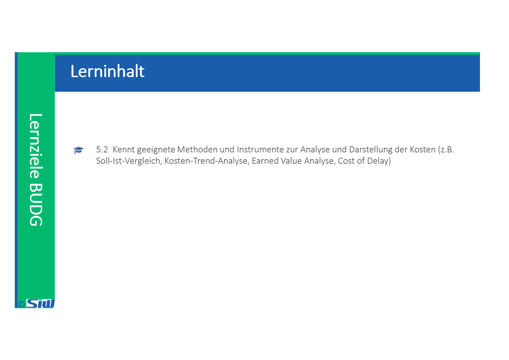
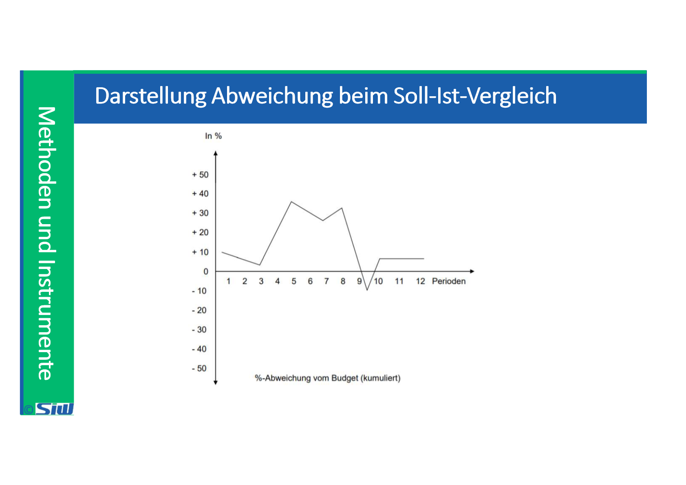
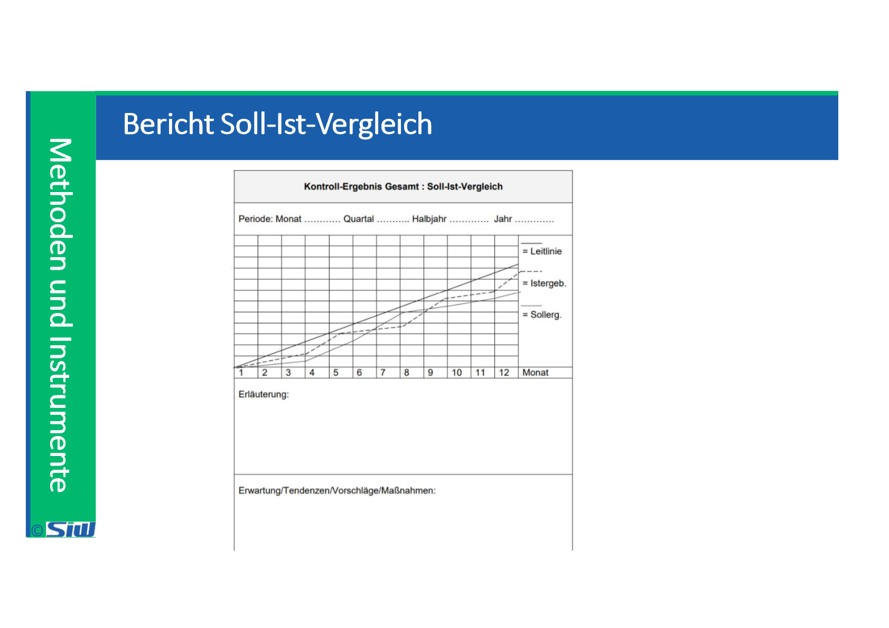
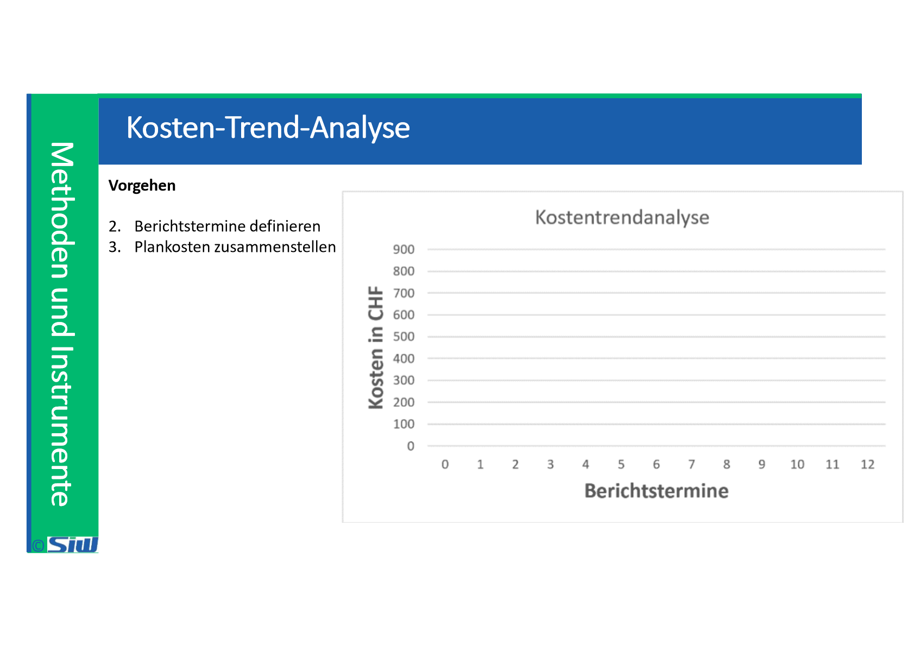
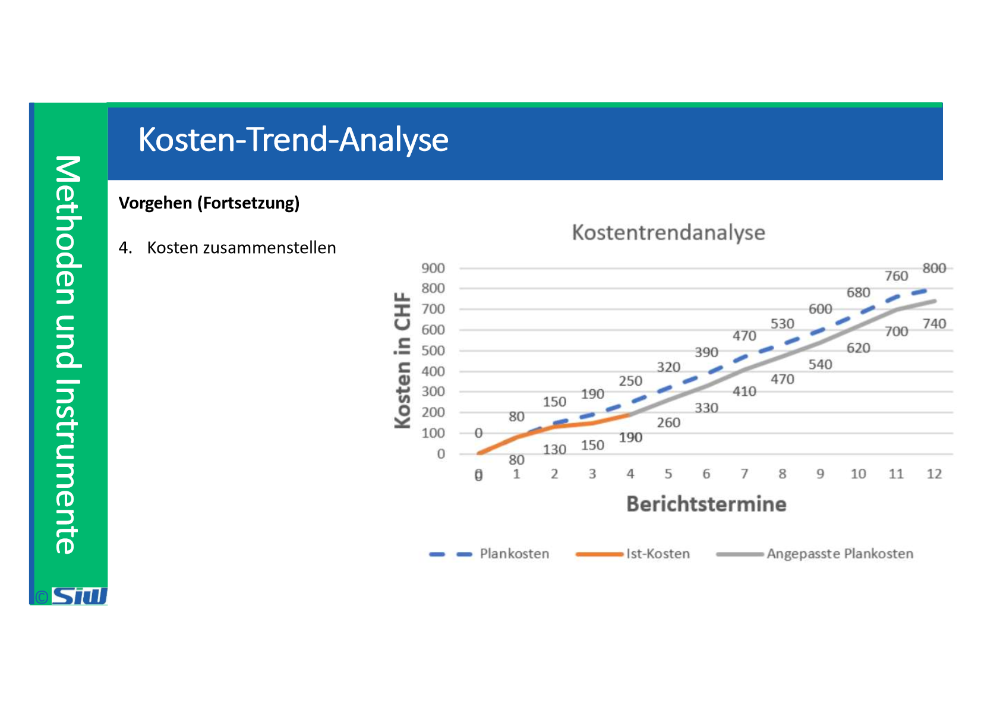
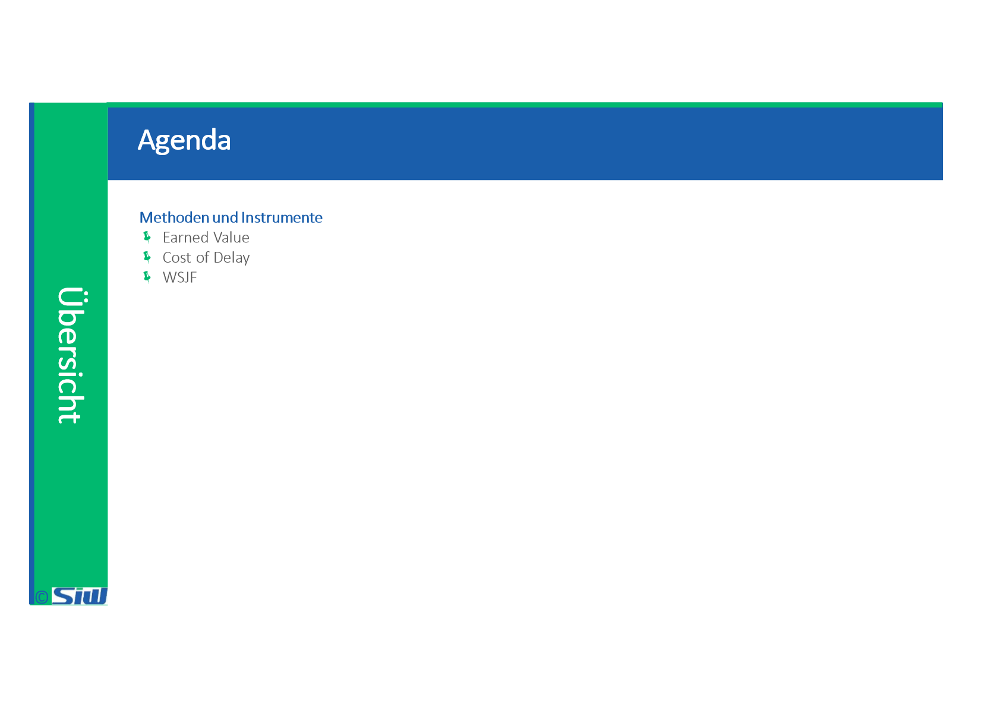
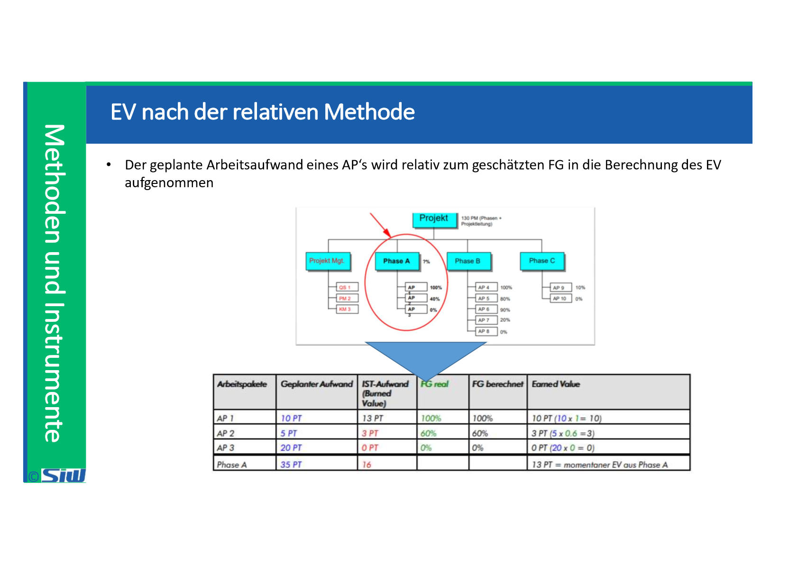
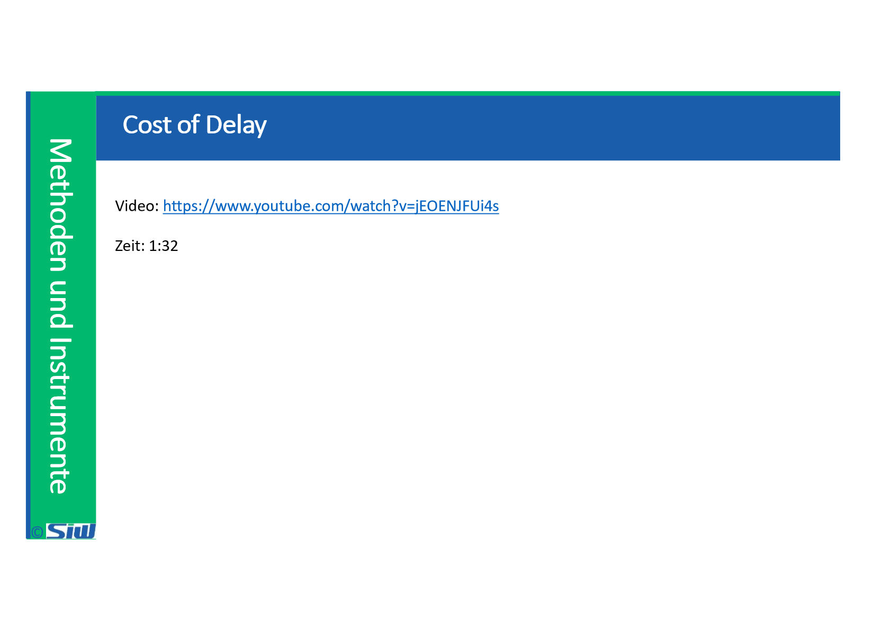
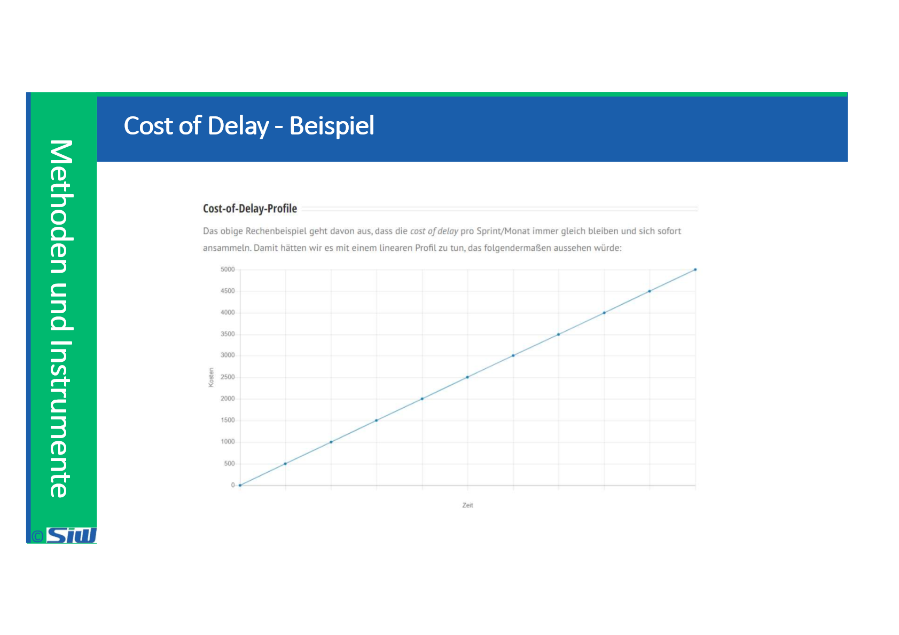

# BUDG: Block 8

Created: 2021-11-02 17:34:22 +0100

Modified: 2022-07-09 09:05:33 +0200

---

![Aspekte Soll-Ist-Vergleich Vergleich der Istwerte mit den Plan- bzw. Sollwerten und Einleitung von Korrekttrmaßnahmen nach der Abweichungsanalyse Planung und Kontrolle müssen der Ver*Éhbarken wegen aufeinander abgestimmt sein Korrekturmechanismus durch Abweichungsanalyse kann mit Lösungsansätzen das ursprüngliche Unternehmenszjel realisieren Oder zu führen Planungs- und Kontrollsystem ist für alle wenn auch in unterschiedlichen Ausprägungen Erstellen der Soll-Ist-Vergleiche in regelrnåßW1 Zeitabstånden (monatlich, quartalsweise. halbjährlich. jährlich) und Darlegung gegenüber den Leitern der Verantwortungsbereiche Soll-Ist-Vergleich hat nur dann tatsächlich seine Berechtigung, wenn er als Ansatzpunkt for Steuerungsmaßnahmen akzeptiert wird (entsprechender Aufbau der Analyseberichte) rechtzeitiges Aufzeigen von Veränderungen der Bedingungen und entsprechende zügige Information der Geschäftsleitung und der betroffenen Abteilungen durch den Controller Abweichungen sind der Normalfall: Anspruch eines Controlling ohne Abweichungen ist autoritär in dem Sinne. dass der Überwachungs- und Diszi lin zu stark betont wird ](../media/S1_04_BUDG_Budgetierung-BUDG--Block-8-image6.png)

![Earned Value (EV = Arbeitswertmethode) Ansatz den FG objektiver und mittels absoluten Werten zu bewerten • Wesentliche Vereinfachung einer "gleichartigen" Bewertung aller Projektarbeiten Messung projektfortschritt indirekt über die geleistete Arbeit • Der Leistung wird dazu der monetäre Wert in Personentagen zugewiesen Es steht nicht der Sachfortschritt in % im Mittelpunkt der Betrachtungen, sondern die verbrauchten Arbeitsressourcen die geplant wurden Der EV ist die Kumulation der geleisteten Arbeit an den APIs • Das Einbeziehen der geleisteten Arbeit bei den AP's kann wiederum nach den drei Methoden 0/100 Methode, 50/50 Methode oder relative Methode ablaufen ](../media/S1_04_BUDG_Budgetierung-BUDG--Block-8-image15.png)

![Cost of Delay - Beispiel Ansatz 3 „Cost of Delay" • • Wichtigste Frage: Was kostet es, wenn Projekt A und B nicht rechtzeitig fertig werden? • Umsatzeinbussen, Strafzahlungen, erhöhte Kosten für externe Ressourcen, etc- Projekt A: 1'000 Euro pro Sprint/Monat Projekt B: 10'000 Euro pro Sprint/Monat Neue Situation: Projekt A 35 % ROI (entspricht 350.000€) Fertigstellung in: 5 Sprints Cost of delay: 1.000 € pro Monat Projekt B 20 % ROI (entspricht 200.000 €) Fertigstellung in: 10 Sprints Cost of delay: 10.000 € pro Monat ](../media/S1_04_BUDG_Budgetierung-BUDG--Block-8-image22.png)

![Cost of Delay - Beispiel Ansatz 3 „Cost of Delay" (Fortsetzung) • Entscheidung für Projekt B: • • • ROI Projekt A: 350'000 Euro Fertigstellung Projekt A: Nach 15 Monaten ROI Projekt B: 200/000 Euro Fertigstellung Projekt B: Nach 10 Monaten cost of Delay Projekt B: 10'000 Euro (10 Monate * Euro 1'000.-) Fertigstellung beider Projekte: Nach 15 Monaten ROI über beide Projekte: 550'000 Euro minus 10'000 Euro = 540'000 Euro Wir hätten hier 40/000 Euro eingespart und das, obwohl Projekt B deutlich weniger Profit erzeugt als Projekt A und doppelt so lange bei der Fertigstellung benötigt! ](../media/S1_04_BUDG_Budgetierung-BUDG--Block-8-image24.png)

![Cost of Delay Costs ot Delay (COD) Die •Costs of Delay' sind eine Annäherung an den erwart«en Wert eines Features, eines Projektes oder auch einer benötigen Capability Dabei setzen sich die Costs of Delay im SAFe Framework aus drei Faktoren zusammen: (User-Business-value•h Wie prohtiert der Kunde (User Value). wie profitieren wir als Unternehmen (Business Value)? Welche nachteiligen Konsequenzen hat es. wenn wir mit der Fertigstellung warten. müssen wir ZB nut einer Strafe rechnen? 2 Wert CTime Criticalitfi. Gibt es also auf der Zeitachse feste Deadlines und damit verbunden die Gefahr, dass der Wert gar nicht mehr erzielt werden kann (weil ZB ein wichtiger Kunde auf ein Feature wartet und Nicht•æreitstellung auf eine andere Lösung gehen vÄirde)? Hat eine mögliche Fertigstellung in xx Monaten ncxh den gleichen Wert wie heute? Risiken / ('Risk Reduction --- Opportunity Enablement Value': Gibt es 3 andere Risiken. die wir damit senken oder Gelegenheiten von denen dein Unternehmen profitieren kann? Gewinnen wir Einsichten. die uns für andere Vorhaben helfen? Das heißt. mit den 'Costs of Delaf ermittelst Du auf einer relativen Skala von 1-10 die Wirkung deines Vorhabens Dabei werden deine •Costs o: Delay• positiv beeinflusst von dem direkten Mehrwert tür Kunden und Unternehmen und Randtpdingungen. die es sinnvoll machen mit der Umsetzung besser jetzt als morgen zu starten. ](../media/S1_04_BUDG_Budgetierung-BUDG--Block-8-image25.png)

![Cost of Delay und WSJF WSJF - Weighted Shortest Job First (SAFe) Mit der WSJF Methode identifizierst Du die Jobs, die die schnellste Wertgenerierung in Aussicht stellen. Dabei ist ein Job ein Epic ein Feature, ein Projekt oder auch eine Capability (Voraussetzung für ein werthaltiges Projekt oder Feature). Um den erwarteten Wert zu ermitteln, schaust Du mit VVSJF zwei Dimensionen an, die Costs of Delay (COD) und die Jobs Size. Cost of Delay WSJF = Job Size WSJF im SAFe @ scaled Agile. Inc Dabei sind die Costs of Delay vereinfacht gesagt eine Annäherung an den erwarteten Wert. Dagegen ist die Job Size eine Annäherung an den erwarteten Aufwand bzw. eine Aussage darüber, wie lange es braucht den Wert zu liefern. ](../media/S1_04_BUDG_Budgetierung-BUDG--Block-8-image29.png)

![Cost of Delay und WSJF Feature / Projekt A Feature / Projekt B Job Size CoD 'Wert 4 2 Job Size 'Aufwand 8 2 Die •Job Size• ist eine Annäherung an den erwarteten Aufwand eines Features, eines Projektes oder auch einer benötigen Capability. Dabei unterstellt SAFe als agiles Framework, dass ein festes Team dauerhaft an der Erledigung einer Aufgabe arbeitet. Das heißt, die benötigte Zeit für die Umsetzung eines Vorhabens ist gleich der •Job Size' und eine valide Annäherung an die Kosten eines Vorhabens. Wie auch die "Costs of Delay' bewertest Du die-Job Size' bzw. den erwarteten Aufwand auf einer Skala von 1-10. Dabei vergleichst Du den Aufwand relativ. d.h. nur mit anderen Vorhaben aus deiner Liste. ](../media/S1_04_BUDG_Budgetierung-BUDG--Block-8-image30.png)

