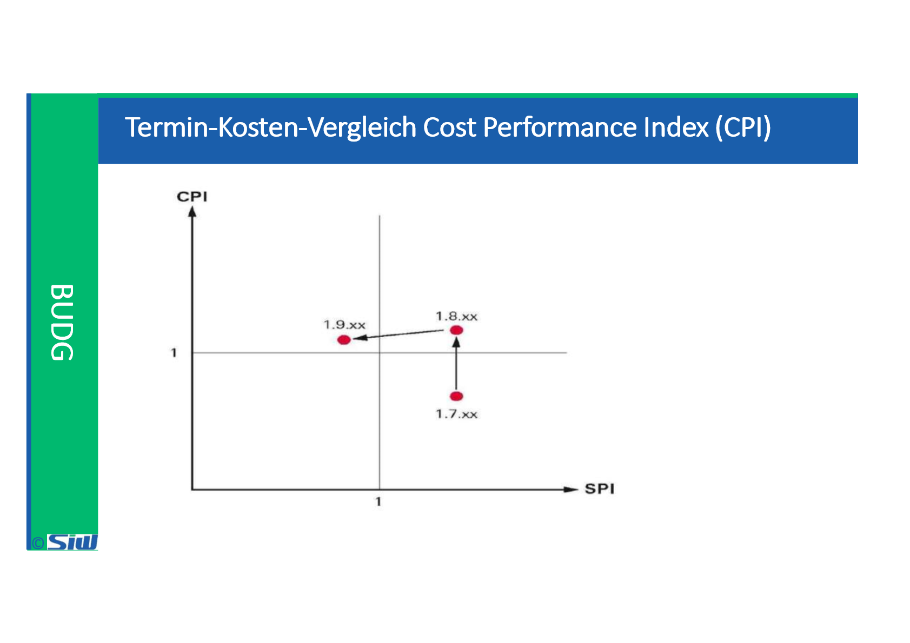
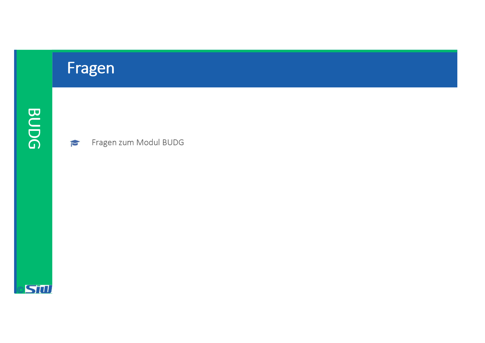

# BUDG: Block 9

Created: 2021-11-02 17:34:25 +0100

Modified: 2021-11-04 19:45:04 +0100

---

![Termin-Kosten-Vergleich Scheduled Performance Index (sm) Stellt die bis zum Stichtag budgetierten Kosten dem EV gegenüber (Aussage zur Terminsituation) Budget bis Stichtag Terminprognose Budgetierte Durchlauf zeit SPI Ergebnis SPI -1 SPI < I Bedeutung Die bewertete. erbrachte Leistung ist grösser als im Plan vorgesehen. Das Projekt läuft also schneller als geplant. Wenn es so weitergeht, wird es auch früher als geplant fertig sein. Das Projekt verlauft termingemå33, d. h. nach Plan. Die bewertete, erbrachte Leistung ist kleiner als im Plan vorgesehen. Man muss mit ener Terminverzögerung rechnen. sofern das Projekt weiterhin so verläuft. ](../media/S1_04_BUDG_Budgetierung-BUDG--Block-9-image5.png)

![Termin-Kosten-Vergleich Cost Performance Index (CPI) teilt bis zum Stichtag tatsächli angefallene Kosten dem bis zu diesem Zeitpunkt erzielten Earned Value gegenüber Bede n g Ist --- Kosten Kostenprognose Plankosten CPI Die bewertete. erbrachte Leistung ist grosser als die tatsachlich angefallenen Kosten. Das Projekt läuft also kostengünstiger als geplant; wenn es 30 weitergeht. wird es auch unter Budget abschliessen (Kostenunterschreltung). Das Projekt verlauft kostenmåssig nach Plan. Die bewertete. erbrachte Léstung ist kleiner als die tatsächlich angefallenen Kosten Man muss mit einer Kostenüberschreituno rechnen. sofern das Projekt weiterhin so verläuft. ](../media/S1_04_BUDG_Budgetierung-BUDG--Block-9-image6.png)

