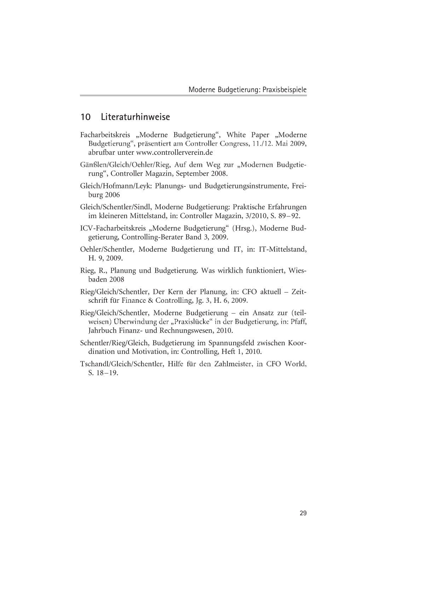
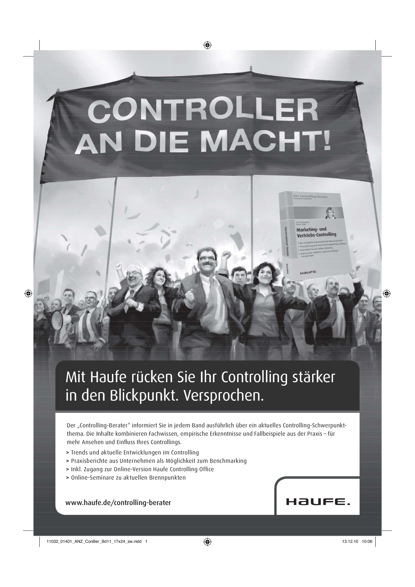

# BUDG: Lektion 11 & 12 Moderne Budgetierung Praxisbeispiele

Created: 2021-09-20 20:28:52 +0200

Modified: 2021-10-21 21:38:44 +0200

---

![Moderne Budgetierung: Praxisbeispiele Moderne Budgetierung: Praxisbeispiele 12 Beispiele aus unterschiedlichen Unternehmen zeigen, Wie die Moderne Budgetierung in der Praxis ausgeprägt ist. • Diese Praxisbeispiele können als Basis oder Referenz flir die Gestal- tung der Budgetierung im eigenen Unternehmen herangezogen werden. • Wichtig ist dabei, die Beispiele an die spezifischen Gegebenheiten des anwendenden Unternehmens anzupassen. • Dieses Dokument ergänzt die bisherigen Veröffentlichungen und Vorträge zur Modernen Budgetierung um ausgewählte Praxis- beispiele. Inhalt 1.1 1.2 2.1 2.2 3.1 3.2 3.2.1 3.2.2 3.3 3.3.1 3.3.2 4 4.1 4.2 5 5.1 5.2 Seite Die Moderne Budgetierung Die Entwicklung der Modernen Budgetierung Die Prinzipien im Überblick Einfachheit . Detaillierung verringern: Case Mineralölkonzern Aufbau und Ablauf der Budgetierung vereinfachen: Case Medienkonzern Flexibilität „ Forecasting kontinuierlich durchführen: Case Handel Szenarien und Sensitivitäten berücksichtigen: Case Bad- und Sanitärspezialist Szenarien . Sensitivitäten . Relative Ziele ergänzend einsetzen Case 1 Handel --- Case 2 Best-practice Unternehmen Integration . Planungsebenen verknüpfen: Case Hersteller von Sensoren und Logistikautomation --- Anreizsysteme ausbalancieren: Case Maschinen- und Anlagenbauer . Wertschöpfung abbilden Geschäftsmodell abbilden: Case Energieversorger --- Outputfokus forcieren: Best practice aus dem Mittelstand 3 4 6 8 9 9 11 12 12 13 16 16 18 20 20 21 ](../media/S1_04_BUDG_Budgetierung-BUDG--Lektion-11-&-12-Moderne-Budgetierung-Praxisbeispiele-image1.png)

![Grundlagen Et Konzepte 6 7 7.1 72 8 9 10 Organisation abbilden: Pläne vertikal und horizontal integrieren Absichten klarmachen und kommunizieren Absichten klarmachen und Mitarbeiter einbinden Mitarbeiter kommunizieren: Business Plan Info Kaskade Zusammenfassung und Ausblick Mitglieder des Facharbeitskreises „Moderne Budgetierung" Literaturhinweise --- Die Autoren 23 25 25 26 27 27 29 Prof. Dr. Ronald Gleich, Head of Department Innovation Management and Entrepreneurship der EBS Universität fur Wirtschaft und Recht i.Gr., Executive Director Strascheg Institute for Innovation and Entre- preneurship sowie Geschäftsfiihrer der EBS Executive Education GmbH Matthias Handrich, wissenschaftlicher Mitarbeiter am Strascheg Insti- tute for Innovation and Entrepreneurship der EBS Universitåt fur Wirtschaft und Recht i.Gr. Prof. Dr. Hans-Ulrich Holst, Professor for Financial Controlling, Management und Rechnungswesen, Hochschulc Osnabrück --- University of Applied Sciences Michael Kappes, Senior project Manager im Competence Center Controlling und Finanzen bei Horvath & Partners. Udo Kraus, Leiter Corporate Controlling & Accouting, Hansgrohe AG Dr. Uwe Michel, Senior Partner und Leiter des Competence Centers Controlling und Finanzen bei Horvåth & Partners. Dr. Peter Schentler, Managing Consultant im Competence CRnter Controlling und Finanzcn bei Horvath & Partners. Helmut Willmann, Manager Controller-Services/Business-Processes, SICK AG ](../media/S1_04_BUDG_Budgetierung-BUDG--Lektion-11-&-12-Moderne-Budgetierung-Praxisbeispiele-image2.png)

![Moderne Budgetierung: Praxisbeispiele 1 Die Moderne Budgetierung 1.1 Die Entwicklung der Modernen Budgetierung Die anhaltende Diskussion um Planung und Budgetierung hat der Internationale Controller Verein (ICV) in Zusammenarbeit mit der EBS Business School (EBS) sowie Praxisvertretern, Beratern und weiteren Wissenschaftlern zum Anlass genommen, einen Facharbeitskreis zum Thema zu gründen und ein wissenschaftlich fundiertes und praxis- taugliches Konzept zu entwickeln: die Moderne Budgetierung. Um von vornherein viele Aspekte, Ideen und Sichtweisen einzubringen, wurden bereits bei der Entwicklung die wesentlichen, betroffenen Personengruppcn einbezogen: Zukünftige Anwender aus Unternehmen sowie Berater und Wissenschaftler. Damit konnten Erfahrungen und Anforderungen aus vielen Branchen und Unternehmensgrößen berück- sichtigt werden. Neben einer Benchmarking-Studie mit 35 befragten Unternehmen und der Berücksichtigung des Inputs der Facharbeitskrcismitglieder wurden im Rahmen der Entwicklung des Konzeptes auch bestehende Konzepte analysiert und empirische Erkenntnisse zur Ausgestaltung der Budgetie- rung ausgewertet. Eine Übersicht über die Veröffentlichungen der Arbeits- und Endergebnisse ist in Abb. I dargestellt. White Paper I White Paper Il - praxisbeispiele Publikationen Controller Magazin. CFO Aktuell. CFO World, Controlling, Beitrage in Sa mmelbåndon Arbeitspapiere zu den Dimensionen Controller Statement (in g) Vorträge (Congress Controller, ICV• Veranstaltungen, Voran stan White Paper III - IT 2011 im Mag Abb. I Veröffentlichung der Modernen Budgetierung ](../media/S1_04_BUDG_Budgetierung-BUDG--Lektion-11-&-12-Moderne-Budgetierung-Praxisbeispiele-image3.png)

![Grundlagen Et Konzepte Das vorliegende Dokument stellt die in Abbildung I dargestellten „Praxisbeispiele" dar. Dabei handelt es sich um eine Beispielsammlung, Wie ausgewählte Inhalte der Modernen Budgetierung in der Praxis ausgeprägt sind. Diese Beispiele können als Anhaltspunkt für dic Gestaltung der Budgetierung in einem Unternehmen dienen. Wichtig ist, sie auf die spezifischen Anforderungen und Rahmenbedingungen des Unterneh- mens anzupassen. 1.2 Die Prinzipien im Überblick Moderne Budgetierung führt zurück zum Planungskern. Über ein integriertes Konzept, verknüpft mit der Strategie, den Zielen und dem Managementsystem soll das Budget konsequent, einfach, und vor allen Dingen umfeldflexibel bestimmt werden. Moderne Budgetierung bedeu- tet nicht, neue Tools und gar Konzepte zu erfinden. Die Prinzipien werden in zwei Kategorien mit insgesamt sechs Dimen- sionen eingeteilt: Gestaltungsempfehlungen: • Einfach: schlanke Abläufe, die sich auf steucrungsrelcvante Inhalte beschränken, nur Nutzen bringende Instrumente und Methoden einsetzen, nur wenige Eingavsgrößen, optimale Detaillierung finden, manchmal genügt auch „top-down" • Flexibel: Bereitschaft für Änderungen, Sensitivitäten und Szenarien, auch relative Ziele aufgrund von Benchmarks, (rollierende) Forecasts, flexibles und kontrolliertes Umschichten von Ressourcen • Integriert: Strategie, Planung, Reporting und Forecasts müssen ver- knüpft sein. Konkrete, aber wcnigc voneinander ableitbare Vorgaben. Budget und Anreizsysteme lose koppeln. Nicht nur kurzfristige Ziele. Fundamente: Organisation abbilden: konkrete, eindeutige Ziele, Orientierung am Gesamtziel, Organisation muss kurze und schnelle Entscheidungswege finden • Wertschöpfung abbilden: Verständnis der eigenen Wertschöpfungs- kette. Ziele, Engpiwe und Restriktionen determinieren die Planung • Absichten klar machen und kommunizieren: Ziele und Absichten klar verständlich machen, den Kern des Plans kommunizieren und leistungsebenengerecht transformieren, Umsetzungsverantwortung ](../media/S1_04_BUDG_Budgetierung-BUDG--Lektion-11-&-12-Moderne-Budgetierung-Praxisbeispiele-image4.png)

![Moderne Budgetierung: Praxisbeispiele mitteilen, durch Prämissen und Top-down-Vorgaben Planungsschlei• fen verhindern. 2 Einfachheit 2.1 Detaillierung verringem: Case Mineralölkonzern Bei dem betrachteten Unternehmen handelt es sich um eine Sparte eines internationalen Mineralölkonzerns. Hier wurden sowohl das Budgetjahr als auch die Folgejahre im Planuvstool der Sparte sehr detailliert geplant. Dann wurde das Budgetjahr im ERP-Tool (SAP R/3) noch einmal detailliert. Der hohe Detaillierungsgrad zog sich durch alle Planungen; am augenfälligsten jedoch in der Kostenartenplanung. Dic hohe Detaillierung war mit einem hohen Aufwand für die Erfassung verbunden; jeder Planungsverantwortliche musste 38 Kostenarten pla- ncn. Dieser Aufwand wäre zu rechtfertigen, wenn ihm ein entsprechen- der Steuerungsnutzen gegenüber steht. Ein solcher Nutz.•n wurde jedoch nur für das Budgetiahr gesehen; der Nutzen der hohen Detaillierung der Folgejahrc wurde durchweg als ungenügend betrachtet. Um zu prüfen, inwiefern die Detaillierung der Kostenartenplanung Ohne Verringerung des Steuerungsnutzens reduziert werden kann, wurde eine ABC-Analyse durchgeführt (vgl. Abbildung 2). Diese zeigte, dass über 80 % der Kosten von 8 Kostenarten ausgemacht wurden und 13 Kostenarten 90 % der Plan-Kosten repräsentierten. Diese Ergebnisse konnten dazu genutzt werden, den Detaillierungsgrad der Kostenartenplanung deutlich zu verringern. In der Mittelfristpla- nung werden jetzt nur noch 13 Kostenarten separat geplant; die restlichen Kostenarten wurden in einer Plan-Kostenart „Sonstige" zusammengefasst. Damit muss der einzelne Planer statt 38 nur noch 14 Kostenarten die Folgcjahre des Budgetjahrs planen. Sofern der Wunsch besteht, die sonstigen Kosten aus Informationsgr(indcn in grobe Blocke aufzuteilen, können diese auf Basis von Vergangenheitswerten (in Prozent) geplant werden. 5 ](../media/S1_04_BUDG_Budgetierung-BUDG--Lektion-11-&-12-Moderne-Budgetierung-Praxisbeispiele-image5.png)

![Grundlagen Et Konzepte arten' Abb. 2: ABC- Analyse Kostenartenplanung • 8 von Kostenarten im P Ianungstod matt-Wl 82% der Kosten aus • 13 von 38 Kostenarten in Planungsm machen 90% der Kosten aus Auf 25 von 38 Kostenarten entfallen nur der 2.2 Aufbau und Ablauf der Budgetierung vereinfachen: Case Medienkonzern Das Beispielunternehmen gehört zu den führenden europäischen Medienunternchmcn und beschäftigt ca. 10.000 Mitarbeiterinnen und Mitarbeiter. Die hier präsentierten Lösungen sind das Ergebnis eines umfassenden Umstrukturierungsprojektes der Planung und Budgetie- rung bei dem Beispielkonzern. Der ursprüngliche Ablauf der Budgetierung in diesem Unternehmen gemäß Planungskalcnder startete im Juni eines Jahres und endete im November. Die erarbeiteten Ergebnisse wurden schließlich final im Dezember vom Vorstand verabschiedet. Der gesamte Prozess erforderte sehr intensiv die Ressourcen der Controller und auch der Manager und sollte infolge des Umgestaltungs- ansatzes drastisch reduziert werden. Folgenden Haupterwartungen wurden an eine Neugestaltung gestellt: • Radikale Reduzierung der Budgetierungszeit. • Konzentration auf die wesentlichen Kosten- und Ergebnistreiber. • Nutzung eines integrierten Planungstools. ](../media/S1_04_BUDG_Budgetierung-BUDG--Lektion-11-&-12-Moderne-Budgetierung-Praxisbeispiele-image6.png)

![Moderne Budgetierung: Praxisbeispiele Die erarbeitete Lösung überzeugt genau durch die Umsetzung dieser Erwartungen. Der Gesamtprozæss der Planung wurde von 6 Monaten auf 8 Wochen reduziert. Dies gelang durch einen Split des Planungsprozesses in eine Eckwerteplanung und eine Detailplanung. Erstere ist top-down-getrie- ben und maximal 2 Wochen lang, letztere erfolgt unmittelbar nach der Grobplanung und soll maximal 4-6 Wochen dauern. Vorgabe hierbei ist, dass sich kein Bereich länger als 6 Wochen mit seiner Planung beschäftigen darf. Ferner wurden Standardisierungen (ZB. einheitliche Planungstemplates bzw. -masken) geschaffen und eine Verschlankung der Planungsanalysen und -gespråchc initiiert. Die Konzentration auf die relevanten Ergebnistreiber (LB. Vertriebs- und Werbeerlöse) gelang durch den Verzicht auf Scheingenauigkeiten und die Ableitung belegbarer und vergleichbarer Aussagen. Ferner wurde die Planungspolitik dadurch stark reduziert, dass die Budgetierung weitestgehend von der Zielvereinbarung entkoppelt wurde. Schließlich wurde durch die Einfuhrung von SAP BW 7.0 ein ein- heitliches und integriertes Planungstool geschaffen, welches durch viele Neuerungen (LB. „Bierdeckel "-Handhabung, individueller Detaillie- rungsgrad, Verfügbarkeit aller relevanter Refercnzwerte, Verzahnung von Planungsschritten) und vom Controller-bereich bereitgestellte Pla- nungs- und Analyse-Layouts erheblichen Nut7en fir die Neugestaltung des Budgetierungsprozesse sorgte. Die Vereinfachung des Prozesses, der nach einer Pilotierungsphase im Jahr 2008 schließlich im Jahr 2009 eingeführt wurde, gelang unter anderem durch • Involvierung wohlgesonnener, interner Controllerkunden in der Pilotierungsphase, • eine intensive Schulung in allen Projektphasen und • eine stetige intensive Überzeugungsarbeit der Controller. Schließlich schaffte die Integration von Controller- und SAP-Know-How eine hohe Akzeptanz bei den Anwendern, was durch ansprechende Layouts der Planungsmaskcn und einc einfache und verständliche Handhabung flankiert wurde. ](../media/S1_04_BUDG_Budgetierung-BUDG--Lektion-11-&-12-Moderne-Budgetierung-Praxisbeispiele-image7.png)

![Grundlagen Et Konzepte 3 Flexibilität 3. I Forecasting kontinuierlich durchführen: Case Handel Das Beispielunternehrncn ist eine große Warenhauskettc mit über 50 Filialen. In der Ausgangssituation basierte die Steuerung auf einer starren Detailplanung. In einer langen und aufwendigen Budgetierung wurden mit langem Vorlauf die verschiedenen Größen in hoher Detaillierung geplant. Diese Planung bildete --- neben einer mechanischen „WIRD"-Hochrech- nung (angcfallcnc Ist-Werte zuzüglich vclblcibcndcr Planwerte) --- dic Basis für die unteriährige Steuerung. Da aber viele Planwerte wie beispielsweise der Personaleinsatz nur sehr eingeschränkt mit dem langen Vorlauf einer Budgetierung planbar sind, waren große Teile davon im Planjahr regel- mäßig veraltet und damit nicht mehr als Vergleichsbasis brauchbar. Freqenz; (Erstellung alle drei Monate. Anfang Februar, Mitte April. Juli. Cl Oktober) Jahr (LJ) Jahr (FJ) Jahr FC 11 01 02 03 04 01 02 03 04 01 Detaillienmg bei Beda r' Abb. 3: Forecasting Horizmt: 4 Ouartale, davm 2 fein und 2 Ouarlale Unterhat u M ReparNuren Vor diesem Hintergrund und mit dem Ziel einer schlankeren und flexibleren Planung wurden einerseits die Budgetierung verkürzt und die im Budget zu planenden Größen deutlich reduziert. Andererseits wurde ein Forecast installiert, der viele Aufgaben der Budgetierung übernimmt (z. B. die Personaleinsatzplanung) und viermal jährlich dezentral von den Abteilungsleitern der Warenhäuser erstellt wird. Der Forecast ist dabei rollierend gestaltet: Es werden jeweils vier Quartale prognostiziert, davon ](../media/S1_04_BUDG_Budgetierung-BUDG--Lektion-11-&-12-Moderne-Budgetierung-Praxisbeispiele-image8.png)

![Moderne Budgetierung: Praxisbeispiele zwei in höherer Detaillierung und zwei in gröberer Detaillierung. Je Forecast werden cin zusätzliches Quartal neu prognostiziert und die anderen Quartale überarbeitet (erstes und drittes Quartal) bzw. detailliert (zweites Quartal). Um den Aufwand möglichst gering zu halten, werden dabei nur sehr wenige zentrale Größen prognostiziert (vgl. Abbildung 3). Durch diese Veränderung hat sich die Flexibilität deutlich erhöht. Nun sind stets aktualisierte, zukunftsgcrichtctc Informationen verfilgbar, die frühzeitig Trends signalisieren und so eine unteriåhrige Anpassung der Einkaufspolitik einleiten können. 3.2 Szenarien und Sensitivitäten berücksichtigen: Case Bad- und Sanitärspezialist 3.2.1 Szenarien Das Beispielunternehmen stellt hochwertige, design-orientierte Badkon- Zepte und umweltfreundliche Sanität-technologicn her und vertreibt diese weltweit. Der Bad- und Sanitärspezialist beschäftigt mehr als 3.100 Mitarbeiter. Personal- kosten Marketing- Sonstige Kosten CAPEX - 10% verschieben • ken Ersatz Iur z.B. Watterschansudaub Von stoppen mi' des Personals zur LJn-sa1zgeiwung P) arvassen die Umsatz nu mrekl unterstützen Meda Events' um Reisekosten um X % Weitere PluS21 Maßnahmen Reduien_mg, % (kein umbau 2@9) Teilw. Kapazitatsausbau um 5% kürzen kündgen mi' Aug.ahrv* des Mag nahmen Umsatz indirekt unterstützen (z E, Events) Weitere Plus2" Maßnahmen y) Reduiemng, (kein in T e Kaøaaitatsauoau herabstufen y' Abb. 4: Auszug einer Tochtergesellschaft Conti ngency Planung ](../media/S1_04_BUDG_Budgetierung-BUDG--Lektion-11-&-12-Moderne-Budgetierung-Praxisbeispiele-image9.png)

![Grundlagen Et Konzepte Aufgrund der verstärkten Unsicherheit der Marktindikatoren und Prämissen wurde bei dem Beispielunternchmen bereits frühzeitig im Januar 2009 eine Szenarienplanung erstellt. Dabei wurden für die zusätzlichen definierten Szenarien pro Gesellschaft so genannte Contin- gency-Plänc aufgesetzt. Diese Contingency-Planung erfolgte bei Weitem nicht im selben Wie die Budgetplanung selbst. Die Gesellschaften und Abteilungen definierten in Abhängigkeit der Stärke der Betroffenheit zwei weitere Umsatz-Szenarien und erarbeiteten dazu entsprechende Gegenmaßnahmen aus. Beispielhaft ist im Anschluss ein Auszug aus einer Contingency-Planung dargestellt (vgl. Abbildung 4). Das Beispiel bezieht sich auf das Jahr 2009, in welchem aufgrund der Wirtschaftskrise ausschließlich 2 negative Szenarien geplant wurden. In anderen Jahren bietet sich für das Unternehmen eher ein positives 410 und ein negatives ---10 %-Szenari0 an. • HOiZ.n) etc. Marketing etc. Außendienst etc. etc. AÜniniStra&X1 Gehe t W" etc. Feti »g (n i cht FOW"O ådigu ng • 8 E ritwÉküVSk(Stgt • für M i tarbøim•era1StaltunW1 etc. Pkw/ etc Pkw/ T rad er r etc. Lkw/ Abb. 5: Auszug Ampel- Stat us der Maßnahmen S---io 2 Plus 21 . s Sparen Str," Nutzung Szg'a60 2: E nstenmgen 2: Sßzielle ZE ](../media/S1_04_BUDG_Budgetierung-BUDG--Lektion-11-&-12-Moderne-Budgetierung-Praxisbeispiele-image10.png)

![Moderne Budgetierung: Praxisbeispiele Auch um die Abhängigkeit von Rohstoffprcisen und Fremdwährungskurscn darzustellen, wurden verschiedene Szenarien gerechnet und entsprechende Risikoanalysen erstellt. Ziel hierbei war es insbesondere zu verstehen, welche Bedeutung ein Worst Case hätte. Es galt, sich als Unternehmen nach gründlicher Abwägung gewisse Schwcllcnwcrte bei Kursen oder Preisen zu setzen, ab denen reagiert werden muss, um negative Folgen zu vermeiden bzw. zu minimieren. Die zusätzliche Szenarienplanung wurde Obcrsichtlich auf max. 50 Kostenartengruppen vorgenommen (vgl. Abbildung 5). 3.2.2 Sensitivitäten Spätestens dic Krisc hat gezeigt, dass Unternehmen neben extremen Absatzschwankungen verstärkt auch mit Schwankungen anderer Fak- toren konfrontiert werden, die Auswirkungen auf die Zielerreichung haben. Für das Beispieluntcrnchmen stieg aufgrund der internationalen Ausrichtung nochmals die Bedeutung der Wechselkursschwankungen sowie der Rohstoffprcisentwicklung. Für beide Faktoren wurden folglich Stresstest-Szenarien bzw. Sensibilitätsanalyscn etabliert. Diese waren enorm hilfreich, um dem Unternehmen ein Gefühl für das vorhandene Risiko zu vermitteln Sic bilden Cinc Grundlage für dic Szenarioplanung (S. Kap. 3.2.1) und helfen somit bei der Entscheidung evtl. Rohstoff- oder Währungsabsicherungcn durchzuführen, was dann entsprechend eine der Contingency-Maßnahmen darstellt. Abbildung 6 zeigt ein Währungsszcnario von einer 10 %-Schwankung. Fonign Risk Year 20XX Practice (Exa Abb. 6: Sensitivitåtsanalysc Simulation Währungsschwankungcn von 10 ](../media/S1_04_BUDG_Budgetierung-BUDG--Lektion-11-&-12-Moderne-Budgetierung-Praxisbeispiele-image11.png)

![Grundlagen Et Konzepte 3,3 Relative Ziele ergänzend einsetzen 3.3.1 Case 1 Handel' Das Beispielunternehmen ist im Handel von Möbeln und Einrichtungen aller Art tätig. Es hat rund 200 Filialen in Europa. Im Unternehmen wurde intensiv diskutiert, wie eine Wettbewerbs- Orientierung zwischen den Filialen sichergestellt werden kann. Bisher hatten die Filialen ausschließlich absolute Ziele. ein Vergleich zwischen den Filialen wurde nur unsystematisch und unregelmäßig vorgenom- men. Aus diesem Grund wurden relative Vergleiche institutionalisiert und damit die Wettbewerbsorientierung verstärkt. Dies funktioniert über ausgewählte Kennzahlen: • Neukunden: Anzahl von Neukunden im Vergleich zur Gesamtzahl der Kunden im Betrachtungszeitraum2. Als Neukunden gelten all jene Kunden, die nicht im Kundenbindungsprogramm („Kundenkarte") erfasst sind oder die im Kundenbindungsprogramm erfasst sind, jedoch in den letzten 3 Jahren keine Einkäufe getätigt haben. • Deckungsbeitrag pro Kunde: Durchschnittlicher Deckungsbeitrag im Betrachtungszeitraum, wobei der Deckungsbeitrag nicht pro Produkt berechnet wird, sondern unterschiedlichen Produktgruppen unter- schiedliche Deckungsbeitråge zugeordnet sind. j • Umsatz: Summe des Umsatzes der Filiale im Betrachtungszeitraum im Vergleich zum Vorjahreszeitraum. Die relativen Ziele sind nicht die einzigen Ziele der Filialleiter, stellen aber ein Drittel der Gesamtziele dar. Die Ergebnisse aller Filialen werden alle zwei Monate in so genannten „Performance-Tabellen" dargestellt (vgl. Abbildung 7). Die einzelnen Ziele fli&n mit einer unterschiedlichen Gewichtung in die Gesamttabelle ein. Für die Zielerreichung und variable Vergütung der Filialleiter Wird einerseits die absolute Platzierung herangezogen, andererseits die Ver- besserung oder Verschlechterung der Platzierung im Vergleich zur letzten Tabelle. In Bezug auf die Verwendung relativer Ziele sei an dieser Stelle auch auf das Kapitel 4.2 Anreizsysteme ausbalancieren verwiesen. Als iktrachtungm•itram-n dic Monate, dic die Tabelle erstellt wird. Diese Zuordnung dient der Vereinfachung. Beispielsweise gibt es im Bereich Betten fünf Produktklasscn (Einsteiger, Normal, Hochwertig. Luxus, dcncn dcfinicrte Dcckungsbcitragc als Prozcntantcil vom Verkaufspreis hintcrlcgt sind. ](../media/S1_04_BUDG_Budgetierung-BUDG--Lektion-11-&-12-Moderne-Budgetierung-Praxisbeispiele-image12.png)

![Moderne Budgetierung: Praxisbeispiele Neukunden Filiale x PL. „ Performance Level Gewichtung Abb. 7: perform ance-Tabelle DB I Kunde Filiale x PL = 120% Top 25% Umsatz Filiak x PL 110% Top Aggregation: E PL • g „Performance Index" Top Performance Index z 95 3.3.2 Case 2 Best-practice Unternehmen Zahlreiche Unternehmen sind mit der klassischen Konzeption von Anreizsystemen insbesondere in marktnahen Bereichen immer weniger zufrieden. Dic klassische Vorgehensweise besteht darin, die spätere Leistungsbeurteilung und Vergütung im Wesentlichen davon abhängig zu machen, inwieweit die im Planungsprozess vereinbarten Ziele verfehlt, erreicht oder gar übererfüllt wurden. Durch die Vereinbarung von Mindesteinkommen und Deckelungen der Gehaltsobergrenzen wird sichergestellt, dass die betroffenen Mitarbeiter weder unter ein bestimm- tes Gehaltsnivcau sinken, aber auch nicht in beträchtlicher Höhe Ober dem üblichen Gehaltsrahmen liegen können. Wie Unternehmen relative Ziele zur Performance-Beurteilung und Vergütung einsetzen können, erläutert das folgende Beispiel: Die „Best- Practice-AG" hat ein Umsatzwachstum von 5 % geplant und am Ende des Planungszeitraumes tatsächlich cincn Umsatzzuwachs von 6 % erreicht. Mit einem klassisch gestalteten Bonus-System leistet das ](../media/S1_04_BUDG_Budgetierung-BUDG--Lektion-11-&-12-Moderne-Budgetierung-Praxisbeispiele-image13.png)

![Grundlagen Et Konzepte Unternehmen deutlich über Plan liegende Tantiemezahlungen. Dic Qualität dieser (Vertriebs-)Leistung ist jedoch relativ stark davon abhängig, Ob der Markt/dic unmittelbaren Mitbewerber B. um 8 % wachsen konnten Oder aber mit nur 3 % Umsatzsteigerung der „Best- Practice-AG" den Gewinn von Marktanteilen zugestehen mussten. Dieser relative Vertriebserfolg sollte aber sinnvollerweise nicht unbe- rücksichtigt bleiben und insbesondere auch in der Vergütung Berück- sichtigung finden. In Krisenzeiten können Absatz und Umsatz rapide und unvorhergesehen negativ von den Planwerten abweichen. Gerade dann sind von Mit- arbeitern hohe Anstrengungen zur Sicherung des Fortbestands des Unternehmens und zur rechtzeitigen Neupositionicrung für den nächs- ten Aufschwung von entscheidender Bedeutung und bieten zudem Oft die Chance zur Verbesserung der relativen Wettbewerbsposition. Der Präsident des Verwaltungsrates eines Mittelständlers mit mehr als 1000 Beschäftigten in der Schweiz formuliert die Notwendigkeit zur Weiter- entwicklung der Vergutungs.systeme wie folgt: „Die nächste konjunktu- reue Krise können wir als Unternehmen nicht verhindern. Wir können jedoch durch effiziente Vergotungssystcme unser Topmanagement besser steuern und entlohnen und damit Leistung und nicht Zufall honorieren. Dies ist ein wichtiges Signal an unsere Mitarbeiter, unsere Kunden und die Bevölkerung in unserer Region" Performance Un±rperformance Abb. 8: Grafik flexible n Vergütung Fehr/Fehr NTL 10.10.2010 Wettbewerb Ist Budget ](../media/S1_04_BUDG_Budgetierung-BUDG--Lektion-11-&-12-Moderne-Budgetierung-Praxisbeispiele-image14.png)

![Moderne Budgetierung: Praxisbeispiele Die klassische Vorgehensweise illustriert zunächst die Abbildung 85: In der „klassischen Beispielsituation" vereinbart das Unternehmen, bei Erreichung des budgetierten Umsat7x•s von 5 Mio. EUR einen Bonus von 50 TEUR zu zahlen. Dieser Bonus wird nach unten abgesichert durch eine Mindestregelung von z-B. 30 TEUR, die in jedem Fall zu zahlen ist. Eine Obergrena• für die Höhe des Bonus Wird so gestaltet, dass pro EUR Umsatz Ober Budget weiter I % des Ober Budget liegenden Mehr- Umsatzes als Bonus ausgezahlt wird, maximal jedoch ein Betrag von 80 TEUR als Bonus insgesamt erreicht werden kann. Der tatsächlich erreichte Umsatz liegt nun mit 6 Mio. EUR zwar über dem vereinbarten Budget i. H. v. 5 Mio., bleibt aber hinter der relevanten Marktcntwicklung zurück. Damit ist relativ zum Markt Cinc Under- performance zu konstatieren, die auch entsprechend in der Vergütung Berücksichtigung findet bei der Orientierung an relativ (zur Markt- entwicklung) formulierten Zielen. Rechnerisch ist dies in einfacher Form so darzustellen, dass der sich nach der klassischen Berechnung ergebende Bonus mit der relativen Marktentwicklung multipliziert würde; zur Veranschaulichung dient das Zahlenbeispiel in Abbildung 9. Re%e zun 20mom 4 ncm somom 9unn 401" 70 mom 40 n 70 Om 51.48 Abb. 9 : Orientierung der Entlohnung an der Performance der Peer-Group vgl.: Gleich/Hofmann/I.eyk, 2006 15 ](../media/S1_04_BUDG_Budgetierung-BUDG--Lektion-11-&-12-Moderne-Budgetierung-Praxisbeispiele-image15.png)

![Grundlagen Et Konzepte Der tatsächlich ausgezahlte Bonus berücksichtigt bei Verwendung relativer Zielvereinbarungen in der Basis die Plan-Übererfiillung, diese Wird durch die hinter dem Wettbewerb zurückgebliebene Wachstums- dynamik aber wieder relativiert. 4 Integration 4.1 Planungsebenen verknüpfen: Case Hersteller von Sensoren und Logistikautomation Das Beispielunternehmen beschäftigt ca. 5.000 Mitarbeiter und ist einer der führenden Hersteller von Sensoren für Fabrik-, Logistikautomation und Prozessautomation. Mit dem Planungsbrief des Vorstandes wird im Frühjahr der jährliche Planungsprozess gestartet. Basis dazu ist die Unternehmensstrategie. Daraus werden die Rahmenbedingungen und die übergeordneten Ziele für die Konzerneinheiten mit Strategieveranrwortung (Corporate Solu- tion Center, Division und Central Department) festgelegt. Die Visuali- sierung und Kommunikation erfolgt in Form einer Strategy Map und mit Hilfe von Key Performance Indicators (KPIs). Parallel wird die Organisation aufgerufen, einen Forecast (FCI) für das laufende Jahr zu erstellen. Die Ergebnisse der strategischen Planung aller Konzernein- heiten müssen vom Vorstand und Geschäftsleitung (Management Board) freigegeben werden. Im Anschluss Wird im Rahmen eines International Management Meetings Ober die strategischen Maßnahmen informiert und Inhalte dazu abgestimmt. Nach der Sommerpause startet die Budgetplanung mit der Umsetzung und Quantifizierung der strategischen Maßnahmen. Es werden konkrete operative Ziele fiir das folgende Jahr geplant. Darin ist ein Forecast (FCII) integriert. Alle Konzerneinheiten und Gesellschaften präsentieren die Ergebnisse ihrem internen Board-Gremium. Mit der Freigabe durch den Konzernaufsichtsrat wird der Schlusspunkt der Jahresplanung (Budgetprozess) gesetzt. Das Herunterbrechen der Ziele und Maßnahmen auf die Mitarbeiter erfolgt durch den jährlichen Performance-Dialog Jede Führungskraft führt unabhängig von der Hierarchie mit ihren Mitarbeitern Gespräche hinsichtlich der Ziele, der Kompetenz, der Entwicklung/Karriere und dem Entgelt. In diesem Dialog Wird die Zielverfolgung der Planungs- ergebnissc im Unternehmen erheblich gestärkt und die für die Umset- zung die notwendige Dynamik entwickelt. Mit der Integration der Planungsphasen (Strategie, Budget, Forecast) werden konkurrierende Ziele eliminiert. Bei sich veränderten Rahmenbedingungen und Zielen ](../media/S1_04_BUDG_Budgetierung-BUDG--Lektion-11-&-12-Moderne-Budgetierung-Praxisbeispiele-image16.png)

![Moderne Budgetierung: Praxisbeispiele wird mit Hilfe von „Boxen-Stopps" zwischen Mitarbeiter und Führungs- kraft die Steuerung neu ausgerichtet, d.h. Ziele werden angepasst. Der Planungskreislauf in Form einer „Zwiebel" (siehe Abbildung 10) zeigt den Integrationsansatz der Planungseb rting BSC Strategische, planung Jahres- abschluss OnvisiOn Forecast Mitarbeiter Performance-Dialog Abb. 10: Planungskreislauf Über Maßnahmen B. Produktportfolio, Technologieportfolio, etc.) wird die Verbindung zwischen der strategischen und operativen Planung sichergestellt. In der strategischen Planung sind Maßnahmen formuliert, deren Wirkung über KPIS gemessen Wird. In dieser Phase Wird verstärkt mit relativen Zielen (z. B. Strukturkosten in % zum Umsatz) gearbeitet. Somit können die BezuBsgrößen „atmen" und flexibel auf Wachstums- veränderungen reagieren. Im operativen Budget werden die Maßnahmen fur das Fiskaljahr quantifiziert. For Budget und Forccast werden gezielt identische und integrierte Planungsinstrumente verwendet. Dieser Ansatz stellt beson- dere Anforderungen an die IT-gcstützten Planungsinstrumente. Sie müssen neben der Quantifizierung auch die dazugehörigen qualitativen („weichen") Informationen mitführen. Dic Ressourcenbasis (Kosten- stellen) und die Mittelverw•endung (Projekte und Maßnahmen) müssen in den Planungsinstrumenten integriert sein. Der strategische Teil wird ](../media/S1_04_BUDG_Budgetierung-BUDG--Lektion-11-&-12-Moderne-Budgetierung-Praxisbeispiele-image17.png)

![Grundlagen Et Konzepte mit der Balanced-Scorecard-Methodik, auf Basis einer einfachen, integrierten Lotus-Notes-Anwendung mit Workflow-Funktionen doku- mentiert und verfolgt. Die Ziele und Ergebnisse der Planung werden in das Standard-Reporting integriert und regelmäßig auf Abweichungen analysiert. Daraus werden die notwendigen Impulse und Gegenmaßnahmen zur Zielerreichung generiert. 4.2 Anreizsysteme ausbalancieren: Case Maschinen- und Anlagen bauer Im Bezug auf das Ausbalancieren von Anreizsystemen sei an dieser Stelle auch auf das Kapitel 3.3 „Relative Ziele ergänzend einsetzen" verwiesen. Das Beispieluntcrnehmen beschäftigt 800 Mitarbeiter. Es ist im Business- to-Business-Bereich als Teilezuliefcrer für Maschinen- und Anlagenbaucr tätig. Das Unternehmen ist in Familienbesitz, wobei jedoch keine Familienmitglieder im Management tätig sind. Dic durchschnittliche Betriebszugehörigkeit des Managements und der Mitarbeiter ist hoch. Das Unternehmen hat intensiv diskutiert, inwieweit die Mitarbeiter im Rahmen einer variablen Vergütung am Untcrnchmcnscrfolg beteiligt werden. In der Vergangenheit waren die zu erreichenden Ziele aus- schließlich an die Budget-ziele gekoppelt, was Zu Verhandlungen über die Zielhöhe gefiihrt hat. Folgende Probleme traten auf: • Auch wenn beide Seiten schlussendlich meist der Meinung waren, dass die definierten Ziele sowohl anspruchsvoll als auch erreichbar waren, wurde der Prozess der Zielfindung als sehr aufwendig beschrieben und hat den jährlichen Planungszeitraum deutlich ver- längert. • Durch den ausschließlichen Fokus auf Budgetziele wurde die Weiter- entwicklung des Untcrnchmcns, z.B. in Form von mehrjährigen strategischen Projekten, vernachlässigt. Zusätzlich gab es viele unterschiedliche Zielsysteme im Unternehmen, was einen hohen Aufwand für das Personalwescn bedeutet hat und teilweise auch zu Missstimmung im Unternehmen führte, da sich einige Mitarbeiter im Vergleich mit anderen ungerecht behandelt fühlten. Aus diesen Gründen fand im Jahr 2007 eine Überarbeitung des Zielsystems Sta tt. Beschreibung der Lösung: Der Anteil der variablen Vergütung an der Gesamtvergütung und die Ausgestaltung dieses Anteils erfolgt je Hie- 18 ](../media/S1_04_BUDG_Budgetierung-BUDG--Lektion-11-&-12-Moderne-Budgetierung-Praxisbeispiele-image18.png)

![Moderne Budgetierung: Praxisbeispiele rarchieebene unterschiedlich. Jeder Mitarbeiter hat drei variable Ver- gotungsantcile: • Unternehmen santeil • Bereichs-/Abteilungsanteil • Persönlicher Anteil Der Unternehmensanteil basiert auf der Differenz des aktuellen (Ergebnis der gewöhnlichen Geschäftstätigkeit: EGT = EBIT + Finanz- crgcbnis) zum vorjährigen EGT. Steigt das EGT im Vergleich zum Vorjahr an, werden 30 % der Steigerung auf die Mitarbeiter aufgeteilt. Im Falle eines negativen EGTs erfolgt keine Aufteilung. Der Aufteilungs- schlüssel umfasst dabei sowohl dic Hierarchiestufc, den Beschäftigungs- umfang, das Gehalt und die Betriebszugehörigkeit. Als grundlegendes Ziel liegt in jedem Jahr eine 5 %ige EGT-Steigerung zugrunde. Wird diese erreicht, können • Führungskräfte der ersten Hierarchiccbcne mit einem variablen Anteil von rund 25 % ihres Jahresgehalts, • Führungskräfte der zweiten/dritten Ebcnc mit 8 bis 12 % und • übrige Mitarbeiter mit 3 bis 5 % rechnen. Der genaue Anteil ist pro Mitarbeiter unterschiedlich und ergibt sich aus dem Aufteilungsschlosscl. Ist die EGT-Steigerung geringer oder höher, ändert sich auch der variable Gehaltsanteil. Beispielsweise erhalten die Führungskräfte bei 4 % EGT einen 20 %-igen Anteil am Jahresgehalt, bei 3 % einen 15 %-igen Anteil. Ist das EGT negativ, wird kein variabler Anteil am Unternehmenscrfolg ausgeschüttet, die BC- reichs-/Abteilungs- und persönlichen Ziele bleiben davon aber unbe- rühn. Der Bereichs- und Abteilungsanteil basiert auf den im Rahmen der Planung festgelegten Zielen für die Bereiche; diese werden je Bereich/ Abteilung mit der Geschäftsführung und den Eigentümern definiert. Dabei kann es sich sowohl um monetäre Ziele (z.B. Produktionskosten pro Teil) als auch um nicht monetäre Ziele (z.B. Ausschuss in der Produktion) handeln. Um das Zielsystem nicht zu komplex zu gestalten, werden maximal 3 Ziele festgelegt, wobei für die Geschäftsführung/ l. Führungsebcne keine persönlichen Ziele festgelegt werden. Der persönliche Anteil setzt sich bei allen Mitarbeitern aus unterschied- lichen Themen zusammen, die im jährlichen Mitarbeitergcspräch mit ihren Vorgesetzten festgelegt und im Folgejahr evaluiert werden. Inhalte konnten die Umsetzung von Projekten (z B. Einführung eines CRM- Systems) oder persönliche Weiterentwicklungsziele sein. Auch hier sind maximal 3 Ziele festzulegen. Der Übergang Bereichs7ielen ist teilweise ](../media/S1_04_BUDG_Budgetierung-BUDG--Lektion-11-&-12-Moderne-Budgetierung-Praxisbeispiele-image19.png)

![Grundlagen Et Konzepte fließend, das als Beispiel erwähnte CRM-System könnte auch als Bereichs- oder Abteilungsziel Verwendung finden. Das gesamte Zielsystem ist in Tabelle I dargestellt. Bereichs-l Unternehmensziel persönliche Ziele l. Führungsebene / Geschäftsführung 2. und 3. Fohrungscbcnc Cbrigc Mitarbeiter (1 Ziel) 25 % (S) -8bis C) 3 bis 5 % ( • ) Abteilungsziele (maximal 3 Ziele) (maximal 3 Ziele) Tab. l: Zielsystem Bei einer angenommenen EGT-Steigerung von 5 C') Im Rahmen der Mitarbeitet-gesprächc werden Ziele vereinbart, dic jedoch keinen direkten Einfluss auf die variable Vergütung haben. Der große Vorteil des neuen Zielsystems liegt in der ausgewogeneren Zielsetzung, der stärkeren Kopplung des tatsächlichen an den bisherigen (und nicht den geplanten) Erfolg des Unternehmens und der Ein- bindung von nicht monetären Bereichsziclen in die Zielsetzung. Nach- teilig ist die höhere Komplexität des Zielsystems, die mehr Aufwand in der Zielfestlegung, -kommunikation und -messung erfordert. 5 Wertschöpfung abbilden 5.1 Geschäftsmodell abbilden: Case Energieversorger Das betrachtete Unternehmen ist ein regionaler Energieversorger mit typischen Wertschöpfungsaktivitätcn bzw. Geschäftsfeldcrn: Beschaf- fung, Netz. Vertrieb, (externe) Dienstleistungen und (interne) Shared Services. Das Unternehmen ist als Stammhaus-Konzern organisiert, in dem neben den Führungsbercichcn auch operative Funktionen zu finden sind. Neben der Stammhaus-AG gibt es acht weitere Legalgesellschaften. Die Planung (Wie auch das Reporting) erfolgten bislang primär entlang der Legalstrukturen. Dabei wurden --- unabhängig von der Grölk• und der zugehörigen Wertschöpfungsaktivitat --- je Gesellschaft eine GuV und eine Bilanz geplant. Dies ist unproblematisch, solange die Gesellschaft genau eine Wertschöpfungsaktivität repräsentiert. In der GuV der Stammhaus-AG mit Ober 75 % des Gesamtumsatzes vermischten sich dic Effekte verschiedener Aktivitäten (insbesondere Beschaffung/Vertrieb ](../media/S1_04_BUDG_Budgetierung-BUDG--Lektion-11-&-12-Moderne-Budgetierung-Praxisbeispiele-image20.png)

![Moderne Budgetierung: Praxisbeispiele und Shared Services). Dadurch wurde eine Abweichungsanalyse auf Basis der Planwerte deutlich erschwert. Im Zuge der Neugestaltung der Planung erfolgte eine primäre Aus- richtung nach den Wertschöpfungsaktivitåten. Im Vordergrund stehen nun die einzelnen Funktionen. Dazu wurde insbesondere die Stamm- haus-AG mit Hilfe eines Center-Konzeptes in verschiedene Teil-Ein- heiten zerschnitten. Zukünftig plant der Vertrieb im Stammhaus analog zu den Vertriebs-Gesellschaften sein Vertriebsergebnis, während Stamm- haus-Service-Einheiten ihre Kosten und Auslastung planen. Damit bildet die Planung die Grundlage für eine unterjährige Abweichungsanalyse gemäß dem Geschäftsmodell (vgl. Abbildung I l). Starrnhaus AG O G mbH Anlagen (MA) GmbH Wåme•SevCe (WS) N atz SCR]osf GmbH E nto nStleiStu ngS•G mbH für und Abb. Shared Serves Konzemcon t Vertrieb & - AG: Center SO s Nægesell- VA G mbH WS GmbH für Planung und Der dargestellte Ansatz lässt sich natürlich auch auf andere Branchen und Geschäftsmodclle übertragen. So finden sich beispielsweise in der produzierenden Industrie häufig (kleinere) Konzerngebildc, wo pro- duktion, Forschung und Entwicklung sowie Vertrieb als Teile der Stammhaus-Gesellschaft vermengt gemäß der Legalsicht geplant werden. 5.2 Outputfokus forcieren: Best practice aus dem Mittelstand Startimplus der Budgetierung sollte der Output eines Unternehmens oder der verschiedenen Leistungseinheiten sein. Richtigerweise ist der ](../media/S1_04_BUDG_Budgetierung-BUDG--Lektion-11-&-12-Moderne-Budgetierung-Praxisbeispiele-image21.png)

![Grundlagen Et Konzepte Ausgangs- und Startpunkt der Planung und Budgetierung der Markt und die absetzbaren Einheiten der Produkte oder Dienstleistungen in der zu betrachtenden Planungsperiode. Diese Outputoricntierung wird allerdings nicht durchgängig im gesam- ten Budgetsystem gelebt. Dies hängt sicherlich an den inputorienticrtcn, traditionellen Kcystenrechnungssystemen, welche oftmals die Logik der Planung und Budgetierung bestimmen. Dies hat zur Folge, dass in vielen Fällen vor allem in Gemeinkostenbereichen Bereichsressourcen geplant werden, ohne eine direkte Beziehung zum Bereichsoutput herzustellen. Hier hilft eine prozessorientierte Budgetierung auf Basis einer Prozess- kostenrechnung. Die Abbildung 12 zeigt die prinzipielle Logik auf. Aus der Planung und Budgetierung auf Grundlage der bewerteten Ressour- Cen Wird ein outputorientierter Ansatz. Planung der gen (O Planung der Prozess- kapaZtat Planung der Bearbeitungs- zeit je Kosten je MJ Verfügbare Personal- kapaztat Kapa z "ts- angeba u. -nachfrage Summe Prozess- Planung der Persmal- und Sachkosten ( Input) Summe Plankosten inpcnorienbertes Budget mit prozessorien- Prozesskosten Summe benöti*e Personal kapazitat 12: Ablauf und Informationsfluss einer prozessorientierten Budgetierung (vgl. Rieg, R- 2008) Am Beispiel des Controller-Bereichs eines mittelständischen Unter- nehmens kann die Funktionsweise skizziert werden: Vom Management werden als Leistungen z.B. „Kostenstellenberichte" verlangt, der dahinter stehende Prozess „Kostenstellenbericht erstellen" wird je Kostenstclle einmal monatlich durchgeführt. In eincr Prozess- kostenrechnung wurde ermittelt, dass je Berichtserstellung 200 EUR ](../media/S1_04_BUDG_Budgetierung-BUDG--Lektion-11-&-12-Moderne-Budgetierung-Praxisbeispiele-image22.png)

![Moderne Budgetierung: Praxisbeispiele Prozesskosten anfallen. Als Prozessgesamtkosten wurden 240 TEUR ermittelt (bei 100 Kostenstellen mit je 12 Kostenstellenberichten). Der Prozess wird von 15 Controllern bearbeitet. Eine analytische, korrekte und logische Planung der Controller-Kapazi- üitcn in diesem Unternehmen geht nun nicht von der Controller- Kapazität und deren mutmaßlichen Änderungen auf Grundlage der Geschäftsentwicklung, sondern von der Controllerleistung aus. So erfordern z.B. 10 zusätzliche Kostenstellcn im Unternehmen (statt 100 jetzt 110 Kostenstellen) auch 10 % mehr Controller-Ressourcen, vorausgesetzt die Effizienz wird nicht gesteigert oder es wirken keine andere Effekte. Genau solche Verbesserungsvorgaben können auf Grundlage einer outputbezogenen Betrachtung gemacht werden. So kann beispielsweise die gewünschte Reduzierung der Durchlaufzeiten (z.B. -15 % DLZ, Reduzierung von Liegezeiten) auch die Prozesskosten und die notwendigen Controller-Ressourcen reduzieren. Einc solche, der Arbeitsplanung ähnlichen Vorgehensweise, durchdringt seit Jahren und Jahrzehnten bereits die produzierenden Bereiche. Es gibt wenig Argumente (z.B. nicht unbeträchtlicher Erfassungs- und Pfle- geaufwand), eine solche Logik nicht auch auf die nicht produzierenden Einheiten bzw. Gemeinkostenbcreiche zu übertragen. 6 Organisation abbilden: Pläne vertikal und horizontal integrieren Das Beispiclunternehmen gehört zu den führenden europäischen Medienuntcrnc•hmen und beschäftigt ca. Mitarbeiterinnen und Mitarbeiter. Im Folgenden wird am Beispiel dieses Medienunternehmens die Unternehmensplanung mittels kombinierter Eckwert- und Detail- planung erläutert (vgl. Kapitel 2.2). Ursache für die Umstellung des Planungsprozesses bei dem Unterneh- men war, das der Prozess zu lang und zu komplex war. Es gab zu viele Abstimmungsschleifen und es wurde zu detailliert geplant, weshalb der Planunp;- und Analysezeitraum auch 6 Monate betrug. Des Weiteren berücksichtigte der Planungsprozess keine strategischen Fragestellungen und Kapitalmarkterwartungen. Aufgrund steigender, externer (Informa- tioncn für den Kapitalmarkt und Investoren) und interner Anforderun- gen (Zielvereinbarung auf allen Ebenen) an die Planung sah das Unternehmen Der Gesamtplanungsprozess wurde von 6 Monaten auf 6 bis 8 Wochen verkürzt. Dies war neben Maßnahmen wie einer verbesserten ff-Unter- ](../media/S1_04_BUDG_Budgetierung-BUDG--Lektion-11-&-12-Moderne-Budgetierung-Praxisbeispiele-image23.png)

![Grundlagen Et Konzepte stützung und der Reduktion von Liegezeiten vor allem durch der Aufteilung des Planungsprozesses in 2 Phasen zu verdanken: • Eckwertplanung (top-down in 2 Wochen) und • Detailplanung (bottom-up in 4 bis 6 Wochen). Die beiden Teile der Planung und ihr Zusammenhang sind in Abbildung 13 dargestellt. Eckwertplanungl Hauptobjekt (TOP-DOWN) Freiexemplare Anzeigenmerbung• Display Rubriken Beilagen Elektronische Medien Abb. 13: Vergleich Eckwert- und Detailplanung Detailplanungi Einzelobjekt ( Nicht •rlöstrarnd Wie aus Abbildung 13 ersichtlich, wird in der Eckwertplanung nur grob in drei Rubriken geplant: • Vertriebserlöse werden objektindividuell geplant, d. h. Preise und Mengen (Auflage x Erscheinungstage) nach Preisgebieten, Regionen Oder Vertriebskanälcn. Vcrtricbssystcmc unterstützen dic Planung durch Referenzwerte aus dem Vorjahr, der Mittelfristplanung und dem Forecast. • Werbeerlöse werden ebenfalls objektspezifisch nach Branchen, Regio- nen Oder Rubriken geplant. Die Planung erfolgt auf Basis der Mengen- und Preisentwicklungen (nach Seitenanzahl, Farbqualität etc.). Analog zu den Vertriebserlösen werden ebenfalls Referenzwerte aus den Vertriebssystemen bereitgestellt. ](../media/S1_04_BUDG_Budgetierung-BUDG--Lektion-11-&-12-Moderne-Budgetierung-Praxisbeispiele-image24.png)

![Moderne Budgetierung: Praxisbeispiele • Bei den Kosten fallen folgende Blöcke an: --- Herstell- und Versandkosten, deren Planung auf Basis der Entwick- lung von Preisen und Mengen abgeschätzt wird. --- Sonstige Einzelkosten, die durch manuelle Anpassungen auf Basis von Vorschlags- und Referenzwerten entstehen. --- Gemeinkosten, die unter Beachtung bestimmter Prämissen x % Steigerung/Senkung gegenüber dem Vorjahr) hochgerechnet wer- den. Die Eckwertplanung erfolgt top-down, die Ergebnisse werden gegen die Kapitalmarkt- und Vorstandsemartungen gespiegelt. Kommt es hier nicht zu einer Übereinstimmung, Wird die Planung überarbeitet. Die in der Abbildung ebenfalls dargestellte Detailplanung erfolgt bottom-up, nachdem die Vorgaben (also die Eckwertplanung) fixiert wurden. In der Detailplanung erfolgt die Ausplanung der Vorgaben auf einem deutlich höheren um als unteriährigc Steuerungsgrundlage fur die verschiedenen Produkte und Geschäfts- felder dienen zu können. 7 Absichten klarmachen und kommunizieren 7.1 Absichten klarmachen und Mitarbeiter einbinden Das Beispielunternehmen stellt hochwertige, design-orientierte Badkon- Zepte und umweltfreundliche Sanitårtechnologicn her und vertreibt diese weltweit. Der Bad- und Sanitärspezialist beschäftigt mehr als 3.100 Mitarbeiter. Sowohl beim strategischen Plan als auch beim Budget werden bei dem Beispieluntcrnehmcn alle relevanten Mitarbeiter und Führungskräfte frühzeitig eingebunden (vgl. Abbildung 14). Selbst nach Erstellung der entsprechenden Plänc müssen die darin enthaltenen Zielrichtungen und Maßnahmen entsprechend kommuniziert werden. Der Business Plan definiert die strategischen Stoßrichtungen und Wird in alle Unternehmensbereiche und Tochtergesellschaften kaskadiert. Alle Bereiche leiten aus den strategischen Unternehmens-zielen ihre Bereichs- ziele ab und legen eine so genannte Roadmap, den Maßnahmenplan für die Implementierung der Strategie, fest. Quantitative Ziele und Road- Inap bilden dann die Basis für die jährliche Budgetplanung in jedem Bereich. Nationale und internationale Führungskräfte sowie Fachspezia- listen werden aktiv jedes Jahr im Rahmen eines Business-Plan-Klausur- Workshops in die Zielfestlegung und Strategieentwicklung eingebunden. Dabei wird neben einem Führungskräftestamm auch verstärkt auf eine ](../media/S1_04_BUDG_Budgetierung-BUDG--Lektion-11-&-12-Moderne-Budgetierung-Praxisbeispiele-image25.png)

![Grundlagen Et Konzepte rollierende Teilnahme von Nachwuchskräften gesetzt. Inhalte des Work- Shops sind beispielsweise • Analyse der Markt- und Kundenstruktur, • Visionen oder • Positionierung bei Vertriebs-, Logistik-, Produktions- und Verwal- tu ngsprozessen. In den Tochtergesellschaften werden eigene Business Pläne, abgeleitet aus dem Business Plan der Gruppe, erstellt. Abb. 14: Mitarbeiter bei der Planung und Zielfestlegung 7.2 Mitarbeiter kommunizieren: Business Plan Info Kaskade Jährlich finden über allc Bereiche des Beispicluntcrnchmens so genannte Business Plan Info Kaskaden statt. Dort sind alle Bereichsleiter angehal- ten, neben den Gesamtzielen des Unternehmens (Umsatz, Kosten, EBIT, Investitionen etc.) auch die relevanten Business Plan Ziele sowie operativen Ziele ihres Bereichs an die Mitarbeiter zu kommunizieren und diese zu Das Beispiclunternehmen ist hierbei zu allen seinen Mitarbeitern sehr offen (auch mit Unternehmenskennzahlen und Ergebnissen). Durch diese offene Kommunikation und Einbindung werden die Ziele besser verstanden und es Wird eine hohe Identifikation geschaffen. ](../media/S1_04_BUDG_Budgetierung-BUDG--Lektion-11-&-12-Moderne-Budgetierung-Praxisbeispiele-image26.png)

![Moderne Budgetierung: Praxisbeispiele 8 Zusammenfassung und Ausblick Die in diesem Artikel dargestellten Praxisbeispiele haben gezeigt, wie die Prinzipien der Modernen Budgetierung praktisch umgesetzt werden können. In der nächsten Zeit wird vom Facharbeitskreis „Moderne Budgetierung" noch ein Controller Statement verfasst, das alle Inhalte zusammenfasst. Des Weiteren wird es noch Vier Arbeitspapiere geben. Es wird ein Papier zu allen Prinzipien der Modernen Budgetierung quasi als Grundlagenpapier verfasst. Außerdem wird zu den drei Gestaltungs- empfehlungen der Modernen Budgetierung je eine Veröffentlichung erscheinen. Des Weiteren ist ein white paper der Arbeitsgruppe IT in Arbeit, welches ebenfalls in Kürze erscheinen Wird. 9 Mitglieder des Facharbeitskreises „Moderne Budgetierung" Norbert Althaus (GKN Driveline) Florian Baier (Axel Springer) Heidi Beyer (Axel Springer) Uwe Becking (Agentur für Arbeit) Alfred Biel (Internationaler Controller Verein e. V.) Petra Bohn (Purena GmbH) Bernhard Bücket- (Suhrkamp Verlag) Dr. Elmar Dworski (Deloitte) Prof. Dr. Christoph Eisl (FH Oberösterreich) Stephan Elster (Cognos) Stefan Erlenbach (EnBW) Patricia Frey (Hansgrohe) Gunter Fauth (Telekom) Siegfried Gänßlen (Hansgrohc) Prof. Dr. Ronald Gleich (EBS Universität Wirtschaft und Recht i.Gr.) Matthias Handrich (EBS Universität nir Wirtschaft und Recht i.Gr.) Markus Happe (Benteler) Klaus Harm (FH Oberösterreich) Lars Hartje (Dematic Accounting Services) ](../media/S1_04_BUDG_Budgetierung-BUDG--Lektion-11-&-12-Moderne-Budgetierung-Praxisbeispiele-image27.png)

![Grundlagen Et Konzepte Stefan Hirsch (Odewald & Compagnie) Prof. Dr. Hans-Ulrich Holst (Fachhochschule Osnabrück) Axel Israel (rent a controller) Christian Janßen (Mühlhoff Umformtechnik) Michael Kappes (Horvåth & Partners) Matthias Koch (Proctor & Gamble) Bernd Koschitzki (CSS) Udo Kraus (Hansgrohe) Claudia Maron (Datev) Dr. Martin Ludwig Mayr (ConRoom) Alexandra Meidl (ConRoom) Dr. Uwe Michel (Horvath & Partners) Andreas Nebe (Deutsche Telekom) Dr. Karsten Oehler (Cognos) Peter Pfeiffer (GKN Driveline) Gunter Piotrowski (Axel Springer) Prof. Dr. Robert Rieg (Hochschule Aalen) Lars Riemer (Hotvåth & Partners) Dr. Peter Schentler (Horvath & Partners) Christian Schmahl (Deutsche Telekom) Thomas Schulze (SAP) Dr. Matthias Schmitt (matthias schmitt --- Unternehmensberatung) Jürgen Schnöbel (HID Global) Steffen Sindl (Sindl Controllingsysteme) Markus Steiner (Detecon) Gregoris Theisen (HID Global) Prof. Dr. Martin Tschandl (FH Joanneum) Mathias Walter (Deutsche Telekom) Dr. Matthias Weiß (Kölner Verkehrs-Betriebe) Andreas Wernet (SICK) Helmut Willmann (SICK) 28 ](../media/S1_04_BUDG_Budgetierung-BUDG--Lektion-11-&-12-Moderne-Budgetierung-Praxisbeispiele-image28.png)

