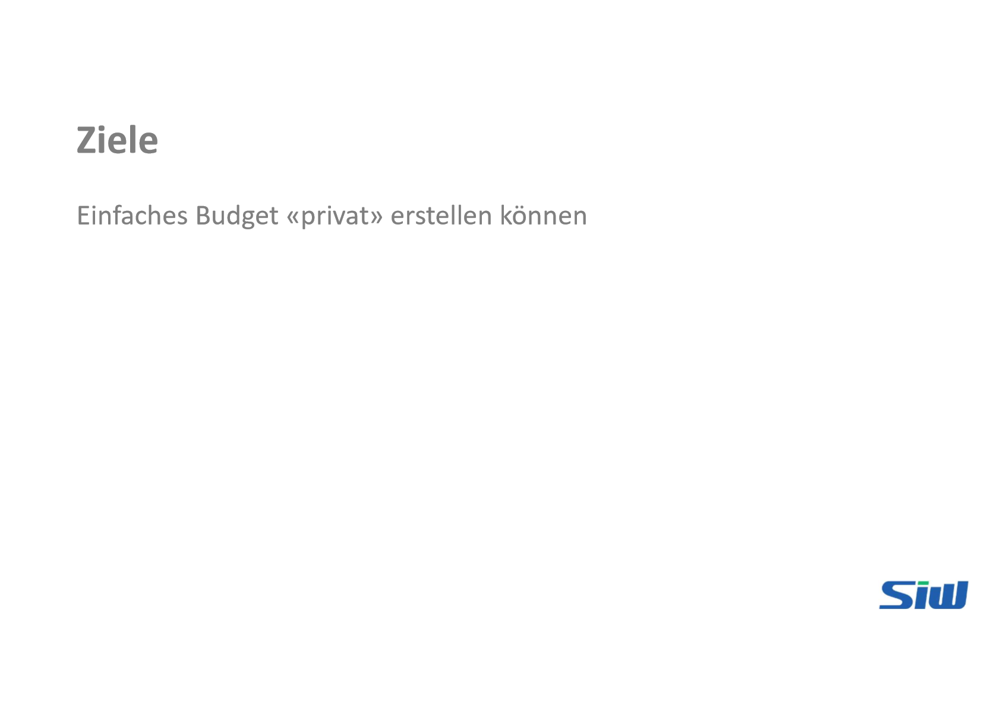

# Lernvideo 1 - Sequenz 3

Created: 2021-09-20 19:55:31 +0200

Modified: 2021-09-30 17:11:17 +0200

---

![Beispiel Bäcker Ein Bäcker will jeden Morgen zwischen 6 und 10 Uhr 3.000 Brötchen verkaufen (Absatzplan). Für seinen Produktionsplan muss er unter anderem wissen: • • • • • Wie viele Brötchen kann ein Bäcker pro Stunde formen, in den Ofen schieben und wieder herausholen? Wie viel Mehl und Zutaten werden dafür benötigt? Wann kann mit dem Backen begonnen werden? Wie viele Brötchen können gleichzeitig im Ofen gebacken werden? Wie lange müssen die Brötchen backen? Daraus berechnet er seinen Personalbedarf, seinen Kapazitätsbedarf, seinen Materialbedarf, seinen Lagerbedarf etc. Was ihm nicht zur Verfügung steht, muss er zusätzlich beschaffen. Durch eine neue Maschine kann er vielleicht mehr Brötchen gleichzeitig backen. Für solche Investitionen braucht er Geld; er erstellt einen Investitionsplan mit einem Investitionsbudget. SiUJ ](../../../media/S1_04_BUDG_Budgetierung-Lernvideo-1---Sequenz-3-image12.png)

![3c) Marketing- und Vertriebsplanung Bislang hat der Bäcker 1.500 Brötchen verkauft. Nun will er den Absatz auf 3.000 Brötchen erhöhen (Ziel in seinem Absatzplan). Dazu will er seinen Absatz durch Werbung ankurbeln. Er lässt Plakate drucken und schreibt die Kunden in seiner Nachbarschaft per Brief an. Außerdem druckt er Flyer, die er in den Briefkästen seiner Stadt verteilt. Das alles soll eine Werbeagentur für ihn planen, vorbereiten und umsetzen. Der Bäcker stellt dann Schüler ein, die seine Flyer verteilen. Auch diese Kosten für die Werbeagentur als Dienstleister und für die Schüler als Personal kann er berechnen. Daraus ergibt sich der notwendige Geldbedarf für sein Marketing. In den Bäckereifilialen muss er zusätzliches Personal einstellen, die die zusätzlichen 1.500 Brötchen verkaufen sollen. Auch das sind Personalkosten für den Verkauf und Vertrieb, die er berücksichtigen muss. SiUJ ](../../../media/S1_04_BUDG_Budgetierung-Lernvideo-1---Sequenz-3-image13.png)

