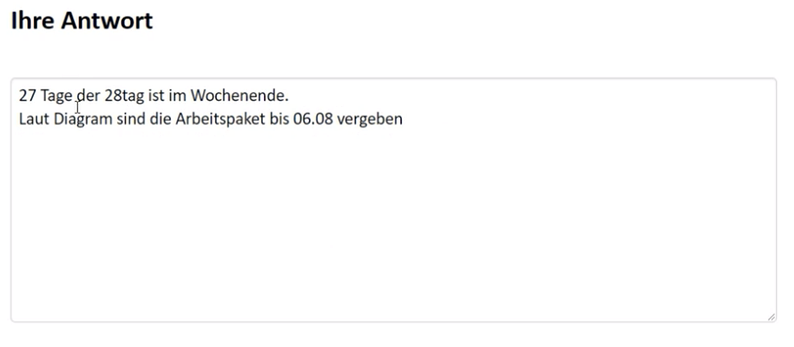
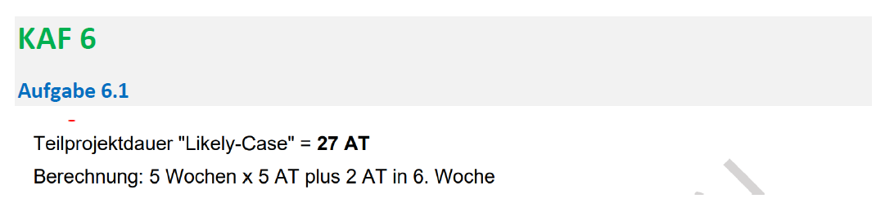

# Aufgabe 10

Created: 2021-11-13 10:39:18 +0100

Modified: 2021-11-18 18:42:45 +0100

---

![Ressourcen für ein Teilprojekt planen Ausgangslage Innerhalb eines grösseren Entwicklungsprojekts gibt es das Teilprojekt "Tutorial", in welchem multimediale Benutzeranleitungen für das Endprodukt produziert werden sollen. Der Gesamtprojektplan sieht vor, dass dieses Teilprojekt am 01.07.2019 startet und nach 4 Wochen zu je 5 Arbeitstagen (20 Arbeitstage) am 28.07.2019 abgeschlossen ist. Pierre wurde die Leitung des Teilprojekts "Tutorial" übergeben. Weil Pierre vermutet, dass die zeitlichen Vorgaben der Gesamtprojektleitung sehr optimistisch angesetzt sind, lässt er das Teilprojekt mit unterschiedlichem Fokus durch zwei Arbeitskolleginnen grob planen. Veronique hat auf der Basis ihrer Erfahrungen in ähnlichen Projekten eine realistische Variante "Likely-Case" geplant und dabei folgendes Gantt-Diagramm erstellt: Likely•Case planning subproject "Tutorial• Start End Jasmine hat im Auftrag von Pierre eine Variante "Worst-Case" geplant und dabei folgenden Projektnetzplan erstellt: Dauer (Tagel &iOurSl Acquisition Dauer [Tagel dwée storyboard Da ITagel du rée Dau« (Tagel Teilfrage 1 von 5 Aufgabentext planning [Duer [Tagel Speonat [Tagel Dauer (Tagel Review r trage) r (Tage) Dauer (Tagel Modificaticm Dauer durée User Acceptance Dauer (Tagel Lioursl cutting dwée : Sneak (Tagel du rée Ijm_vsJ Worst-Case planning subproject «Tutorial» Filming #14; Scene Selection Dauer [Tagel dwée (Tagel #18: Am' Release Dauer [Tagel dwée Ermitteln Sie auf der Basis des Gantt-Diagramms in der Ausgangslage die maximale Dauer der Variante in Arbeitstagen und stellen Sie Ihre Berechnung nachvollziehbar dar. Antwortstruktur Maximale Dauer "Likely-Case" in Arbeitstagen mit nachvollziehbarer Berechnung ](../media/S1_05_Prüfungsvorbereitung-Aufgabe-10-image1.png)

**Musterlösung**

