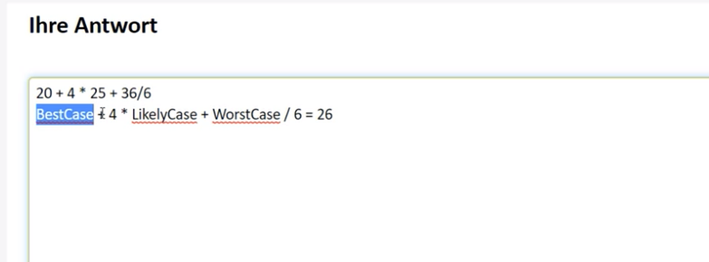
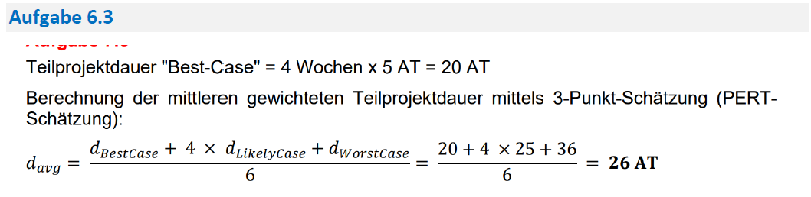

# Aufgabe 12

Created: 2021-11-13 10:39:24 +0100

Modified: 2021-11-18 19:04:43 +0100

---

![Ressourcen für ein Teilprojekt planen Ausgangslage Innerhalb eines grösseren Entwicklungsprojekts gibt es das Teilprojekt "Tutorial", in welchem multimediale Benutzeranleitungen für das Endprodukt produziert werden sollen. Der Gesamtprojektplan sieht vor, dass dieses Teilprojekt am 01.07.2019 startet und nach 4 Wochen zu je 5 Arbeitstagen (20 Arbeitstage) am 28.07.2019 abgeschlossen ist. Pierre wurde die Leitung des Teilprojekts "Tutorial" übergeben. Weil Pierre vermutet, dass die zeitlichen Vorgaben der Gesamtprojektleitung sehr optimistisch angesetzt sind, lässt er das Teilprojekt mit unterschiedlichem Fokus durch zwei Arbeitskolleginnen grob planen. Veronique hat auf der Basis ihrer Erfahrungen in ähnlichen Projekten eine realistische Variante "Likely-Case" geplant und dabei folgendes Gantt-Diagramm erstellt: Likely•Case planning subproject "Tutorial• End • Jasmine hat im Auftrag von Pierre eine Variante "Worst-Case" geplant und dabei folgenden Projektnetzplan erstellt: Dauer Acquisition Dauer [Tagel dwée Da [Tagel du rée Dau« (Tagel Teilfrage 3 von 5 Aufgabentext [nu er [Tagel Da i R r [Tagel Dauer (Tagel Review r trage) r (Tage) du rée Dauer (Tagel Modification Dauer durée User Acceptance Dauer (Tagel cutting dwée (Tagel du rée Ijm_wsJ Worst-Case planning subproject «Tutorial» Vilming Dauer (Tage) #14; Scene Selection Dauer [Tagel (Tagel #18: FimlRelese Dauer [Tagel dwée Berechnen Sie mittels 3 - Punkt-Schätzung (PERT-Schätzung, 3-Zeiten-Methode) die gewichtete mittlere Dauer des Teilprojekts in Arbeitstagen und stellen Sie Ihre Berechnungen nachvollziehbar dar. Gehen Sie bei Ihren Berechnungen von folgenden Werten aus, um Folgefehler aus den Aufgaben 1 und 2 zu vermeiden: • Best-Case: gemäss Vorgaben aus dem übergeordneten Gesamtprojektplan • Likely-Case: 25 Tage • Worst-Case: 36 Tage Antwortstruktur Nachvollziehbare Berechnung der gewichteten mittleren Dauer in Arbeitstagen ](../media/S1_05_Prüfungsvorbereitung-Aufgabe-12-image1.png)

**Musterlösung**

