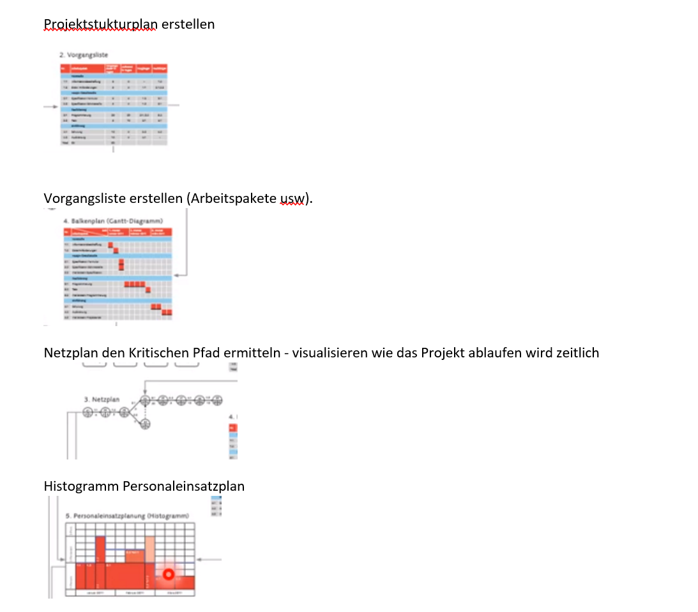

# Aufgabe 13

Created: 2021-11-13 10:39:27 +0100

Modified: 2021-11-18 18:44:38 +0100

---

![Ausgangslage Innerhalb eines grösseren Entwicklungsprojekts gibt es das Teilprojekt "Tutorial", in welchem multimediale Benutzeranleitungen für das Endprodukt produziert werden sollen. Der Gesamtprojektplan sieht vor, dass dieses Teilprojekt am 01.07.2019 startet und nach 4 Wochen zu je 5 Arbeitstagen (20 Arbeitstage) am 28.07.2019 abgeschlossen ist. Pierre wurde die Leitung des Teilprojekts "Tutorial" übergeben. Weil Pierre vermutet, dass die zeitlichen Vorgaben der Gesamtprojektleitung sehr optimistisch angesetzt sind, lässt er das Teilprojekt mit unterschiedlichem Fokus durch zwei Arbeitskolleginnen grob planen. Veronique hat auf der Basis ihrer Erfahrungen in ähnlichen Projekten eine realistische Variante "Likely-Case" geplant und dabei folgendes Gantt-Diagramm erstellt: Likely•Case planning subproject "Tutorial• Start End Jasmine hat im Auftrag von Pierre eine Variante "Worst-Case" geplant und dabei folgenden Projektnetzplan erstellt: Dauer dwée Acquisition Dauer Tagel dwée storyboard Da ITagel du rée Dau« (Tagel Teilfrage 4 von 5 Aufga bentext Dauer Tagel Da L R r Tagel Dauer (Tagel Review r trage) r (Tage Dauer (Tagel Modificaticm Dauer durée User Accepta Dauer (Tagel cutting dwée (Tagel du rée Ijm_wsJ Worst-Case planning subproject «Tutorial» Vilming Dauer (Tage) #14; Scene Selection Dauer Tagel (Tagel #18: FimlRelese Dauer Tagel dwée Das Gantt-Diagramm und der Projektnetzplan in der Ausgangslage geben Auskunft über die Dauer und den zeitlichen Verlauf des geplanten Teilprojekts. Erläutern Sie, weshalb aus diesen Darstellungen aber keine Rückschlüsse auf die benötigten personellen Ressourcen für die Projektabwicklung möglich sind. Antwortstruktur Erläuterung in maximal 3 Sätzen ](../media/S1_05_Prüfungsvorbereitung-Aufgabe-13-image1.png)

**Musterlösung**

