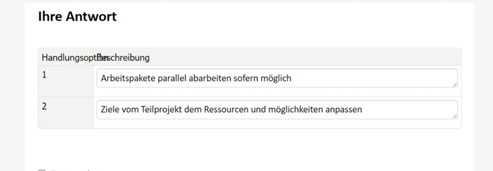

# Aufgabe 14

Created: 2021-11-13 10:39:31 +0100

Modified: 2021-11-14 23:17:51 +0100

---

![Ressourcen für ein Teilprojekt planen Ausgangslage Innerhalb eines grösseren Entwicklungsprojekts gibt es das Teilprojekt "Tutorial", in welchem multimediale Benutzeranleitungen für das Endprodukt produziert werden sollen. Der Gesamtprojektplan sieht vor, dass dieses Teilprojekt am 01.07.2019 startet und nach 4 Wochen zu je 5 Arbeitstagen (20 Arbeitstage) am 28.07.2019 abgeschlossen ist. Pierre wurde die Leitung des Teilprojekts "Tutorial" übergeben. Weil Pierre vermutet, dass die zeitlichen Vorgaben der Gesamtprojektleitung sehr optimistisch angesetzt sind, lässt er das Teilprojekt mit unterschiedlichem Fokus durch zwei Arbeitskolleginnen grob planen. Veronique hat auf der Basis ihrer Erfahrungen in ähnlichen Projekten eine realistische Variante "Likely-Case" geplant und dabei folgendes Gantt-Diagramm erstellt: Likely•Case planning subproject "Tutorial• (Start End Jasmine hat im Auftrag von Pierre eine Variante "Worst-Case" geplant und dabei folgenden Projektnetzplan erstellt: Dauer Acquisition Dauer dwée Da Tagel du rée Dau« (Tagel Teilfrage 5 von 5 Aufgabe ntext Due r Tagel Da L R r Tagel Dauer (Tagel Review r trage) r (Tage du rée Dauer (Tagel Modificaticm Dauer durée Ijæ.rsj User Accepta Dauer (Tagel cutting dwée (Tagel du rée Ijm_vsJ Worst-Case planning subproject «Tutorial» Filming Dauer (Tage) #14; Scene Selection Dauer Tagel (Tagel #18: FimlRelease Dauer Tagel dwée Der Teilprojektleiter Pierre hat aufgrund seiner Erkenntnisse zwischenzeitlich mehr Zeit für das Teilprojekt beantragt. Beschreiben Sie 2 unterschiedliche und realistische Handlungsoptionen, sofern die Gesamtprojektleitung den Antrag abweist und auf dem ursprünglichen Zeitrahmen von 20 Arbeitstagen beharrt. Antwortstruktur 2 unterschiedliche Handlungsoptionen in maximal je 2 Sätzen ](../media/S1_05_Prüfungsvorbereitung-Aufgabe-14-image1.png)

