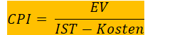
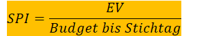

# Formeln

Created: 2021-11-18 19:38:47 +0100

Modified: 2021-11-20 08:39:13 +0100

---

**Break Even Point (BEP)**

**BEP=Fixkosten / (Einnahmen - variablen Kosten)**

**Online Rechner**: <https://www.nase.org/business-help/calculators/business/breakeven-analysis-calculator>

**Earned Value (EV)**

**EV = %fertig * Budget / 100**

**Cost Performance Index (CPI)**

**CPI = EV / Ist-Kosten**

**Scheduled Performance Index (SPI)**

**SPI = EV / Budget bis Stichtag**

**Return of Invest (ROI)**

