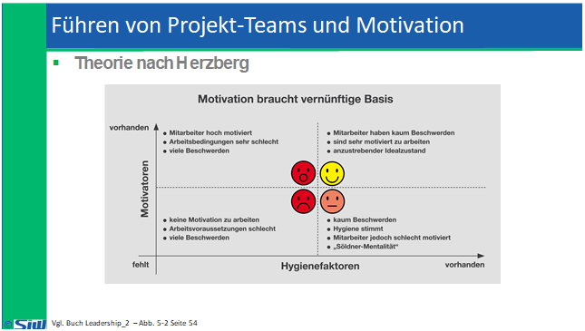

# PERF: Block 3 & 4

Created: 2021-12-02 17:31:07 +0100

Modified: 2021-12-04 01:01:09 +0100

---

![Führen von Projekt-Teams und Motivation • Das Kurz-Feedback Wie Du bei der Analyse ein--- fare StrRtur Ins Projekt eingebracht) sc lage mir in Zukunft von Dir„.. dass Du das Projeldteam in konftigen Sitzungen st%cer unptUtzt und engagier<. Gesamt- R 1 %sitiw Beobach tungen Negative Beobachtungen I n-#-sa Ziemt*gend' gut, gut, passa II umfänglich überzeugend Nicht gefallen hat mir/weniger gelungen fand ich/geärgert hat mich wie passiv Du Dich verhalten hast. Ich habe das Gefühl, dass Du dich zu wenig an der Diskussion beteiligst, so dassdas Meeing zäher war als sonst. ](../media/S2_01_PERF_Personalfuehrung-2-PERF--Block-3-&-4-image20.png)

